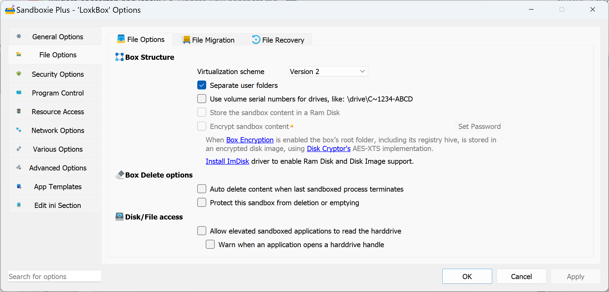

# Auto Delete 

AutoDelete is a sandbox setting in [Sandboxie Ini](SandboxieIni.md). It is typically specified as AutoDelete=y, and indicates that the contents of the sandbox should be automatically deleted after each use. For example:
```
   .
   .
   .
   [DefaultBox]
   AutoDelete=y
```

You can also add it in ui:


Related [Sandboxie Control](SandboxieControl.md) setting: [Sandbox Settings > Delete > Invocation](DeleteSettings.md#invocation)
