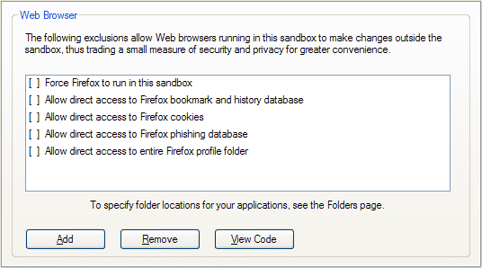
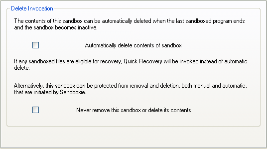

# Firefox Tips

## Tips Specific to Firefox

[Sandboxie Control](SandboxieControl.md) > [Sandbox Settings](SandboxSettings.md) > [Applications > Web Browser > Firefox](ApplicationsSettings.md#firefox)

### Always Run In Sandbox

**Setting:** Force Firefox to run in this sandbox

This option instructs Sandboxie to automatically supervise any instance of Firefox, even if not initiated directly through a Sandboxie facility or command.

### Updating Firefox and its Add-ons

In the default configuration, Firefox and add-on updates occur only within the sandbox. To retain updates after sandbox deletion, run Firefox outside the sandbox when updates are available. Let Firefox complete updating, including necessary restarts, and then restart it under Sandboxie.

If Firefox is forced to always run under Sandboxie (as discussed above), use the [Disable Forced Programs](FileMenu.md#disable-forced-programs) command to temporarily disable forced sandboxing. Follow the update procedure mentioned earlier and then use the _Disable Forced Programs_ command again to resume forced sandboxing.

### Bookmarks, History, and Favorites

**Setting:** Allow direct access to Firefox bookmarks and history database

This setting enables Firefox under Sandboxie to store bookmarks outside the sandbox, ensuring persistence even after sandbox deletion. If unselected, bookmarks are stored only in the sandbox and are deleted along with it.

*Note:* Starting from Firefox 3, the same file (_places.sqlite_) stores both bookmarks and the history of visited sites.

### Cookies

**Setting:** Allow direct access to Firefox cookies

Enabling this setting lets Firefox under Sandboxie store cookies outside the sandbox (_cookies.sqlite_), ensuring persistence after sandbox deletion. If unselected, cookies are stored only in the sandbox and are deleted with it.

An alternative approach is to visit your favorite sites once with a normal Firefox, allowing them to remember you in their cookies. Then switch to a Firefox under Sandboxie to keep any new cookies in the sandbox until deletion.

### Phishing Database

**Setting:** Allow direct access to Firefox phishing database

Keep this setting selected to allow Firefox under Sandboxie to efficiently update and maintain the phishing database (_urlclassifier*.sqlite_). If unselected, Firefox might need to spend time copying the potentially large file into the sandbox whenever it's deleted.

### Full Profile Access

**Setting:** Allow direct access to the entire Firefox profile folder

Avoid selecting this setting, as it grants unrestricted access to all Firefox profile data, overriding other "direct access" settings.

## General Tips

### Automatic Delete Sandbox

[Sandboxie Control](SandboxieControl.md) > [Sandbox Settings](SandboxSettings.md) > [Delete](DeleteSettings.md) > [Invocation](DeleteSettings.md#invocation)

**Setting:** Automatically delete contents of the sandbox

Enable this setting to automatically delete the sandbox contents when all programs within it stop running.

### Highlight Windows of Programs Running Under Sandboxie

[Sandboxie Control](SandboxieControl.md) > [Sandbox Settings](SandboxSettings.md) > [Appearance Settings](AppearanceSettings.md)

**Setting:** Display a border around the window

This setting adds a color border around windows of programs running in the sandbox, facilitating visual identification. Optionally, blur the distinction by selecting "Don't show Sandboxie indicator in the window title."
