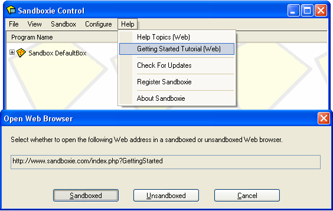

# 开始

### 第一部分: 介绍

Sandboxie 在名为沙盒的隔离抽象化区域中运行应用程序。在 Sandboxie 的监督下，应用程序可以正常全速地运行，但无法对计算机进行永久性更改。相反，更改仅在沙盒中生效。

本入门教程将向您展示：

  * 如何使用 Sandboxie 运行应用程序
  * 更改如何被限制在沙盒中
  * 如何从沙盒中恢复重要文件和文档
  * 如何删除沙盒 

或者跳转到 [开始：第六部分](GettingStartedPartSix.md) ，其中讨论了起决定性的几点。
你也可以查看 [外部教程](ExternalTutorials.md) 页面以获取有关 Sandboxie 的更多教程链接，其中一些是英语以外的语言，另一些是视频形式而不是文本。

* * *

### Sandboxie Control（Sandboxie 的图形前端）

Sandboxie 通过 [Sandboxie Control](SandboxieControl.md) 程序运行. 该程序将一个黄色 Sandboxie 图标添加到任务栏的系统通知(“托盘”) 区域:

如果[Sandboxie Control](SandboxieControl.md) 程序没有运行，你可以在 Windows “开始”菜单 里的 “Sandboxie” 程序组里启动它:

运行后，您可以在 Sandboxie 的托盘图标上双击来隐藏和显示 [Sandboxie Control](SandboxieControl.md)的主窗口 , 您可以右键单击该图标并选择第一个命令，该命令在 _隐藏窗口_ 和 _显示窗口_ 之间切换。

在本教程中，请确保 [Sandboxie Control](SandboxieControl.md) 的主窗口可见。

* * *

您可以在沙盒 Web 浏览器中查看本教程。为此，请使用[Sandboxie Control](SandboxieControl.md)的[“帮助”菜单](HelpMenu.md)里的 _入门教程 (网页)_ 命令 , 并确保您对[Sandboxie Control](SandboxieControl.md) 使用了 **在沙盒中运行**:

本教程在[开始：第二部分](GettingStartedPartTwo.md) 继续。
