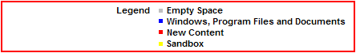

# How Sandboxie Works

Sandboxie runs your programs in an isolated space, preventing them from making permanent changes to other programs and data on your computer. The process is illustrated below:

The red arrows indicate changes flowing from a running program into your computer. The box labeled _Hard disk (no sandbox)_ shows changes by a program running normally, while the box labeled _Hard disk (with sandbox)_ shows changes by a program running under Sandboxie. The animation demonstrates that Sandboxie can intercept and isolate these changes within a **sandbox**, represented as a yellow rectangle. Grouping the changes together in this sandbox makes it easy to delete all of them at once.

**[Download Sandboxie](https://github.com/sandboxie-plus/Sandboxie/releases) now and give it a try!**
