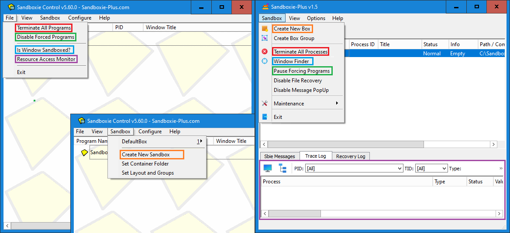
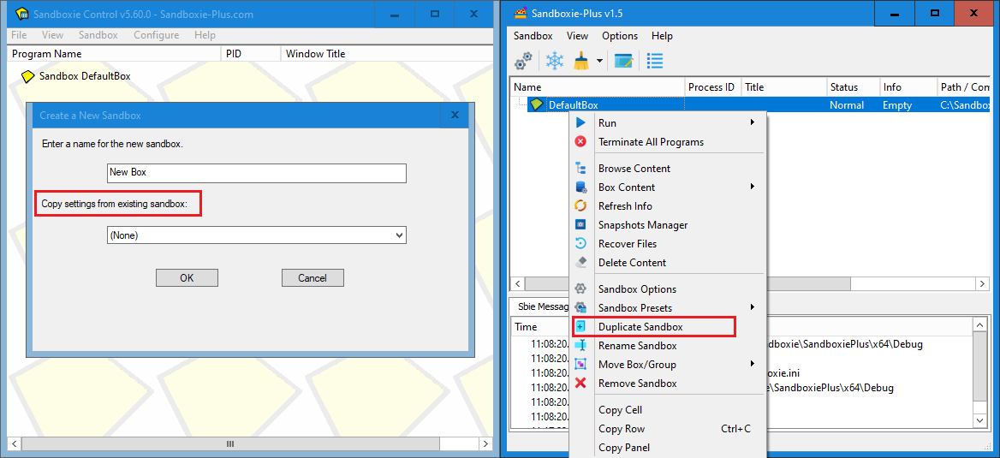
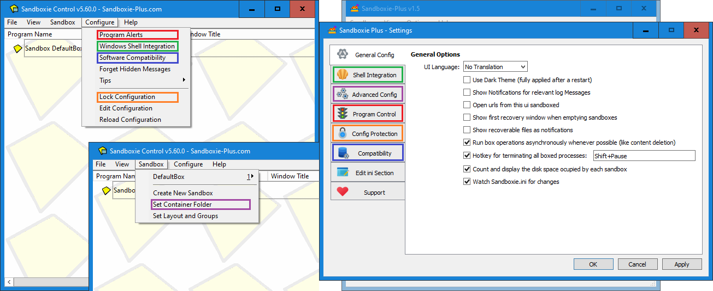
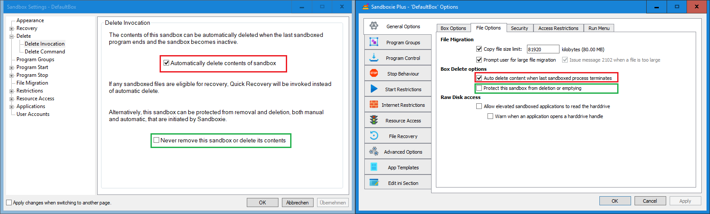
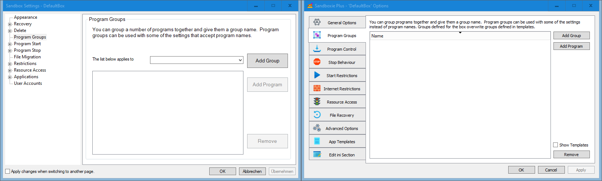
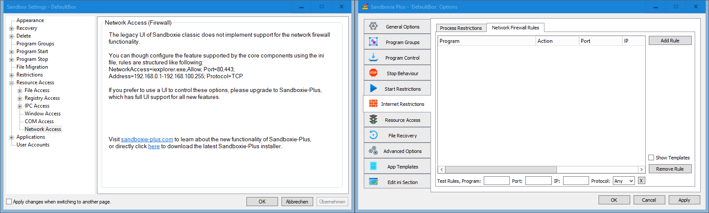
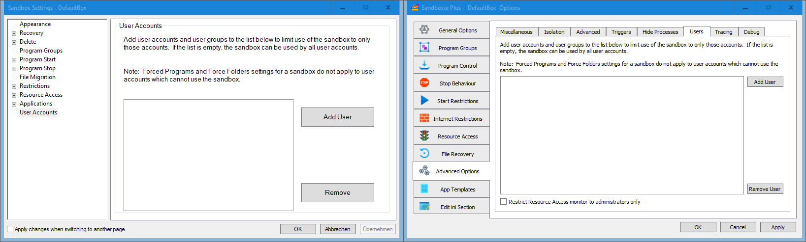
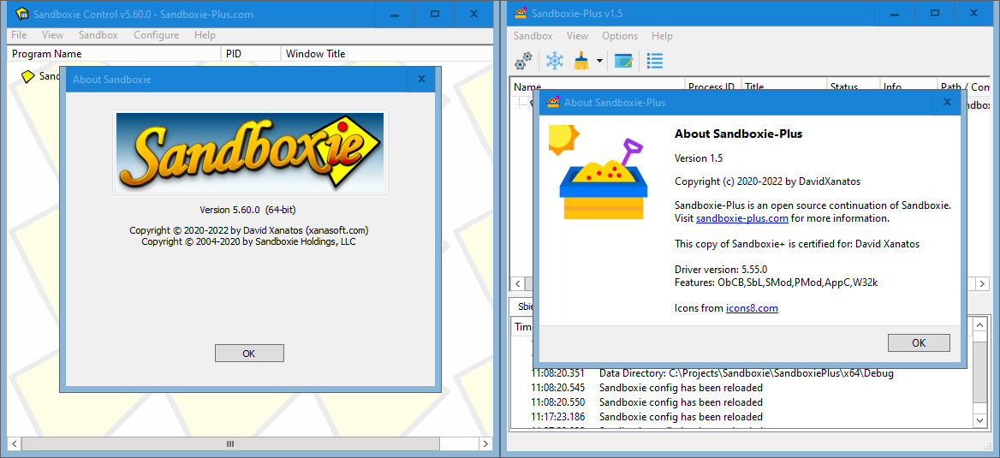

# Sandboxie-Plus Migration Guide

This guide shows where all the known sandboxie functions can be found in the new UI.

## Main Window

The over all layout of the main window of sandman.exe is exactly the same as the old one of sbiectrl.exe when the "Simple View" is chosen. If the "Advanced View" is chosen there are three additional tabs on the bottom of the window ("Sbie Messages" etc.), so it corresponds with what can be seen in the right picture.

## Fila and Sandbox Menus

All important menu commands can be found in simmilar places, although some have been move.

## Create Ne Box dialog

The "Create New Box" command opens the new box dialog. Unlike in classic here a box type preset can be selected.

The feature to copy an existing box can be found now on another place. (See the following unit.)

## Copying Sandbox Configuration

To copy a existing box configuration the "Duplicate Sandbox" menu comand can be used.

## View Menu

The "View" menu  offers a few more functions, and the option to enable a simplified view mode. The recovery log is no longer a separate window but a tab at the bottom (visible when that the "Advanced View" is chosen).

## View Menu - Files and Folders

The modern Sandboxie UI has replaced by the "Files and Folders" view to a separate window which can be opened form the box context menu.

## Files and Folders - view / widnow

The window 'Files' offers the same functionality as the old view, but enhances it by providing a full windows context menu.

## Global Settings

The new Sandboxie UI has a global settings window (Options --> Global Settings) where all options are located together on vertical tabs instead of havin to open individual windows.

## File System Root

In the modern UI it is possible to not only change the file system root path, but also the registry root and the IPC root.

## Program Start monitoring

Sandboxie-Plus can not only warn when unboxed processes are started, but it can also prevent the start entierly.

## Shell Integration

On this tab the shell integration can be configured, most functions are available, although depecated windows features were dropped and other options were moved out.

## Create Sandbox shortcut

To create a shortcut to a boxed program now an option in the box context menu is to be used, which can be reached quicker.

## Software COopatybility

Also the compatibility dialog is integrated now into the window with the global settings* (tab 'Compatibility').

## Lock Configuration

The setting protection options are available in the Global Settings Window as well (tab 'Config Protection').

## Sandbox Context Menu

The Box Context Menu is much more advanced, and contains all the options of from the old menu. Double click on the box name now opens the Box Settings.

## Explore Contents

In addition to being able to explore contents, the Box Content sub menu allows to mount and browse the sandboxed registry.

## Sandbox Settings

All functionality from the old Sandbox Settings are now located in the Sandbox Options. Some area similar place, but many have also been moved around.

## Quick and Immediate Recover

The options for Quick Recovery and Immediate Recovery have been merged into one tab ('File Recovery').

## Delete Options

The Delete Options have been moved to the sub tab 'File Options' of the tab 'General Options'.

## Delete Command

The Delete Command option can now be found on the sub tab 'Triggers' of the tab 'Advanced Options'.

## Program Groups

The new UI supports groups just liek the old one.

## Forced Programs and Folders

Force programs and Folders are also merged into one tab.

## Lingering Programs & Leader Programs

Program stop behavioure are also merged into one tab.

## File Migration

File Migration options have been integrated into the File Option sub tab of the General tab

## Internet Access

Sandboxie plus can not only use the old method of blockign internet access but also use the Window Filtering Platform (WFP) instead, which provides better compatybility.

## Network Access

Aditionally using the WFP facility a full per box firewall can be configured.

## Start/Run Access

Start restriction options have been promoted to a top level tab.

## Drop Rights

The "drop admin rights" option is in the new UI located on the Security sub tab of the general tab, together with additional security enchancements.

## Network Files

"Block network file and folder access" have been moved to the Access Restrictions sib tab of the General tab

## Resource Access

The "Resource Access" options have been integrated into a joined view which shows all presets in one list, the options can be edited as well as disabled without removing them.

## Application Compatybility Templates

The Compatybility Templates are now also presented as a joined view.

## User Accounts

Last but not lwast the ability to restrict a box to selected users, have been moved to a sib tab of the advanced tab.

## About Dialog

And finally we have the about dialog.

As is apaprent Sandboxie-Plus has much more additional options not shown here as this guise is only ment to facilitate the migration from sandboxie Classic to Sandboxie Plus.

