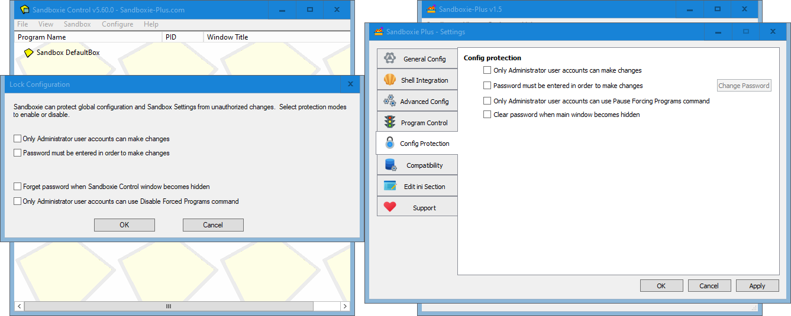
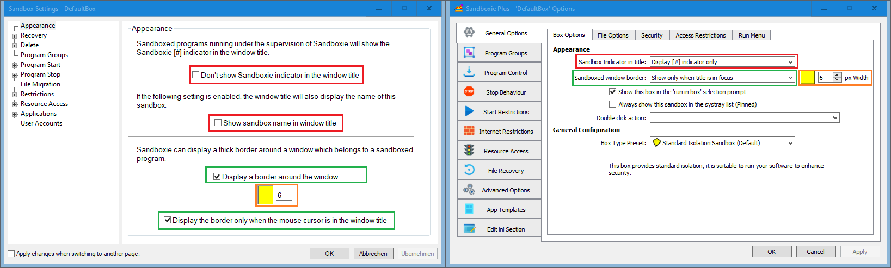
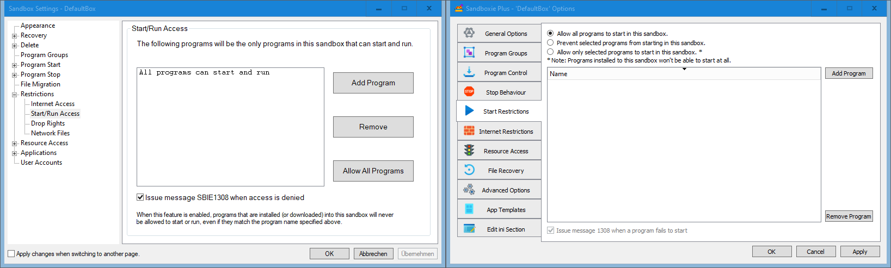

### Sandboxie-Plus contains all the functionality of sandboxie and much more.

This guide shows where all the known sandboxie functions can be found in the new UI.

---

The over all layout of the main window of sandman.exe is the same the old one of sbiectrl.exe

---

All important menu commands can be found in simmilar places, although some have been move.

---

The "Create New Box" command opens the new box dialog, unlike in classic here a box config preset an be selected instead of an otehr box to be copied.

---

To copy a existing box configuration the "Duplicate Sandbox" menu comand can be used.

---

The "View" menu  offers a few more functions, and the option to enable a simplified view mode. The recovery log is no longer a separate window but a tab at the bottom.

---

The modern Sandboxie UI has moved the "Files and Folders" view to a separate window which can be opened form the box context menu.

---

The Files and Folders window offers the same functionality as the old view, but enchances it by providing a full windows context menu.

---

The new Sandoxie UI has a global settings window where all options are located together on tabs instead of havin to open individual windows.

---

In the modern UI it is possible to not only change the File root path, but also the Registry and IPC roots.

---

Sandboxie-Plus can not only warn when unboxed processes are started, but it can also prevent the start entierly.

---

On this tab the shell integration can be configured, most functions are available, although depecated windows features were dropped and other options were moved out.

---

To create a shortcut to a boxed program now a context menu optin is to be used, which can be reached quicker.

---

Also the compatybility dialog was was integrated into the Settings Window.

---

The setting protection options are available in the Settings Window as well.

---

The Box Context Menu is much more advanced, and contains all the options of from the old menu. Double click now opens the Box Settings.

---

In addition to being able to browse the File Root, the Box Content sub menu allows also to mount and browse the sandboxed registry.

---

All functionality from the old Sandbox Settings are now located in the Sandbox Options dialog. Some are a simmilar place, but many have also been moved around.

---

The Quick Recovery and Immidate Recovery tabs have been merged into one tab.

---

The Delete Options have been moved to a sub tab of the General tab.

---

The Delete Command option can now be found as one of the event trigegrs on the Advanced tab.

---

The new UI supports groups just liek the old one.

---

Force programs and Folders are also merged into one tab.

---

Program stop behavioure are also merged into one tab.

---

File Migration options have been integrated into the File Option sub tab of the General tab

---

Sandboxie plus can not only use the old method of blockign internet access but also use the Window Filtering Platform (WFP) instead, which provides better compatybility.

---

Aditionally using the WFP facility a full per box firewall can be configured.

---

Start restriction options have been promoted to a top level tab.

---

The "drop admin rights" option is in the new UI located on the Security sub tab of the general tab, together with additional security enchancements.

---

"Block network file and folder access" have been moved to the Access Restrictions sib tab of the General tab

---

The "Resource Access" options have been integrated into a joined view which shows all presets in one list, the options can be edited as well as disabled without removing them.

---

The Compatybility Templates are now also presented as a joined view.

---

Last but not lwast the ability to restrict a box to selected users, have been moved to a sib tab of the advanced tab.

---

And finally we have the about dialog.

As is apaprent Sandboxie-Plus has much more additional options not shown here as this guise is only ment to facilitate the migration from sandboxie Classic to Sandboxie Plus.

