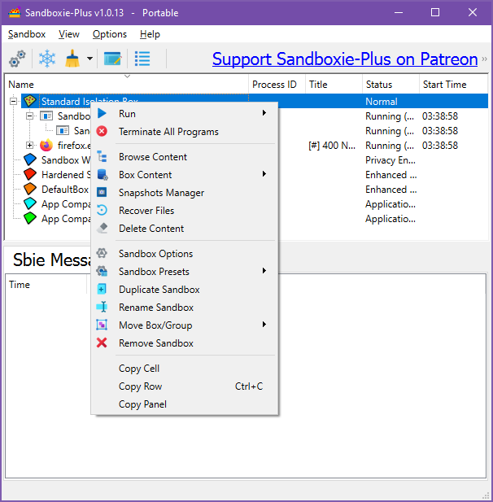
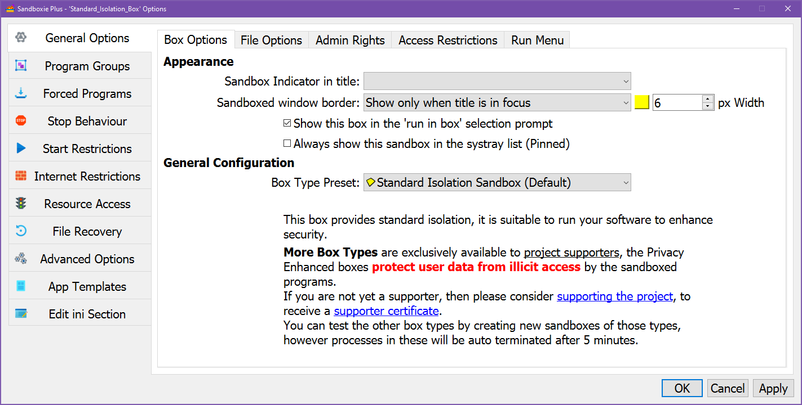

# Sandboxie Plus Sandbox Settings

The Sandbox Settings window in [Sandboxie Plus](SandboxiePlus.md) displays and changes the configuration and options associated with a single sandbox. The Sandbox Settings window can be accessed in two ways:

* From the context menu: In the main window area, right-click (or press Shift+F10) on the name of a sandbox, then select the _Sandbox Options_ command. (See the discussion about Context Menus in [Programs View](ProgramsView.md) or [Files And Folders View](FilesAndFoldersView.md) for more information.)
* From the [Tray Icon](SBPlusTrayIconMenu.md) menu by double left clicking on the sandbox.

Note that unless new sandboxes are added, Sandboxie lists only one sandbox: DefaultBox.

* * *

In the Sandbox Settings window, the individual settings are organized into settings pages, and some pages are organized into groups, as shown below.

The left part of the window contains the pages and groups. When a settings page is selected (clicked) in the left part of the window, the right part of the window shows the related settings.

When a change has been made in a particular page, the change must be applied to Sandboxie before moving to any other settings page. This can be done manually using the Apply button, or automatically by marking the checkbox at the bottom of the window ("Apply changes when switching to another page").

The sections below describe each settings page.

Configuration changes do not apply to programs that are already running sandboxed at the time the configuration is changed. To keep things simple, you are advised to make configuration changes when no programs are running in the sandbox.

* * *

For information about the settings, see these pages:

* [Appearance Settings](AppearanceSettings.md)

* [Recovery Settings](RecoverySettings.md)

* [Delete Settings](DeleteSettings.md)

* [Program Start Settings](ProgramStartSettings.md)

* [Program Stop Settings](ProgramStopSettings.md)

* [File Migration Settings](FileMigrationSettings.md)

* [Restrictions Settings](RestrictionsSettings.md)

* [Resource Access Settings](ResourceAccessSettings.md)

* [Applications Settings](ApplicationsSettings.md)

* [User Accounts Settings](UserAccountsSettings.md)
