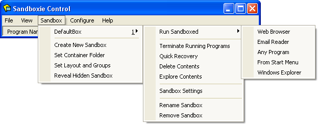

# Sandbox Menu

[Sandboxie Control](SandboxieControl.md) > Sandbox Menu

* * *

### Sandbox Sub-Menu

One or more sub-menus appear for each sandbox defined. The default configuration includes only one sandbox named _DefaultBox_, but more can be added using the [Create New Sandbox](SandboxMenu.md#create-new-sandbox) command. Each sub-menu contains the following commands:

*   The _Run Sandboxed_ sub-sub-menu is used to start programs under the supervision of Sandboxie:

*   The _Web Browser_ command starts the system (default) Web browser.  
    (Note: If the wrong program starts, see [Frequently Asked Questions](FrequentlyAskedQuestions.md#why-does-the-wrong-program-start-when-i-run-my-default-web-browser-sandboxed) to fix this.)

*   The _Email Reader_ command starts the system (default) email reader

*   The _Any Program_ command displays the Run Any Program dialog box which is similar to the standard Windows _Run..._ dialog box. It can be used to start programs, open documents, and browse folders, all under the supervision of Sandboxie.

*   The _From Start Menu_ command displays the Sandboxie Start menu, similar to the standard Windows Start menu. It can be used to start programs and other shortcuts that appear in the start menu and on the desktop. Note that if any programs were installed into the sandbox, the Sandboxie Start menu will include the shortcuts created during the installation.

*   The _Windows Explorer_ command starts a sandboxed instance of the Windows Explorer. It can be used to navigate folders and start programs, all under the supervision of Sandboxie.

*   The _Terminate Running Programs_ command stops all programs running in the sandbox.

*   The _Quick Recovery_ command shows the [Quick Recovery](QuickRecovery.md) window.

*   The _Delete Contents_ command shows the [Delete Sandbox](DeleteSandbox.md) window.

*   The _Explore Contents_ command opens an _unsandboxed_ folder view for the contents of the sandbox _outside the supervision of Sandboxie_. If possible, use the [Files And Folders View](FilesAndFoldersView.md) to browse the contents of the sandbox.

*   The _Sandbox Settings_ command opens the [Sandbox Settings](SandboxSettings.md) window.

*   The _Rename Sandbox_ command changes the name of the sandbox.

*   The _Remove Sandbox_ command removes a sandboxed created using the [Create New Sandbox](SandboxMenu.md#create-new-sandbox) command.

These commands, except for Rename Sandbox and Remove Sandbox, are also available in the [Tray Icon Menu](TrayIconMenu.md).

* * *

### Create New Sandbox

The _Create New Sandbox_ command defines a new sandbox in Sandboxie. A dialog box window will be displayed asking for the name of the new sandbox. The name can be any of combination of digits and letters, and its maximum length is 32 characters. A combobox button can specify some existing sandbox, from which settings will be copied into the new sandbox. If such an existing sandbox has not been selected, the new sandbox will initially have a default set of settings. Once the sandbox is created, the [Sandbox Settings](SandboxSettings.md) window can be used to alter sandbox settings.

* * *

### Set Container Folder

The _Set Container Folder_ command selects the container (or master, or parent) folder which will contain all other sandboxes. The default location is **X:\Sandbox\%USER%\%SANDBOX%**, where **X:** stands for the drive where Windows is installed, typically **C:**.

The special variable **%SANDBOX%** is replaced by the name of the sandbox.

The special variable **%USER%** is replaced by the name of whichever user account (or logon) is using that sandbox. Note that a sandbox created in one user account is visible and can be used by other accounts in the system.  
However, if the container folder includes the **%USER%** special variable, then the user accounts don't actually share the same sandbox. Each account has a separate instance of the sandbox.

Related [Sandboxie Ini](SandboxieIni.md) setting: [FileRootPath](FileRootPath.md).

* * *

### Set Layout and Groups

The _Set Layout and Groups_ command permits ordering sandboxes within a hierarchy of groups, when displayed in menus and lists. This does not have any effect on how programs behave within a sandbox. This feature is useful when more than a few sandboxes are defined, as it permits easier menu access to a specific sandbox.

Once any groups have been defined, the main [Programs View](ProgramsView.md) in [Sandboxie Control](SandboxieControl.md) will include a combo-box button which can be used to restrict the list of sandboxes that are displayed.

Related [Sandboxie Ini](SandboxieIni.md) setting: BoxDisplayOrder.

* * *

### Reveal Hidden Sandbox

The _Reveal Hidden Sandbox_ command appears in the menu only if some sandboxes are not visible to or usable by the current user account. A sandbox can be restricted to specific user accounts using the [User Accounts Settings](UserAccountsSettings.md) settings page in the [Sandbox Settings](SandboxSettings.md) window. The _Reveal Hidden Sandbox_ command can restore visibility of a sandbox that has been made unavailable the current user account.

* * *

Go to [Sandboxie Control](SandboxieControl.md#menus), [Help Topics](HelpTopics.md).
