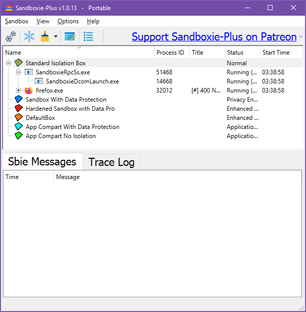

### Overview

Sandboxie Plus is the modern graphical agent to Sandboxie, and can control most aspects of Sandboxie. These are some of the things that you can do with it:

* Start and stop programs under the supervision of Sandboxie
* View files inside the sandbox
* Recover desired files out of the sandbox
* Delete the contents of sandboxes, purging all undesired files
* Create, remove and configure sandboxes
* Configure, start, and view [trace logs](TraceLog.md)

* * *

### Menus

* [Sandbox Menu](SBPlusSandboxMenu.md)

* [View Menu](ViewMenu.md)

* [Sandbox Sub Menu](SBPlusSandboxSubMenu.md)

* [Options Menu](ConfigureMenu.md)

* [Help Menu](HelpMenu.md)

* See Also: [Tray Icon Menu](SBPlusTrayIconMenu.md)

* * *

### Visibility

Sandboxie Plus is primarily a mechanism to run other programs, not an interactive tool. You will typically hide the main window of Sandboxie Plus, and the program will only be visible as a tray icon in your system notification area, typically at the lower-right corner of the screen:

(Note the yellow Sandboxie Plus icon near the clock.)

To toggle the hidden state, double-click the tray icon, or right-click it and select the _Show Window_ or _Hide Window_ commands. (See [Tray Icon Menu](SBPlusTrayIconMenu.md).) Additionally, you can hide the window by clicking the close button (X) at the upper-right corner of the window.

To quit Sandboxie Plus and remove its tray icon from the system notification area, right-click the tray icon and select _Exit_.

* * *

### ### Quick Links to More Topics

* [Quick Recovery](QuickRecovery.md), [Immediate Recovery](ImmediateRecovery.md) and [Delete Sandbox](DeleteSandbox.md)

* [Sandbox Settings](SBPlusSandboxSettings.md)

* [Pause Forcing Programs](SBPLusSandboxMenu.md#pause-forcing-programs)

* [Shell Integration](ConfigureMenu.md#windows-shell-integration)

* [Is Window Sandboxed?](SBPlusSandboxMenu.md#is-window-sandboxed)

* * *

Go to [Help Topics](HelpTopics.md).
