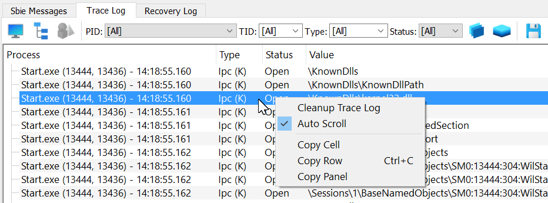

# Trace logging (for Sandboxie Plus)

The Trace Log tool displays the names of any system resources that are accessed by programs running under the supervision of Sandboxie Plus. Designed to make it easy to identify those system resources which should be excluded from sandboxing, this tool can be used with the [Sandboxie Trace](SandboxieTrace.md) options.

**Important:** Please use the Trace Log tool only if you are asked to do so.

**Using the Trace Log**

1\. Open the Sandboxie Plus window, then go to Options menu -> Edit ini file -> confirm yes.

2\. Add `IpcTrace=*` below `[DefaultBox]` (or your sandbox name).

3\. Save the ini file and close it.

4\. Enable 'Trace Log' tab by opening 'Options' menu -> 'Trace Logging'.

5\. When the Trace Log tab is activated, it immediately starts to collect and display resource access information from all sandboxed programs that are running.

6\. At this point, perform any specific tasks that fail when done under the supervision of Sandboxie Plus.

7\. Finally, right click on the collected data and select the entry named **Copy Panel**. This copies the collected data into the clipboard.

8\. You can now paste (Ctrl+V) the collected data somewhere and make it available for analysis.

**Performace Impact**

When inactive, the Trace Log does not use any system resources and does not have any performance impact on any running programs. When active, the Trace Log has a small performace penalty on sandboxed programs. Network Administrators may want to use the [MonitorAdminOnly](MonitorAdminOnly.md) to restrict the use of this command.
