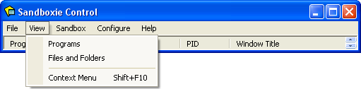

# View Menu

## Views
Choose from three view options:
- **Simple View (for beginners)**
- **Advanced View (for advanced users seeking advanced options)**
- **Vintage View (TODO: ChatGPT, please fill in)**

## Always on Top
Enables keeping the Sandboxie window on top of all applications.

## Show hidden boxes
Shows hidden sandboxes.

## Programs
Selecting the Programs command activates the [Programs View](ProgramsView.md), displaying the programs running in each sandbox. This is the default view.

## Files and Folders
Selecting Files and Folders activates the [Files And Folders View](FilesAndFoldersView.md), providing a display of the files and folders in each sandbox.

## Context Menu
The Context Menu command displays the context menu associated with the highlighted (selected) item. It can also be accessed by right-clicking on an item, such as a sandbox, program, file, or folder. Not all items appear in all views.
