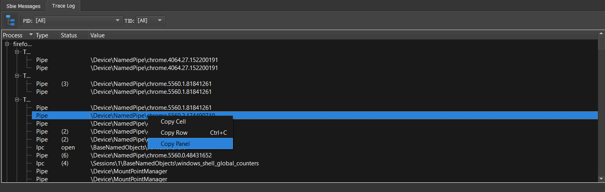

# Trace logging (for Sandboxie Plus)

The Trace Log tool displays the names of any system resources that are accessed by programs running under the supervision of Sandboxie Plus. Designed to make it easy to identify those system resources which should be excluded from sandboxing, this tool can be used with the [Sandboxie Trace](../Content/SandboxieTrace.md) options.

**Important:** Please consider to use the Trace Log before opening a new issue.

### Using the Trace Log

1\. Enable **Trace Log** tab by opening **View** menu -> **Trace Logging**.

2\. When the Trace Log tab is activated, it immediately starts to collect and display resource access information from all sandboxed programs that are running.

3\. At this point, perform any specific tasks that fail when done under the supervision of Sandboxie Plus.

4\. Finally, right click on the collected data and select the entry named **Copy Panel**. This copies the collected data into the clipboard.

5\. You can now paste (Ctrl+V) the collected data somewhere and make it available for analysis.

6\. Optionally, the keyboard shortcut CTRL+F can be used to search for specific entries within the Trace Log tab.

### Performance Impact

When inactive, the Trace Log does not use any system resources and does not have any performance impact on any running programs. When active, the Trace Log has a small performance penalty on sandboxed programs.

### Additional Improvements

> **Sandboxie Plus v0.7.0** adds the ability to adjust the buffer size with `TraceBufferPages=2560`.
>
> **Sandboxie Plus v0.8.0** adds the ability to disable resource access monitor for selected sandboxes with `DisableResourceMonitor=y`.
>
> **Sandboxie Plus v0.9.8b** adds the ability to save the trace log output into a new .log file (via the floppy disk icon).
>
> **Sandboxie Plus v0.9.8d** adds the ability to select multiple access types at once.
>
> **Sandboxie Plus v1.0.16** adds a monitor mode to the resource access trace.
>
> **Sandboxie Plus v1.9.6** adds a full stack trace to all trace messages. Note that activating the Trace Log also turns on the Keep Terminated feature. This is not a bug, but a new intended behaviour. Without it, the stack trace in the Trace Log would not work properly, as it uses the process objects to cache the symbols.
>
> **Sandboxie Plus v1.10.1** adds an auto scroll functionality (enabled by default in the monitor mode).
