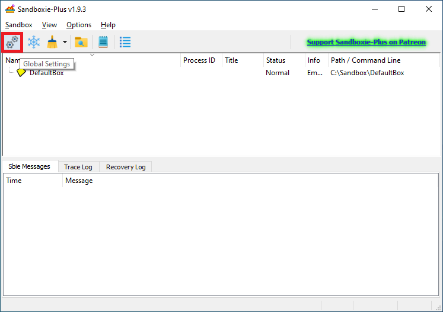
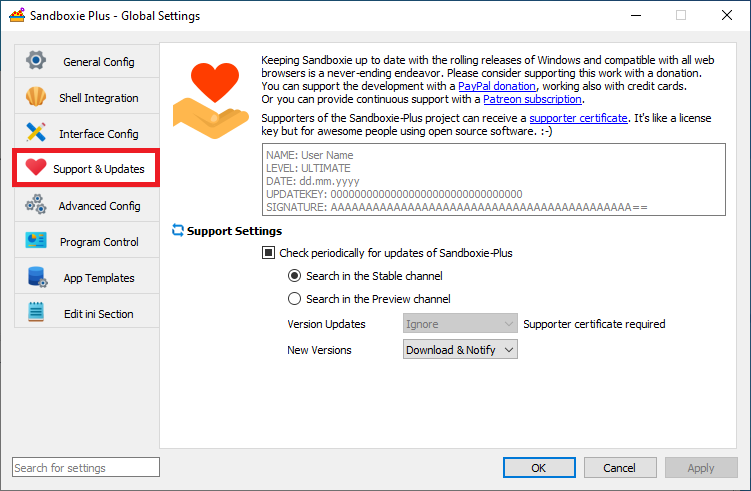
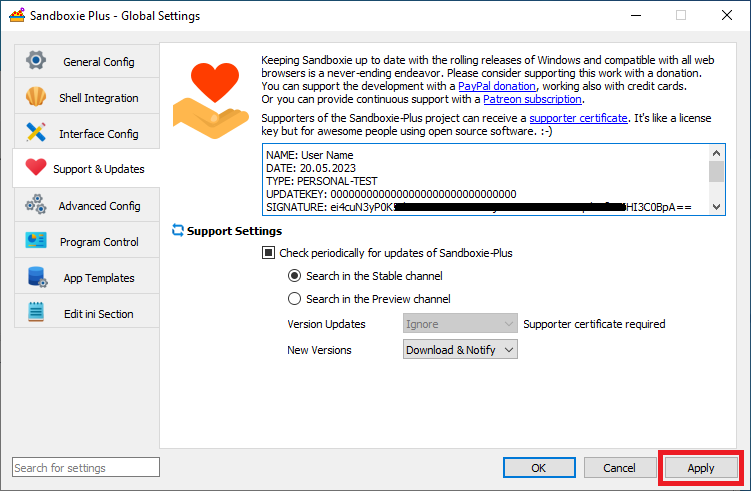
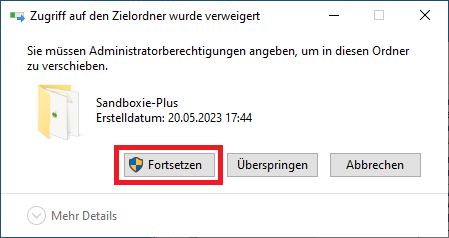
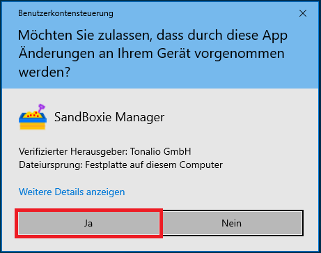
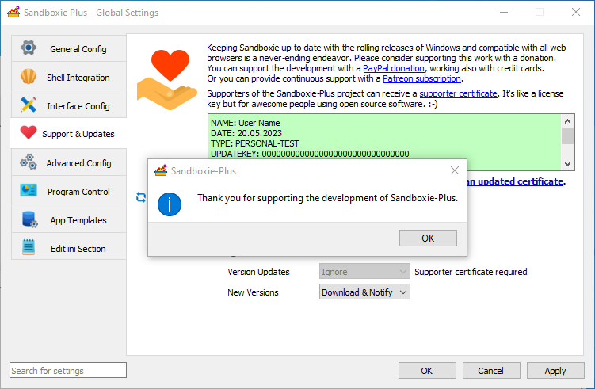

# Applying a Supporter Certificate using the Modern SandMan UI

To apply a supporter certificate, please start the Sandboxie-Plus and open the global settings

In the global options please go to the "Support & Udpates" page.

Enter your entire certificate starting with NAME: up to and including the last == 
Then press Apply (or OK)

Then you will be prompted to grant Administrative privileges, you will need to allow them in order for teh certificate to be installed

Depanding on your OS preset you may need to also confirm an UAC prompt

Once teh certificate is accepted the entry field should become green.

And a notification popUp windows should appear.

