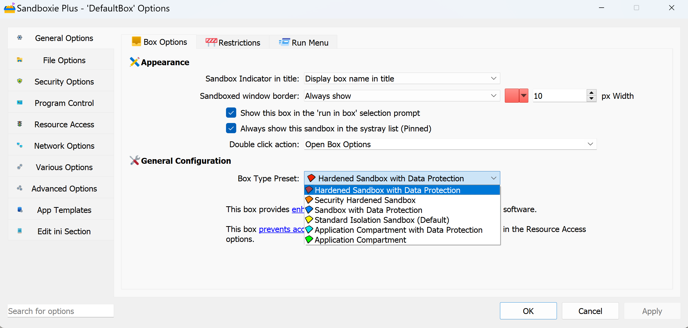

# Privacy Mode

**NOTE: This feature requires a [supporter certificate](https://sandboxie-plus.com/supporter-certificate/).**

The concept of privacy mode and privacy-enhanced (or Data Protection) boxes was introduced in **Sandboxie Plus v1.0.0**. In this mode, most locations on a PC are treated like a Write[File/Key]Path, making sandboxed locations writable, but unsandboxed locations not readable. Additionally, the registry does not allow reading of user root keys, preventing access to private user data by sandboxed processes.

To enable privacy mode, add `UsePrivacyMode=y` to the box settings section of **[Sandboxie Ini](../Content/SandboxieIni.md)**. Alternatively, in the Sandboxie app, right-click on a box, select "Sandbox Options" from the drop-down menu (or double-click on a box), bring up the Box Options UI, choose the box type preset as "Sandbox with Data Protection" (with a **blue** box icon), and click OK. The Sandman UI status column labels this box as **Privacy Enhanced**.

**What is User Space?** AppGuard refers to [user space](https://malwaretips.com/threads/run-by-smartscreen-utility.65145/post-561364) as "computer storage space accessible by non-admin Windows users, including the user's profile directory, removable storage devices, network shares, and non-system hard drives." Think of "user space" as everything outside the **system** (core operating system and programs) in `C:\Windows`, `C:\Program Files`, and `C:\Program Files (x86)` folders!

Internally, a privacy-enhanced box is based on three defaults:
1. **Allow read access to system resources:**
   - `C:\Windows`
   - `C:\Program Files`
   - `C:\Program Files (x86)`
   - Registry resources under HKLM (but not HKCU) are readable and sandboxed.

2. **Hide (and block access to) user space:**
   - In user space, a privacy box works in **default block** mode, setting all drive paths to WriteFilePath. This hides files and folders outside the sandbox but allows new ones to be created inside (unless specifically allowed by an overriding rule). Access to selected paths is enabled using [Rule Specificity](../PlusContent/RuleSpecificity.md).

3. **Enable [Rule Specificity:](../PlusContent/RuleSpecificity.md)**
   - Rule specificity is **always enabled** in privacy mode, using the **[Normal](../Content/NormalFilePath.md)** path directive (`Normal[File/Ipc/Key]Path`) to open selected locations for **readable and sandboxed** access.

**Recent Changes:** Starting with **Sandboxie Plus v1.8.0**, all built-in access rules have been moved to default templates (included in the **Templates.ini** file under the `[TemplatePModPaths]` section) for easier management.
