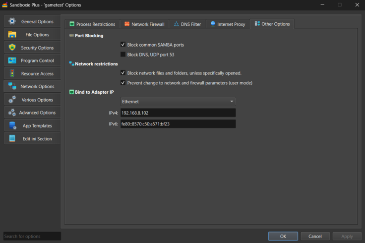

# Bind Adapter

*BindAdapter* and *BindAdapterIP* select the local network interface used by supported socket operations in sandboxed processes. The binding is implemented in SbieDll by intercepting Winsock operations; it is not a firewall or a universal network-enforcement boundary.

For matching processes, Sandboxie can bind supported IPv4 and IPv6 socket paths to an address associated with a named adapter or to a configured local IP address. Standard intercepted paths include connection, datagram send/receive, and related Winsock extension paths, but software that bypasses those paths is outside this feature's scope.

## Choosing a binding method

Use *BindAdapter* when the address may change, as with DHCP or a VPN. Sandboxie matches the configured value to a Windows adapter **FriendlyName**, without regard to letter case, and follows the usable addresses currently assigned to that adapter.

Use [*BindAdapterIP*](BindAdapterIP.md) when a specific local address must be selected. The address must remain assigned to an active host interface; Sandboxie does not migrate the rule to another address if the host configuration changes.

If both settings are applicable to the same process, *BindAdapter* has configuration precedence. *BindAdapterIP* is used when adapter-based binding is not the applicable configured mechanism; it is not a fallback for an unavailable named adapter.

## BindAdapter syntax

```ini
BindAdapter=[process,]adapter_name
```

Omit `process` to apply the rule to every process in the sandbox, or specify an executable name for a program-specific rule. Adapter friendly names that contain spaces can be written directly.

Examples:

```ini
BindAdapter=Ethernet
BindAdapter=browser.exe,My VPN
```

The first rule applies to all processes that do not have a more specific applicable rule. The second applies to `browser.exe` and selects the adapter named `My VPN`.

Rules are read from the sandbox's effective configuration, including inherited template settings. The current Sandboxie Plus interface manages box-wide rules; executable-specific rules require manual [Sandboxie Ini](SandboxieIni.md) configuration.

## Adapter selection and address families

The named adapter must be present and operational. Sandboxie uses at most one usable IPv4 address and one usable IPv6 address from it. During adapter selection it excludes IPv4 link-local addresses in `169.254.0.0/16` and IPv6 link-local addresses in `fe80::/10`.

An adapter may therefore provide:

- only IPv4;
- only IPv6; or
- both address families.

The available family must match the socket operation. *StrictBindIP* controls whether an unconfigured or currently unavailable family may continue without the requested binding.

Sandboxie periodically refreshes the state and addresses of a selected named adapter. This allows an adapter missing when the process initialized to be detected if it later appears, and allows address changes such as DHCP renewal or VPN reconnection to be followed. It does not use localhost as a fallback when the adapter is unavailable.

## StrictBindIP

*StrictBindIP* was added in Sandboxie Plus 1.16.7 and is enabled by default. It is relevant only when *BindAdapter* or *BindAdapterIP* has initialized the binding subsystem.

```ini
StrictBindIP=[process,]y|n
```

Examples:

```ini
StrictBindIP=y
StrictBindIP=browser.exe,n
```

With the default `y` value, supported intercepted Winsock operations normally fail when the selected binding is unavailable or when the operation uses an address family for which no binding is configured. A common observable error is `WSAEADDRNOTAVAIL`, although applications should not rely on one error value for every socket path.

With `StrictBindIP=n`, a normal intercepted path that cannot use the configured address may continue unbound, allowing Windows to choose another local address and route. This may send traffic through a different interface, so the compatibility fallback should be enabled only when that behavior is acceptable.

Connection and datagram paths such as `connect`, `WSAConnect`, `ConnectEx`, `sendto`, `WSASendTo`, `recvfrom`, and `WSARecvFrom` are among the operations handled by the binding code. Explicit application calls to `bind` and other socket paths are not all handled identically. Treat *StrictBindIP* as compatibility behavior within the user-mode interception layer, not as an absolute network policy.

Sandboxie Plus does not currently provide a dedicated *StrictBindIP* checkbox. Configure it in `Sandboxie.ini` when a non-default value is required.

## Security and privacy limitations

Adapter binding controls the local source address used by supported intercepted Winsock operations. It does not:

- create Windows Filtering Platform (WFP) rules;
- block every possible networking mechanism;
- cover code that bypasses the intercepted Winsock paths, including kernel-mode networking; or
- guarantee that traffic can never use another interface.

When interface confinement is security-sensitive, combine binding with an independently enforced network policy. See [Windows Filtering Platform](../PlusContent/WFPSupport.md) for Sandboxie's separate filtering support.

## Interaction with SOCKS proxying

On the normal proxy path, source-address or adapter binding is evaluated before Sandboxie makes the SOCKS proxy connection. An unavailable strict binding can therefore prevent connection to the proxy endpoint.

The experimental `UseProxyThreads` compatibility mode creates the external proxy connection from a separate relay worker and should not be treated as providing the same source-address binding guarantees as the normal path. See [Proxy Support](../PlusContent/ProxySupport.md) for the proxy feature's scope and limitations.

## Applying configuration changes

*BindAdapter* and *BindAdapterIP* rules are initialized when a sandboxed process initializes Winsock. Restart affected sandboxed processes after changing those rules.

The physical state and current addresses of an already selected *BindAdapter* are refreshed while the process runs. By contrast, *BindAdapterIP* revalidates whether its configured literal address remains assigned to an operational interface but does not rewrite the rule to use another address. *StrictBindIP* is queried during intercepted operations, so a saved change may affect subsequent operations in a process whose binding subsystem is already initialized. Restarting affected processes after changing network configuration remains the reliable practice. A SandMan or Sandboxie service restart is not normally required.

## Sandboxie Plus interface

In Sandboxie Plus, open:

**Sandbox Options** > **Network Options** > **Other Options**

The group is labeled **Bind to Adapter IP** and contains:

- an adapter drop-down list;
- an **IPv4:** field; and
- an **IPv6:** field.

Selecting an adapter configures *BindAdapter*. Selecting **None (Don't bind to adapter)** allows literal addresses to be entered for *BindAdapterIP*. The single UI group therefore represents two distinct configuration keys.



SandMan provides this current configuration interface. The runtime is shared by Sandboxie Plus and Classic, so Classic can consume compatible manually configured settings where the feature is available, but it does not provide the equivalent modern interface. *StrictBindIP* is an INI setting rather than a dedicated SandMan or Classic checkbox.

## Version history

- Sandboxie Plus 1.15.10 / Classic 5.70.10 introduced *BindAdapterIP*, including executable-qualified configuration.
- Sandboxie Plus 1.15.12 / Classic 5.70.12 introduced *BindAdapter* for selecting a named adapter.
- The 1.16.x series added fixes for adapter and VPN disconnection handling.
- Sandboxie Plus 1.16.7 / Classic 5.71.7 added *StrictBindIP*.

## Related settings

- [Bind Adapter IP](BindAdapterIP.md) — details for binding to a literal local address
- [Proxy Support](../PlusContent/ProxySupport.md) — SOCKS5 proxy behavior and binding interaction
- [Windows Filtering Platform](../PlusContent/WFPSupport.md) — separate network-layer enforcement
- [Network DNS Filter](NetworkDnsFilter.md) — filters DNS requests from sandboxed programs
