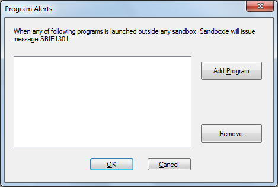
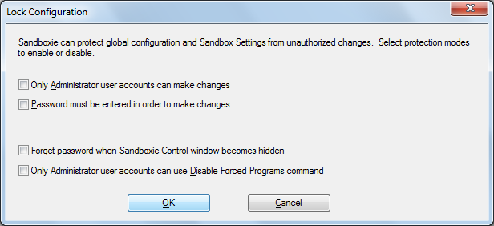

# Configure Menu

[Sandboxie Control](SandboxieControl.md) > Configure Menu

* * *

### Program Alerts

The _Program Alerts_ command opens the following window in which you can configure Sandboxie to issue message [SBIE1301](SBIE1301.md) whenever specific programs start outside any sandbox.

*   Use the _Add Program_ button to open the Program Groups window and select a program to add.

*   For example, _iexplore.exe_ for Internet Explorer, or _firefox.exe_ for Firefox.
*   Alternatively, Internet Explorer is typically found in the folder _C:\Program Files\Internet Explorer_.
*   Mozilla Firefox is typically found in the folder _C:\Program Files\Mozilla Firefox_.

If the desired program is already running sandboxed, you can also use [Program Settings](ProgramSettings.md#page-1) to specify that message [SBIE1301](SBIE1301.md) should be issued for the program.

Related [Sandboxie Ini](SandboxieIni.md) setting: [AlertProcess](AlertProcess.md).

* * *

### Windows Shell Integration

The _Windows Shell Integration_ command opens a window which controls how [Sandboxie Control](SandboxieControl.md) integrates into and associates itself with your Windows desktop. It can also be used to create desktop shortcut icons to run your programs sandboxed. By default, all settings in the window are enabled.

*   The top frame indicates when [Sandboxie Control](SandboxieControl.md) should start:

*   _When Windows starts_ will integrate [Sandboxie Control](SandboxieControl.md) into the startup sequence

*   _When a sandboxed program starts_ will start [Sandboxie Control](SandboxieControl.md) (if it is not already running) when a sandboxed program starts. This applies to programs that are started explicitly through Sandboxie, such as when using the [Run Sandboxed](SandboxMenu.md#sandbox-menu) commands, or shortcuts created using _Add Shortcut Icons_ (see below). It also applies to [forced programs](ProgramStartSettings.md#forced-programs) and [forced folders](ProgramStartSettings.md#forced-folders).

*   The middle frame deals with shortcut icons:

*   _Add desktop shortcut for starting Web browser under Sandboxie_ creates (when checked) or removes (when cleared) the _Sandboxed Web Browser_ shortcut icon on your desktop.

*   _Add Quick Launch shortcut for starting Web browser under Sandboxie_ creates (when checked) or removes (when cleared) the _Sandboxed Web Browser_ shortcut icons on your Quick Launch bar. The Quick Launch bar is typically adjacent to the Windows Start menu button.

*   _Add Shortcut Icons_ creates a shortcut icon on your desktop to run a specific program under the supervision of Sandboxie. The program is selected from the Sandboxie Start menu. Note that if any programs were installed into the sandbox, the Sandboxie Start menu will include the shortcuts created during the installation, and they can be used to create desktop shortcuts. To remove desktop shortcuts created using _Add Shortcut Icons_, simply delete them from your desktop.

*   The bottom frame controls "right-click" shell integration:

*   _Add right-click action "Run Sandboxed" to files and folders_ enables (when checked) or removes (when cleared) the _Run Sandboxed_ option which appears when you click the right mouse button on a file or folder on your desktop or in Windows Explorer.

*   _Add sandboxes as targets for "Send To" action_ enables (when checked) or removes (when cleared) the available sandboxes as an option in the _Send To_ action that appears when you click the right mouse button on a file or folder on your desktop or in Windows Explorer. If this setting is enabled, [Sandboxie Control](SandboxieControl.md) will automatically update the list of _Send To_ targets whenever sandboxes are [created](SandboxMenu.md#create-new-sandbox) or removed.

* * *

### Software Compatibility

The _Software Compatibility_ command opens a window with a list of available compatibility templates.

* * *

### Forget Hidden Messages

Whenever [Sandboxie Control](SandboxieControl.md) displays one or more [SBIE Messages](SBIEMessages.md), you have the option to hide future instances of the message. This is accomplished by highlighting and clicking the _Hide_ command:

Note that messages are filtered by message code alone. For instance, the picture above shows message [SBIE1304](SBIE1304.md) with information detail _osk.exe_. Hiding that message will hide all future instances of message SBIE1304, regardless of the information detail.

The _Forget Hidden Messages_ command tells Sandboxie to stop filtering messages, and resume the display of all SBIExxxx messages that occurs.

* * *

### Tips

When [Sandboxie Control](SandboxieControl.md) displays a warning or notification message box, it usually includes a checkbox labeled _In the future, don't show this message._ If you mark the checkbox, that particular message will not be displayed again.

The _Show All Tips_ command tells Sandboxie to disregard any such use of the checkboxes, and resume displaying of all warnings and notifications.

The _Hide All Tips_ command tells Sandboxie to consider all checkboxes as checked, and not display any warnings or notifications.

* * *

### Lock Configuration

Please see [Configuration Protection](ConfigurationProtection.md).

* * *

### Edit Configuration

Opens the system text editor (typically, _Windows Notepad_) to edit the [Sandboxie Ini](SandboxieIni.md) configuration file. The _Reload Configuration_ command will be automatically invoked when the editor is closed.

Note: Manual editing of Sandboxie.ini is not recommended. You are advised to use [Sandbox Settings](SandboxSettings.md) and other configuration windows in [Sandboxie Control](SandboxieControl.md) to make any changes to the configuration of Sandboxie.

Note: The [Sandboxie Ini](SandboxieIni.md) configuration file is usually located in the _Windows_ folder, and cannot be modified by non-privileged user accounts. If you use Windows with User Account Control (UAC), you may have to elevate to an Administrator account before you can modify Sandboxie.ini.

* * *

### Reload Configuration

Forces Sandboxie to reload its configuration from the [Sandboxie Ini](SandboxieIni.md) configuration file.

* * *

Go to [Sandboxie Control](SandboxieControl.md#menus), [Help Topics](HelpTopics.md).
