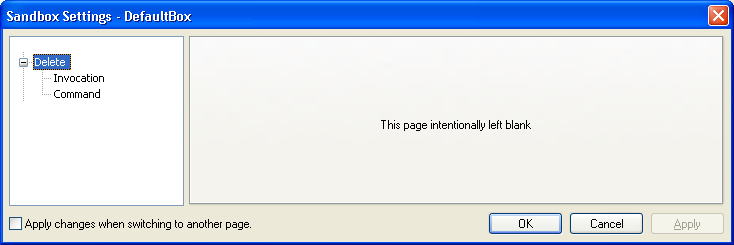
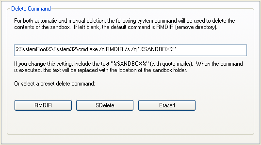

# Delete Settings

This page describes Sandboxie Control / Classic. Its historical **Delete Sandbox** wording refers primarily to deleting stored contents, not removing the sandbox definition. See [Sandbox Deletion and Removal Lifecycle](SandboxRemoval.md) for current SandMan cleanup and removal behavior.

## "Delete" Settings Group

[Sandboxie Control](SandboxieControl.md) > [Sandbox Settings](SandboxSettings.md) > Delete:

Here you configure when and how Sandboxie Control deletes the sandbox's stored contents.

## Invocation

[Sandboxie Control](SandboxieControl.md) > [Sandbox Settings](SandboxSettings.md) > Delete > Invocation:

Use this Classic settings page to indicate when you want the sandbox's contents deleted:

* Deleted only by explicit request: Keep both checkboxes cleared
* Deleted regularly and automatically: Mark the first checkbox
* Never deleted: Mark the second checkbox

Note that while both checkboxes can be cleared, only one checkbox can be marked at any time.

As long as the second checkbox is marked, the normal Classic content-deletion operation is protected, even if you explicitly request it. This is not protection against other programs changing the sandbox's storage. SandMan has separate content and definition protection settings; see [Never Delete](NeverDelete.md).

Related [Sandboxie Ini](SandboxieIni.md) settings: [AutoDelete](AutoDelete.md), [NeverDelete](NeverDelete.md), [DeleteCommand](DeleteCommand.md).

## Command

[Sandboxie Control](SandboxieControl.md) > [Sandbox Settings](SandboxSettings.md) > Delete > Command:

In Sandboxie Control / Classic, use this settings page to specify the system command that deletes the sandbox contents. By default this is a simple RMDIR (remove directory) command. People who are concerned with privacy issues may choose to use secure deletion instead, as described in more detail in [Secure Delete Sandbox](SecureDeleteSandbox.md). SandMan's current cleanup engine does not use this legacy `DeleteCommand`; its separate [`OnBoxDelete`](SandManTriggers.md#onboxdelete) trigger runs before cleanup rather than performing the deletion.

You can use the buttons to select a preset command. The RMDIR button selects the simple RMDIR noted above.

The SDelete button uses [SDelete by SysInternals/Microsoft](https://docs.microsoft.com/en-us/sysinternals/downloads/sdelete) to delete the contents of sandbox. Note that you will need to adjust the path to the command.

The Eraserl button uses [Eraser by Heidi Computers](https://eraser.heidi.ie/) to delete the contents of sandbox.
