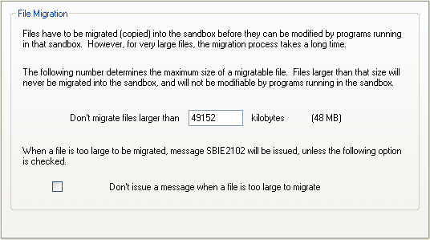

# File Migration Settings

## Sandboxie Plus

SandMan > Sandbox Options > General Options > File Migration

Sandboxie normally lets a sandboxed program read a host file without first copying it. When the program requests an operation that needs to change an existing file, Sandboxie migrates the file into the sandbox and applies the change to that sandbox copy. The host file remains unchanged.

In SandMan, the File Migration page controls the normal size decision and the path rules that can override it.

## Sandboxie Control Classic

[Sandboxie Control](SandboxieControl.md) > [Sandbox Settings](SandboxSettings.md) > File Migration:

Sandboxie Control Classic remains supported. Its File Migration page handles existing migration-size controls such as [CopyLimitKb](CopyLimitKb.md) and [CopyLimitSilent](CopyLimitSilent.md). The newer migration-rule actions documented below describe the current SandMan interface and do not imply equivalent controls in Sandboxie Control Classic.

## Migration rules

The rule list supports four actions:

- **Always copy** ([CopyAlways](CopyAlways.md)) migrates the matching host file with its contents, without applying the normal size threshold.
- **Don't copy** ([DontCopy](DontCopy.md)) prevents content migration. During initial migration, the open is retried without write and delete access, or denied when [CopyBlockDenyWrite](CopyBlockDenyWrite.md) is enabled.
- **Copy empty** ([CopyEmpty](CopyEmpty.md)) creates a zero-length sandbox copy instead of migrating the host contents.
- **Copy newer** ([CopyNewer](CopyNewer.md)) refreshes an existing sandbox copy when the matching host file has a later last-write time.

The first three actions select how an existing regular host file is initially migrated. If their patterns overlap, _DontCopy_ takes priority over _CopyAlways_, which takes priority over _CopyEmpty_. _CopyNewer_ is a separate check for a sandbox copy that already exists. When it initiates a refresh, that migration attempt uses the same evaluator, so applicable migration rules, the size limit, prompt behavior, and related notifications can participate. The other rules do not themselves trigger a refresh.

Rules may be repeated and may be limited to a program. See the dedicated setting pages for syntax, pattern behavior, and open-mode limitations.

## Normal size decision

When no explicit migration rule matches and host contents need to be migrated, Sandboxie compares the host file size with [CopyLimitKb](CopyLimitKb.md). A file strictly smaller than the configured threshold is selected for full-content migration; setting the limit to `-1` disables the size limit. For a file that reaches or exceeds the threshold, SandMan can prompt the user according to [PromptForFileMigration](PromptForFileMigration.md). Approval selects a copy attempt, not guaranteed copy success. If migration is not approved, [CopyBlockDenyWrite](CopyBlockDenyWrite.md) makes the initial migration-dependent open either fail with access denied or retry host access without write and delete rights. That retry can still fail.

If no effective _CopyLimitKb_ value is configured, the runtime consumer falls back to `-1`. SandMan's 80 MiB display fallback and Classic's 48 MiB UI/accessor fallback are different; see [CopyLimitKb](CopyLimitKb.md) for their configuration behavior.

[CopyLimitSilent](CopyLimitSilent.md) controls message [SBIE2102](SBIE2102.md) when the size decision prevents migration and no usable prompt reply is returned; it does not change the decision itself. An explicit negative prompt reply does not emit SBIE2102 through this path. [NotifyNoCopy](NotifyNoCopy.md) separately controls messages SBIE2113, SBIE2114, and SBIE2115 when explicit _CopyEmpty_ or _DontCopy_ modes are selected, including during a _CopyNewer_ refresh.

## Applying changes

The size limit, silent flag, deny-write choice, notification flag, and migration-rule lists are initialized per process. Start new affected sandboxed processes after changing them. _PromptForFileMigration_ is different: after configuration is reloaded, later qualifying decisions in an already-running process can observe its changed value.
