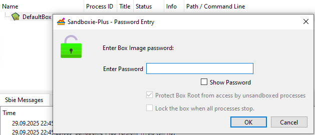

# Force Protection On Mount

_ForceProtectionOnMount_ is a SandMan-consumed per-box setting in [Sandboxie Ini](SandboxieIni.md), introduced in Sandboxie Plus 1.13.4 / Classic 5.68.4. It constrains SandMan's image-mount dialog/workflow to request mounted-root protection for a [file-backed sandbox image](UseFileImage.md).

It is not a service-wide rule enforced for every mount caller.

## Usage

```ini
[DefaultBox]

ForceProtectionOnMount=y
```

SandMan reads the direct box value, with a fallback of `n`. Do not assume that a template or GlobalSettings value controls this workflow.

## When to use

Use this setting when you want SandMan to request mounted-root protection without allowing it to be unchecked in the mount dialog. Protection while mounted is separate from image encryption and is not an absolute host-access guarantee.

## Behavior and UI

Enable **Force protection on mount** under **Sandbox Options > General Options > File Options**. The checkbox is available when the image-backing option is enabled and selected, not for the normal RAM-disk choice.


For the resulting SandMan mount dialog, the setting checks and disables **Protect Box Root from access by unsandboxed processes**. The mount request reaches the service and driver to request protection.



> [!WARNING]
> Requesting protection does not prove successful registration. A mount can succeed even if root-protection registration fails, and the normal mount query does not establish that protection is active.

See [Encrypted Sandboxes](../PlusContent/BoxEncryption.md) for the mounted-access boundary and [Protect Admin Only](ProtectAdminOnly.md) for the session-leader exception.

## Automatic unmount limitation

Do not rely on this setting to force automatic unmount for every SandMan mount. Current caller initialization can overwrite the auto-lock state after the dialog's force state is applied.

SandMan's startup-mount path supplies automatic unmount enabled. The normal manual-mount path supplies it disabled, which can leave **Lock the box when all processes stop.** disabled and unchecked, as shown above. This is a current implementation discrepancy, not a guarantee that automatic unmount is forced.

Automatic unmount itself depends on successful Registry/root release and device cleanup. See [Use File Image](UseFileImage.md#automatic-mounting-and-locking) for that lifecycle.

## Other callers and unmounting

`Start.exe /mount` does not consume `ForceProtectionOnMount`. `/mount_protected` requests root protection explicitly; see [Start Command Line](StartCommandLine.md#mount-box-images).

The setting does not control process termination or unmount success. SandMan's manual unmount action and the underlying service unmount operation have separate behavior, described in [Use File Image](UseFileImage.md#unmounting-box-image).

## Related pages

- [Use File Image](UseFileImage.md)
- [Encrypted Sandboxes](../PlusContent/BoxEncryption.md)
- [Protect Admin Only](ProtectAdminOnly.md)
- [Start Command Line](StartCommandLine.md#mount-box-images)
