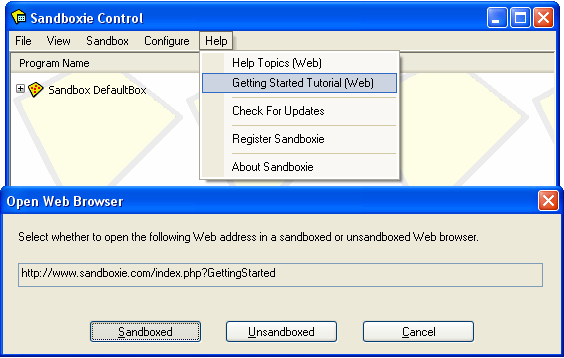

# Getting Started

### Part One: Introduction

Sandboxie runs your applications in an isolated abstraction area called a sandbox. Under the supervision of Sandboxie, an application operates normally and at full speed, but can't effect permanent changes to your computer. Instead, the changes are effected only in the sandbox.

This Getting Started tutorial will show you:

  * How to to use Sandboxie to run your applications
  * How the changes are trapped in the sandbox
  * How to recover important files and documents out of the sandbox
  * How to delete the sandbox

Or skip ahead to [Getting Started Part Six](GettingStartedPartSix.md) which discusses a few final points.

You can also review the [External Tutorials](ExternalTutorials.md) page for more links to tutorials about Sandboxie, some in languages other than English, others are in video form rather than text.

* * *

### Sandboxie Control interface

Sandboxie Classic is operated through the [Sandboxie Control](SandboxieControl.md) program. This program adds the yellow Sandboxie icon to the system notification ("tray") area of your taskbar:

If [Sandboxie Control](SandboxieControl.md) is not already active, you can find it and launch it from the Sandboxie program group in your Windows Start menu:

When active, you can use the Sandboxie tray icon to hide and show the main window of [Sandboxie Control](SandboxieControl.md), by double-clicking the icon. Or, you can right-click the icon and select the first command, which alternates between _Hide Window_ and _Show Window_.

For this tutorial, make sure the main window of [Sandboxie Control](SandboxieControl.md) is visible.

* * *

You should view this tutorial in a sandboxed Web browser. To do that, use the _Getting Started Tutorial (Web)_ command in the [Help Menu](HelpMenu.md) of [Sandboxie Control](SandboxieControl.md), and make sure you tell [Sandboxie Control](SandboxieControl.md) to run your browser **sandboxed**:

The tutorial continues in [Getting Started Part Two](GettingStartedPartTwo.md).
