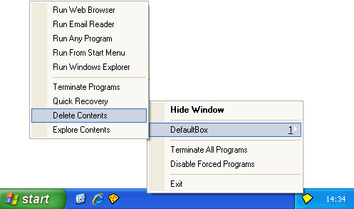

# Getting Started Part Five

### Part Five: Delete Sandbox

When you are finished using the application under Sandboxie, and you have recovered the downloaded files, documents and other desired work items, it is a good idea to delete the contents of the sandbox. Click the **Delete Contents** command in the [Tray Icon Menu](TrayIconMenu.md):

You can also invoke the **Delete Contents** command from the [Sandbox Menu](SandboxMenu.md) in the main window of Sandboxie Control.

* * *

The [Delete Sandbox](DeleteSandbox.md) window appears, giving you one last chance to recover any files still remaining in the sandbox:

The upper part of the window in the picture above was introduced in the last part as the Quick Recovery command. The lower part counts the accumulated size of the contents of the sandbox.

Finally, when you are sure you have recovered everything you need, click _Delete Sandbox_ to delete the sandbox.

Note that regardless of the size of the sandbox, the delete process always takes only a few seconds. This should be considered normal and expected. During this time, the Sandboxie tray icon changes to a red X icon to indicate that sandbox delete is in progress.

* * *

In the default configuration, the sandbox is not deleted automatically, so you will have to manually invoke the **Delete Contents** command whenever you want to delete the contents of the sandbox.

This behavior can be changed by altering a setting. In the main window of [Sandboxie Control](SandboxieControl.md), use the [Sandbox Menu](SandboxMenu.md) to open the [Sandbox Settings](SandboxSettings.md) window:

The [Sandbox Settings](SandboxSettings.md) window appears. Click on _Delete_ to expand the delete settings group, then on _Invocation_ to show the [Delete > Invocation](DeleteSettings.md#invocation) settings page:

Place a checkmark in the box _Automatically delete contents of sandbox_ to have Sandboxie automatically invoke the Delete Sandbox command, as described in the settings page.

* * *

The tutorial concludes in [Getting Started Part Six](GettingStartedPartSix.md).
