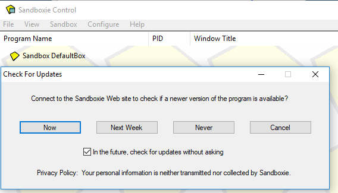

# Help Menu

[Sandboxie Control](SandboxieControl.md) > Help Menu

* * *

### Help Topics (Web)

[Sandboxie Control](SandboxieControl.md) > [Help Menu](HelpMenu.md) > Help Topics (Web)

Opens a web browser on the [Help Topics](HelpTopics.md) page of this online documentation. A window will open to ask if the web browser should run under the supervision of Sandboxie (recommended) or not. See [Getting Stated Tutorial (Web)](HelpMenu.md#getting-started-tutorial-web) below.

* * *

### Getting Started Tutorial (Web)

[Sandboxie Control](SandboxieControl.md) > [Help Menu](HelpMenu.md) > Getting Started Tutorial (Web)

Opens a web browser on the [Getting Started](GettingStarted.md) page of this online documentation. A window will open to ask if the web browser should run under the supervision of Sandboxie (recommended) or not:

* * *

### Check For Updates

[Sandboxie Control](SandboxieControl.md) > [Help Menu](HelpMenu.md) > Check For Updates

This command checks if the Sandboxie web site reports a newer version of Sandboxie than the one installed on the computer.

*   Click the **Now** button to initiate an immediate check.
*   Click the **Next Week** button to postpone the check to a later time.
*   Click the **Never** button to disable automatic check for updates.

* * *

### About Sandboxie

[Sandboxie Control](SandboxieControl.md) > [Help Menu](HelpMenu.md) > About Sandboxie

Displays product ~~and registration~~ information for the Sandboxie program.

* * *

Go to [Sandboxie Control](SandboxieControl.md#menus), [Help Topics](HelpTopics.md).
