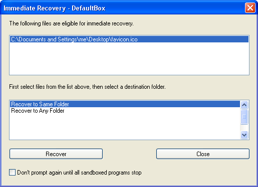

# Immediate Recovery

This page retains the Sandboxie Control / Classic screenshot and workflow. Current Sandboxie Plus uses SandMan for recovery dialogs or notifications; see [File Recovery Architecture](RecoveryArchitecture.md).

Immediate Recovery uses the configured [`RecoverFolder`](RecoverFolder.md) entries, but it is not the same scan as [Quick Recovery](QuickRecovery.md). With [`AutoRecover=y`](AutoRecover.md), SbieDll detects eligible file activity in the sandboxed process and applies [`AutoRecoverIgnore`](AutoRecoverIgnore.md). Quick Recovery separately scans and lists files when invoked.

Quick Recovery is invoked by explicit request, or through the Classic deletion workflow, typically after sandboxed programs have finished running. By contrast, Immediate Recovery's **detection** runs in the sandboxed process. Presentation and the actual move out of the sandbox are handled by the host-side recovery UI. An eligible, non-empty file is reported after relevant file activity, not necessarily at the exact moment it is created.

In the Classic workflow shown above, eligible files appear in the _Immediate Recovery_ window, and further candidates can be collected while it remains open. The upper area shows eligible files, while the lower area lists destination folders. Current SandMan may instead present a notification, depending on its global notification preference; a temporarily suppressed prompt may not appear.

To recover files, select one or more files in the upper area, then select a folder from the lower area, and click _Recover_. (Use the _CTRL_ and _SHIFT_ keys to select multiple files in the upper area).

The lower area initially offers just the special destinations _Recover to Same Folder_ and _Recover to Any Folder_. These work the same as described in [Quick Recovery](QuickRecovery.md). As you use the _Recover to Any Folder_ command, more destinations will be recorded in the lower area for later use.

*   You can disable this feature by clearing the checkbox _Store selected folders for later use_ in the _Browse For Folder_ dialog box that appears when you invoke the _Recover to Any Folder_ command.

In the Classic window, _Immediate Recovery_ prompting can be temporarily disabled until all sandboxed activity stops by marking _Don't prompt again until all sandboxed programs stop_. SandMan has its own presentation preferences under **Global Settings > General Config > Notifications** and **Recovery Options**.

* * *

Go to [Quick Recovery](QuickRecovery.md), [Sandboxie Control](SandboxieControl.md), [Help Topics](HelpTopics.md).
