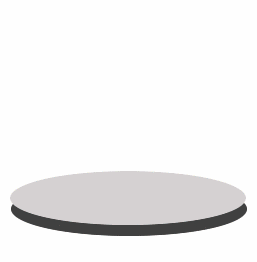

# Paper Analogy

Think of your PC as a piece of paper. Every program you run writes on the paper. When you run your browser, it writes on the paper about every site you visited. And any malware you come across will usually try to write itself into the paper.

Traditional privacy and anti-malware software try to locate and erase any writings they think you wouldn't want on the paper. Most of the times they get it right. But first the makers of these solutions must teach the solution what to look for on the paper, and also how to erase it safely and remove any traces left.

On the other hand, the Sandboxie sandbox works like a transparency layer placed over the paper. Programs write on the transparency layer and to them it looks like the real paper. When you delete the sandbox, it's like removing the transparency layer, the unchanged, real paper is revealed.

(Note: The graphics depicts the [Sandboxie Control](SandboxieControl.md) application prior to version 3.20.)

Thanks to _esalkin_ for the paper metaphor. Thanks to _warwagon_ for the graphics.

* * *

See also the Sandboxie [demonstration](https://www.youtube.com/watch?v=9ZF9c03PN8I) for a different illustration of the same concept.
