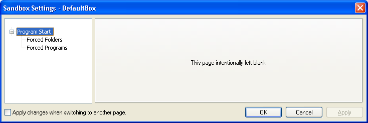

# Program Start Settings

### "Program Start" Settings Group

[Sandboxie Control](SandboxieControl.md) > [Sandbox Settings](SandboxSettings.md) > Program Start:

Settings in this section control which programs will be automatically sandboxed when started outside any sandbox. Put another way, here you select the program which Sandboxie will "force" to run sandboxed.

* * *

### Forced Folders

[Sandboxie Control](SandboxieControl.md) > [Sandbox Settings](SandboxSettings.md) > Program Start > Forced Folders

You may designate some folders for automatic, or forced, sandboxing. This means that if any program from that folder starts unsandboxed, then Sandboxie will automatically force that program to run in the sandbox. Some examples where this is useful:

*   On your "download" folder, where you typically download software from the Internet
*   On your CDROM or DVD drive, so "AutoRun" programs on CDs and DVDs will start sandboxed.
*   If you install several versions of the same program in separate folders, and wish to isolate each version to a separate sandbox.

Use this settings page to select the folders (or drives) to which Forced Folders should apply.

Notes:

*   Forced Folders can be temporarily suspended using the [Disable Forced Programs](FileMenu.md#disable-forced-programs) command.

*   Forced Folders take precedence over [Forced Programs](ProgramStartSettings.md#forced-programs). In other words, when a program matches both a Forced Folders and a Forced Programs setting, the Forced Folder setting will apply, and the Forced Programs setting will be ignored.

Related [Sandboxie Ini](SandboxieIni.md) setting: [ForceFolder](ForceFolder.md).

* * *

### Forced Programs

[Sandboxie Control](SandboxieControl.md) > [Sandbox Settings](SandboxSettings.md) > Program Start > Forced Programs

You may designate some program names for automatic, or forced, sandboxing. This means that if that program starts unsandboxed, then Sandboxie will automatically force that program to run in the sandbox. The most common use for the Forced Programs setting is to set the Web browser to automatically run sandboxed.

Use this settings page to select the programs that will be forced to run in the sandbox. Use the _Add By Name_ button to enter the program name, or the _Add By File_ button to select the program file through folder navigation.

You can also configure this setting in the [Program Settings](ProgramSettings.md) window.

*   On your "download" folder, where you typically download software from the Internet
*   On your CDROM or DVD drive, so "AutoRun" programs on the CD or DVD will start sandboxed.
*   If you install several versions of the same program in separate folders, and wish to isolate each version to a separate sandbox.

Notes:

*   Forced Programs can be temporarily suspended using the [Disable Forced Programs](FileMenu.md#disable-forced-programs) command.

*   [Forced Folders](ProgramStartSettings.md#forced-folders) take precedence over Forced Programs. In other words, when a program matches both a Forced Folders and a Forced Programs setting, the Forced Folder setting will apply, and the Forced Programs setting will be ignored.

Related [Sandboxie Ini](SandboxieIni.md) setting: [ForceProcess](ForceProcess.md).
