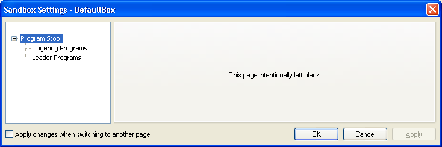
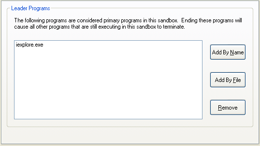

# Program Stop Settings

Sandboxie provides several independent settings for deciding when remaining sandboxed processes should be stopped, restarting processes for compatibility during initialization, and choosing how termination requests are handled. The leader and linger classifications are evaluated inside the sandbox by SandboxieRpcSs; SandMan and Sandboxie Control provide configuration interfaces but do not perform that runtime classification themselves.

## Leader cleanup

[LeaderProcess](LeaderProcess.md) identifies one or more primary executable images. Configured leaders must first have been observed running. After that, Sandboxie requests termination of the remaining processes when none of the configured leader images remains.

Multiple entries behave collectively. If `browser.exe` and `viewer.exe` have both been configured and observed, `browser.exe` exiting does not trigger cleanup while `viewer.exe` is still running. Leader-triggered cleanup bypasses the linger-specific leniency, recent-process grace, and visible-window checks.

```ini
[DefaultBox]
LeaderProcess=browser.exe
LeaderProcess=viewer.exe
```

Names are matched exactly and case-insensitively. The current consumer does not interpret wildcards.

## Linger cleanup

[LingerProcess](LingerProcess.md) identifies helper or background executables that can be cleanup candidates once no ordinary non-lingering process remains. A matching process is not terminated merely because it started or because its name appears in the list. Cleanup is considered only when all remaining relevant processes are classified as lingerers and no applicable exemption prevents it. Sandboxie also treats some of its own helper processes as lingerers internally.

```ini
[DefaultBox]
LingerProcess=helper.exe
LingerProcess=updater.exe
```

Names are matched exactly and case-insensitively; wildcards are not supported by the current consumer.

### LingerLeniency

`LingerLeniency` is a per-box Boolean setting and defaults to `y`. When enabled, it provides three compatibility behaviors:

1. Configured lingerers already active when SandboxieRpcSs initializes are preserved.
2. Configured lingerers explicitly started through the relevant forced or `Start.exe` paths are exempted.
3. Recently started remaining processes receive the current five-second grace check before automatic linger cleanup.

```ini
[DefaultBox]
LingerLeniency=n
```

Setting it to `n` disables these leniency behaviors. The five-second interval is not a configurable duration through this setting. `LingerLeniency` was introduced in Sandboxie Plus 1.0.7 / Classic 5.55.7. Sandboxie Plus 1.13.4 / Classic 5.68.4 expanded the disabled behavior so that `n` also removes the five-second grace check.

### Visible-window exemption

[LingerExemptWnds](LingerExemptWnds.md) defaults to `y`. While automatic linger cleanup is otherwise eligible, it preserves the remaining cleanup candidates if a remaining sandbox process has a visible top-level window. Setting it to `n` removes that exemption. It does not classify a process as a lingerer or initiate termination by itself.

## Process-initialization restart settings

These settings concern compatibility restarts during process initialization. They are not a crash-recovery service and do not relaunch an application after it later exits normally.

### ForceRestart

`ForceRestart` is a repeatable per-box list. When a forced process exactly matches a configured image name, case-insensitively, Sandboxie cleanly restarts it through the current forced-process restart path before normal execution continues. Wildcards are not supported by the current consumer.

```ini
[DefaultBox]
ForceRestart=program.exe
```

There is no dedicated current SandMan list editor for individual `ForceRestart` entries. The setting was introduced in Sandboxie Plus 0.8.0 / Classic 5.50.0.

### ForceRestartAll

`ForceRestartAll` is a per-box Boolean setting, disabled by default. When enabled, the forced-process restart path applies to all forced processes instead of only images listed with `ForceRestart`.

```ini
[DefaultBox]
ForceRestartAll=y
```

SandMan exposes it under **Sandbox Options > Various Options > Compatibility** as **Restart force process before they begin to execute**. The setting metadata lists version 0.8.0; the dedicated UI option was added in Sandboxie Plus 1.14.5 / Classic 5.69.5.

### NoRestartOnPCA

Windows Program Compatibility Assistant can launch a process within a PCA job. For a non-AppContainer process carrying Sandboxie's PCA-job flag, Sandboxie handles the PCA restart path first. This PCA branch takes precedence over the separate forced-process `ForceRestart` / `ForceRestartAll` branch; the forced-process branch is not evaluated for that initialization when the PCA condition matches.

```ini
[DefaultBox]
NoRestartOnPCA=y
```

`NoRestartOnPCA=y` suppresses the normal PCA restart. Because the PCA condition has already selected that branch, suppressing the restart does not fall through to `ForceRestart` or `ForceRestartAll` for the same process initialization. The setting is therefore independent of `ForceRestartAll`, not an alias or subordinate switch for it.

SandMan presents the inverted positive option **Restart forced processes that were launched within a PCA (Program Compatibility Assistant) job object** under **Sandbox Options > Various Options > Compatibility**. The checkbox is selected when `NoRestartOnPCA` is absent or `n`; clearing it stores the negative `NoRestartOnPCA=y` setting. SandMan disables this checkbox while `ForceRestartAll` is selected.

The corrected `NoRestartOnPCA` spelling was documented in Sandboxie Plus 1.11.4 / Classic 5.66.4. The dedicated checkbox was added in Sandboxie Plus 1.16.7.

## Global Terminate All exclusion

`ExcludeFromTerminateAll` is a per-box Boolean setting, disabled by default. SandMan's normal global **Terminate All Processes** operation skips a box configured with:

```ini
[DefaultBox]
ExcludeFromTerminateAll=y
```

This does not prevent ordinary per-box termination, leader or linger cleanup, or every other termination route. SandMan exposes the setting under **Sandbox Options > Various Options > Compatibility** as **Exclude this sandbox from being terminated when "Terminate All Processes" is invoked.** The setting metadata lists version 1.12.0.

The configured global terminate/panic hotkey has a separate repeated-activation override within its one-second counter window: the first activation performs the normal operation, the second rapid activation intentionally performs no termination, and the third and later rapid activations invoke global termination with exclusions bypassed. This behavior belongs specifically to the hotkey; repeatedly clicking the ordinary menu command is not the same mechanism.

## Termination route

`TerminateUsingService` is an effectively global Boolean setting and defaults to `y`. When enabled, Sandboxie first attempts service-assisted process cancellation. If that does not succeed, it falls back to the normal kernel-scheduled termination path. With `TerminateUsingService=n`, the service-assisted attempt is skipped.

```ini
[GlobalSettings]
TerminateUsingService=n
```

This is not a guaranteed graceful shutdown. It selects the normal per-process termination route and is separate from the `TerminateJobObject` behavior described in [Job Objects](JobObjects.md). Leader and linger cleanup ultimately request normal kill-all behavior. The setting metadata lists version 0.8.5, and no dedicated current SandMan editor control was identified.

## When cleanup makes the sandbox empty

Leader or linger cleanup can indirectly lead to an `OnBoxTerminate` event by making the sandbox empty; neither setting directly executes the trigger. Once SandMan observes the normal transition to an empty box, the documented lifecycle can include `OnBoxTerminate`, recovery or [Auto Delete](AutoDelete.md) handling, and `OnBoxDelete` before cleanup where applicable. See [SandMan Triggers](SandManTriggers.md) for the detailed ordering.

## Sandboxie Plus interface

Open **Sandbox Options > Program Control > Stop Behaviour**. The relevant tabs are:

* **Lingering Programs** for `LingerProcess` entries;
* **Leader Programs** for `LeaderProcess` entries;
* **Stop Options**, containing **Don't stop lingering processes with windows** and **Use Linger Leniency**.

The restart and global-termination exclusion controls described above are under **Sandbox Options > Various Options > Compatibility**.

## Sandboxie Control Classic

Sandboxie Control retains its historical **Program Stop** pages:

[Sandboxie Control](SandboxieControl.md) > [Sandbox Settings](SandboxSettings.md) > Program Stop



### Lingering Programs

[Sandboxie Control](SandboxieControl.md) > [Sandbox Settings](SandboxSettings.md) > Program Stop > Lingering Programs


This page configures [LingerProcess](LingerProcess.md). The [Program Settings](ProgramSettings.md#linger) window also provides the historical per-program shortcut.

### Leader Programs

[Sandboxie Control](SandboxieControl.md) > [Sandbox Settings](SandboxSettings.md) > Program Stop > Leader Programs



This page configures [LeaderProcess](LeaderProcess.md). The [Program Settings](ProgramSettings.md#leader) window also provides the historical per-program shortcut.

The shared runtime can consume compatible manual INI settings, but Sandboxie Control Classic should not be assumed to provide dedicated controls for every newer lifecycle option exposed by SandMan.

## Applying changes

The `LeaderProcess` and `LingerProcess` lists are loaded when SandboxieRpcSs initializes. `LingerLeniency` is read both at initialization and during later cleanup checks, while `LingerExemptWnds` is read during cleanup evaluation. Restart or recreate the affected sandbox process tree after changing leader, linger, leniency, or restart policy for predictable behavior.

`ForceRestart`, `ForceRestartAll`, and `NoRestartOnPCA` are read during process initialization. `ExcludeFromTerminateAll` is read when SandMan performs global termination, and `TerminateUsingService` is read for each relevant driver termination request. A service or driver restart is not normally required merely because these settings changed.
