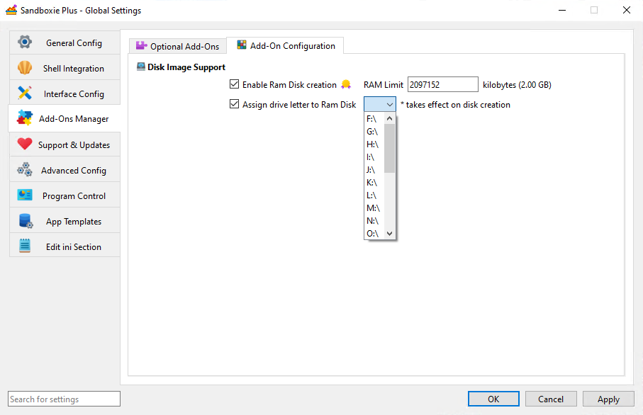

# Ram Disk Size Kb

_RamDiskSizeKb_ is a global setting in [Sandboxie Ini](SandboxieIni.md) (introduced in v1.11.0 / 5.66.0) that specifies the requested capacity, in KiB, of the shared RAM-disk backing used by sandboxes with [UseRamDisk](UseRamDisk.md) enabled. It is not a per-box quota or an immediate allocation of that much physical RAM.

## Usage

To set the `RamDiskSizeKb`, add the following line to the Sandboxie configuration file under the `[GlobalSettings]` section:

```ini
[GlobalSettings]

# Example for a 2 GiB RAM disk
RamDiskSizeKb=2097152
```

## SandMan GUI

The RAM disk size setting can be set through:

1. Open the `Global Settings` window in the SandMan interface.
2. Navigate to `Add-Ons Manager` > `Add-On Configuration` tab.
3. Enable `Enable Ram Disk creation` and enter the capacity in the `RAM Limit` field.

    

When enabled with an empty size field, SandMan suggests `2097152` KiB (2 GiB). This is a UI-suggested value, not the service fallback or an immediate memory reservation. The controls read and write direct global values; effective configuration may also include applicable templates.

## Important Notes

- **Shared Capacity**: RAM-backed boxes use one shared backend. Space consumed by one box reduces available filesystem space there for others; this setting does not configure an independent capacity for each box.

- **Creation Minimum**: New backend creation requires at least `102400` KiB (100 MiB). The service's absent-value fallback is `0`; missing or zero effective values, and values below the threshold, do not proceed to normal new creation. Exactly `102400` passes this minimum check, but does not guarantee successful creation.

- **Capacity versus Memory**: Configured backing capacity, current committed memory, physical residency, and usable NTFS free space are different quantities. Data memory is committed progressively, subject to Windows commit availability. Filesystem and backing overhead also reduce usable space; the configured value is not a promise of that much free file space.

- **Volatile Storage**: Content stored only on the shared backend is lost when that backend is actually destroyed. Preserve wanted data to persistent storage beforehand; a snapshot on the same RAM volume is not a durable independent backup.

- **Drive Letter Assignment**: [RamDiskLetter](RamDiskLetter.md) optionally assigns a visible drive letter when the backend is created.

## Applying changes

The service consults the effective global size when a new shared backend must be created. Changing this setting or reloading configuration does not resize an existing RAM disk. An existing backend can be reused even if the current size setting is missing or zero.

A changed size is used only when the previous shared RAM backend has actually been removed and a later acquisition creates a new one. Closing applications or SandMan, or merely restarting the service, does not guarantee that recreation. Preserve wanted volatile content before backend destruction.

## Performance Considerations

- Monitor system memory resources and shared filesystem free space. Progressive allocation does not eliminate memory-pressure failures.
- Temporary file storage, development workloads, and testing are possible uses. Performance depends on the workload and memory pressure, rather than a universal speed advantage over persistent storage.

## Related Settings

- [UseRamDisk](UseRamDisk.md) - Enables the use of a RAM disk for individual sandboxes.
- [RamDiskLetter](RamDiskLetter.md) - Optionally specifies the drive letter for a newly created RAM disk.
