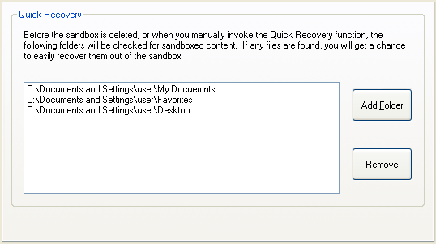

# Recovery Settings

This page shows the Sandboxie Control / Classic recovery settings. For the current SandMan workflow and the distinction between automatic detection, Quick Recovery scanning, and host-side file moves, see [File Recovery Architecture](RecoveryArchitecture.md).

### "Recovery" Settings Group

[Sandboxie Control](SandboxieControl.md) > [Sandbox Settings](SandboxSettings.md) > Recovery:

While you can manually explore the contents of the sandbox and extract the files you need, Sandboxie has a [Quick Recovery](QuickRecovery.md) tool that scans particular folders and informs you if any files are available for recovery out of the sandbox. The Classic Recovery group configures Quick Recovery locations and Immediate Recovery detection.

* * *

### Quick Recovery

[Sandboxie Control](SandboxieControl.md) > [Sandbox Settings](SandboxSettings.md) > Recovery > Quick Recovery:

Use this settings page to add and remove folders that should be scanned by Sandboxie.

You can also influence this setting indirectly:

*   In [Files And Folders View](FilesAndFoldersView.md), by right-clicking on _folder_ items and invoking the actions _Add Folder to Quick Recovery_ or _Remove Folder from Quick Recovery_.

*   In the [Delete Sandbox](DeleteSandbox.md) or [Quick Recovery](QuickRecovery.md) windows, by clicking the _Add Folder_ button.

Related [Sandboxie Ini](SandboxieIni.md) setting: [RecoverFolder](RecoverFolder.md).

* * *

### Immediate Recovery

[Sandboxie Control](SandboxieControl.md) > [Sandbox Settings](SandboxSettings.md) > Recovery > Immediate Recovery:

Quick Recovery scans folders when invoked, including through the Classic deletion workflow. [Immediate Recovery](ImmediateRecovery.md) separately detects eligible files during sandboxed file activity and can notify you about them.

Classic new-box defaults enable this behavior, but it can be disabled. The runtime fallback when `AutoRecover` is absent is disabled; current SandMan's new-box wizard can also explicitly enable it.

It may also be desirable to keep Immediate Recovery enabled, but exclude some file types from Immediate Recovery. For example: You may want to receive Immediate Recovery notifications about document files saved to the (sandboxed) desktop, but not about shortcuts (_.LNK_) files that may be created on the desktop during the installation of sandboxed programs.

Use this settings page to enable or disable the Immediate Recovery extension, and configure exclusions to Immediate Recovery.

Related [Sandboxie Ini](SandboxieIni.md) settings: [AutoRecover](AutoRecover.md), [AutoRecoverIgnore](AutoRecoverIgnore.md).
