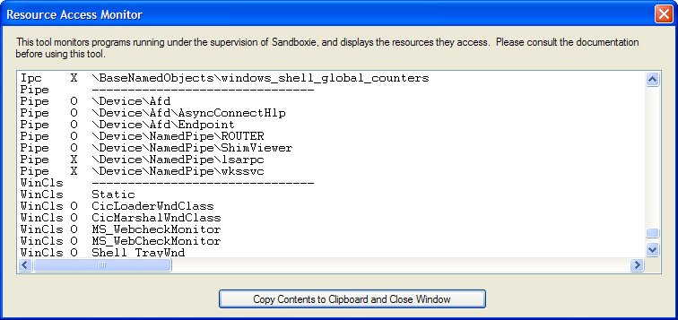

# Resource Access Monitor (for Sandboxie Classic)

The Resource Access Monitor displays system resources accessed by sandboxed programs. It is the Sandboxie Control Classic viewer for the shared monitor used by the [Sandboxie Trace](SandboxieTrace.md) options and can help identify resources involved in compatibility problems.

**Important:** Please consider to use the Resource Access Monitor before opening a new issue.

## Using the Monitor

1\. To activate the monitor, expand or open the [Sandboxie Control](SandboxieControl.md) window, then select **File > Resource Access Monitor**.

2\. You should typically activate the monitor before any programs are running in any sandbox. Note that the Resource Access Monitor window blocks access to the [Sandboxie Control](SandboxieControl.md) main window, including its menu, so you will have to start sandboxed programs through the [Tray Icon Menu](TrayIconMenu.md).

3\. When the monitor is activated and its window appears on the screen, it immediately starts to collect and display resource access information from all sandboxed programs that are running.

4\. At this point, perform any specific tasks that fail when done under the supervision of Sandboxie.

5\. Finally, click **Copy Contents to Clipboard and Close Window**. This copies the collected data into the clipboard and closes the monitor subscription.

6\. You can now paste (Ctrl+V) the collected data somewhere and make it available for analysis.

## Performance impact

The shared monitor buffer and Classic viewer are inactive while the Resource Access Monitor is closed. Explicitly enabled tracing settings can still add diagnostic work independently, even when this viewer is closed. While monitoring is active, overhead depends on event volume and the enabled trace options.

Network administrators can use [MonitorAdminOnly](MonitorAdminOnly.md) to restrict activation of the shared monitor to members of the Administrators group.
