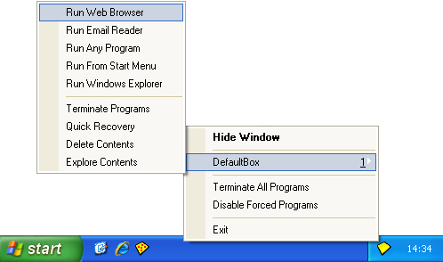

# Tray Icon Menu

To invoke commands from the tray icon menu, right-click the Sandboxie tray icon that appears in your system notification area, typically at the lower-right corner of the screen.

* * *

### Hide Window / Show Window

The first command is _Hide Window_ when the main window of [Sandboxie Control](SandboxieControl.md) is visible. It changes to _Show Window_ when the main window is hidden. This command shows or hides the main window of Sandboxie Control.

* * *

### Sandbox Sub-Menu

One or more sub-menus appear for each sandbox defined. The default configuration includes only one sandbox named _DefaultBox_, but more can be added using the [Sandbox Menu](SandboxMenu.md). Each sub-menu contains the following commands:

*   The _Run Web Browser_ command starts the system (default) Web browser. 
    Same as [Sandbox Menu](SandboxMenu.md) -> _(sandbox)_ -> Run Sandboxed -> Web Browser. 
    (Note: If the wrong program starts, see [Frequently Asked Questions](FrequentlyAskedQuestions.md#why-does-the-wrong-program-start-when-i-run-my-default-web-browser-sandboxed) to fix this.)
*   The _Run Email Reader_ command starts the system (default) email reader. 
    Same as [Sandbox Menu](SandboxMenu.md) -> _(sandbox)_ -> Run Sandboxed -> Email Reader.
*   The _Run Any Program_ command displays the Run Any Program dialog box which is similar to the standard Windows _Run..._ dialog box. It can be used to start programs, open documents, and browse folders, all under the supervision of Sandboxie. 
    Same as [Sandbox Menu](SandboxMenu.md) -> _(sandbox)_ -> Run Sandboxed -> Any Program.
*   The _Run From Start Menu_ command displays the Sandboxie Start menu, similar to the standard Windows Start menu. It can be used to start programs and other shortcuts that appear in the start menu and on the desktop. Note that if any programs were installed into the sandbox, the Sandboxie Start menu will include the shortcuts created during the installation. 
    Same as [Sandbox Menu](SandboxMenu.md) -> _(sandbox)_ -> Run Sandboxed -> From Start Menu.
*   The _Run Windows Explorer_ command starts a sandboxed instance of the Windows Explorer. It can be used to navigate folders and start programs, all under the supervision of Sandboxie. 
    Same as [Sandbox Menu](SandboxMenu.md) -> _(sandbox)_ -> Run Sandboxed -> Windows Explorer.
*   The _Terminate Programs_ command stops all programs running in the sandbox. 
    Same as [Sandbox Menu](SandboxMenu.md) -> _(sandbox)_ -> Terminate Running Programs.
*   The _Quick Recovery_ command shows the [Quick Recovery](QuickRecovery.md) window. 
    Same as [Sandbox Menu](SandboxMenu.md) -> _(sandbox)_ -> Quick Recovery.
*   The _Delete Contents_ command shows the [Delete Sandbox](DeleteSandbox.md) window. 
    Same as [Sandbox Menu](SandboxMenu.md) -> _(sandbox)_ -> Delete Contents.
*   The _Explore Contents_ command opens an _unsandboxed_ folder view for the contents of the sandbox _outside the supervision of Sandboxie_. If possible, use the [Files And Folders View](FilesAndFoldersView.md) to browse the contents of the sandbox. 
    Same as [Sandbox Menu](SandboxMenu.md) -> _(sandbox)_ -> Explore Contents.

* * *

### Terminate All Programs

The _Terminate All Programs_ command stops all programs running in all sandboxes. 
Same as [File Menu](FileMenu.md) -> Terminate All Programs.

See also: [Terminate All Programs](FileMenu.md#terminate-all-programs) in [File Menu](FileMenu.md).

* * *

### Disable Forced Programs

The _Disable Forced Programs_ toggle command temporarily disables and re-enables forced sandboxing. See the associated command in the [File Menu](FileMenu.md). Note that unlike the File Menu command, the tray icon command does not show a dialog box to alter the duration of the command. Instead, forced sandboxing will be suspended for the last duration specified, or the default of 10 seconds. 
Same as [File Menu](FileMenu.md) -> Disable Forced Programs.

See also: [Disable Forced Programs](FileMenu.md#disable-forced-programs) in [File Menu](FileMenu.md).

* * *

### Run As UAC Administrator

The _Run As UAC Administrator_ (not shown in the picture; see [File Menu](FileMenu.md)) toggle command tells Sandboxie to ask for elevation to Administrative privileges before starting any programs. This command is only available on Windows when User Account Control (UAC) is in effect, and the user account is not already elevated. If this command is available in the menu, then it is typically necessary to enable it before installing programs into the sandbox, and it is recommended to disable it when that installation is complete. 
Same as [File Menu](FileMenu.md) -> Run As UAC Administrator.

See also: [Run As UAC Administrator](FileMenu.md#run-as-uac-administrator) in [File Menu](FileMenu.md).

* * *

### Exit

The _Exit_ command quits [Sandboxie Control](SandboxieControl.md). Note that merely closing the window (or selecting the _Hide Window_ command) _does not_ quit Sandboxie Control. 
Same as [File Menu](FileMenu.md) -> Exit.

* * *

Go to [Sandboxie Control](SandboxieControl.md#menus), [Help Topics](HelpTopics.md).
