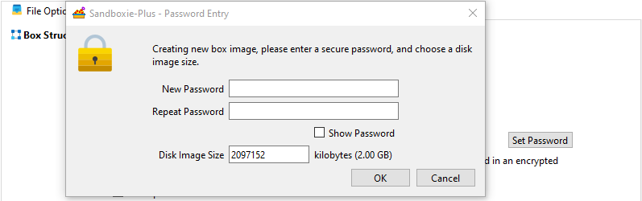
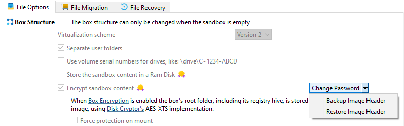
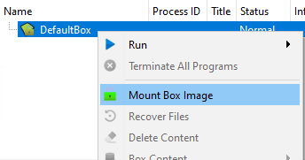

# Use File Image

_UseFileImage_ is a sandbox setting in [Sandboxie Ini](SandboxieIni.md) (introduced in v1.11.0 / 5.66.0) that replaces the standard file system storage with a file-backed virtual disk image as the sandbox root directory.

> [!WARNING]
> Configure this setting on a per-sandbox basis. Applying it globally will force all sandboxes to use file images, which may break existing sandboxes that rely on standard file system storage or cause compatibility issues with non-encrypted sandbox configurations.

> [!NOTE]
> This setting requires an active advanced [supporter certificate](https://sandboxie-plus.com/supporter-certificate/).

## Prerequisites

- Install the **ImDisk Toolkit** via the **Add-Ons Manager > Optional Add-Ons** tab in **Global Settings**.

    

## Usage

```ini
[DefaultBox]

UseFileImage=y
```

When this setting is enabled, the Sandboxie service creates a virtual disk image file with extension `.box`. The image file path is determined by the service[^1] which appends `.box` to the sandbox's file root[^2] path. The sandbox file system is then mounted from this image using the ImDisk virtual disk driver through the mount manager[^3]. All file I/O operations within the sandbox are redirected to the mounted image rather than creating files directly on the host file system.

<!--The image file supports optional encryption using AES, Serpent, or Twofish algorithms with XTS mode.-->Password protection and header backup/restore operations are available through the SandMan GUI or the ImBox command-line utility.

## SandMan GUI

### Setting Password

1. **Right-click** on the sandbox in SandMan > `Sandbox Options`.
2. Navigate to `File Options` tab.
3. Enable the `Encrypt sandbox content`.
4. (Optional) Enable the [`Force protection on mount`](ForceProtectionOnMount.md)
5. Click the `Set Password` button.

    

6. Enter and confirm password in the dialog.

    

### Changing Password

1. **Right-click** on the sandbox in SandMan > `Sandbox Options`.
2. Navigate to `File Options` tab.
3. Click the `Change Password` button.

    

4. Enter current password in the dialog.

    

5. Enter new password and confirm password in the dialog.

### Header Backup

1. In sandbox options `File Options` tab.
2. Click the down arrow next to `Change Password` button.
3. Select `Backup Header` from dropdown menu.

    

4. Choose location to save `.hdr` file.
5. Header is exported using ImBox utility[^4].

### Header Restore

1. In sandbox options `File Options` tab.
2. Click the down arrow next to `Change Password` button.
3. Select `Restore Header` from dropdown menu.

    

4. Select previously saved `.hdr` file.
5. Header is imported using ImBox utility[^4].

### Mounting Box Image

1. **Right-click** on the sandbox in SandMan.
2. Select `Mount Box Image` from the context menu.

    

3. Enter the **password** when prompted.

    
    
    - (Optional) Enable `Protect Box Root from access by unsandboxed processes` to prevent unsandboxed programs from accessing the encrypted sandbox content.
    
    - (Optional) Enable `Lock the box when all processes stop` to automatically unmount the image when the last sandboxed program terminates.

> [!NOTE]
> The image is automatically mounted when starting any program from the sandbox via the UI.

### Unmounting Box Image

1. **Right-click** on the sandbox in SandMan.

    

2. Select `Unmount Box Image` from the context menu.

> [!WARNING]
> Unmounting the image will **terminate all running programs** within the sandbox.

## Best Practices

- Manually close programs before unmounting when possible.
- Ensure no critical processes are running in the sandbox.

## Command Line Operations

- Using `ImBox.exe` for advanced image management:

  ```cmd
  # Backup header
  ImBox.exe type=image image="C:\Sandbox\DefaultBox.box" backup="C:\Sandbox\backup.hdr"
  
  # Restore header  
  ImBox.exe type=image image="C:\Sandbox\DefaultBox.box" restore="C:\Sandbox\backup.hdr"
  ```

- Using [`Start.exe`](StartCommandLine.md) for image [mounting](StartCommandLine.md#mount-box-images)/[unmounting](StartCommandLine.md#unmount-box-images) operations.

Image mounting is handled by the service which verifies driver capabilities before attempting to mount the virtual disk. If the driver does not support encrypted containers or mounting fails, the sandbox will not start and an error is logged.

## Technical Notes

- Requires ImDisk driver support for encrypted image containers.
- Mutually exclusive with [UseRamDisk](UseRamDisk.md).
- Header corruption can render encrypted images unrecoverable - always maintain header backups.
- Maximum image size limited by available disk space and driver constraints.
- Command-line mounting operations handled by `Start.exe` with `mount` and `mount_protected` switches[^5].

[^1]: `MountManager::GetImageFileName` - determines image file path.
[^2]: File root is the base directory where sandbox files are stored, configured via `FileRootPath` setting.
[^3]: `MountManager::AcquireBoxRoot` - handles image mounting process.
[^4]: GUI operations implemented in `COptionsWindow::OnSetPassword`, `COptionsWindow::OnBackupHeader`, and `COptionsWindow::OnRestoreHeader`.
[^5]: Command-line mounting switches implemented in `Sandboxie\apps\start\Start.cpp` - `mount` and `mount_protected` parameters for programmatic image mounting operations.

Related [Sandboxie Ini](SandboxieIni.md), [ForceProtectionOnMount](ForceProtectionOnMount.md), [UseRamDisk](UseRamDisk.md), [FileRootPath](FileRootPath.md), [StartCommandLine](StartCommandLine.md)