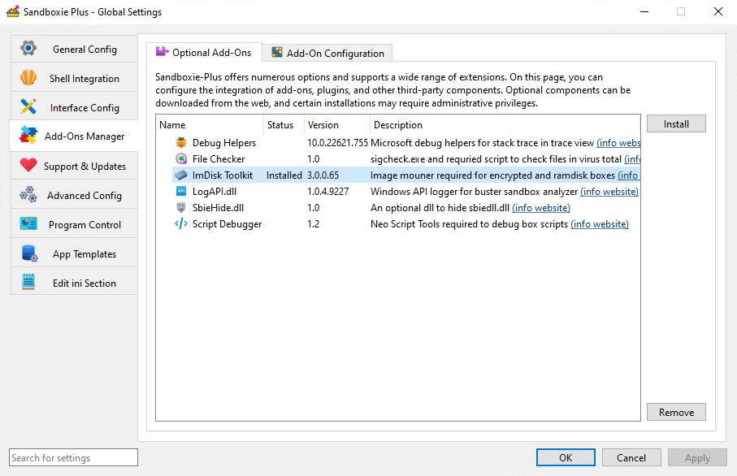
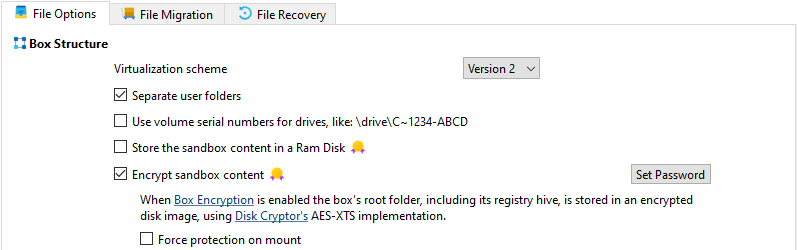
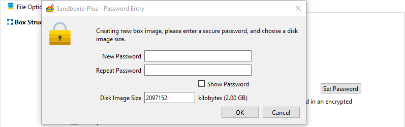
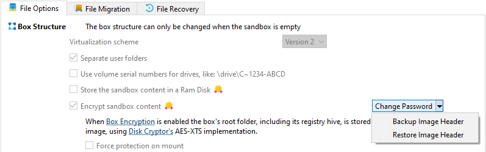
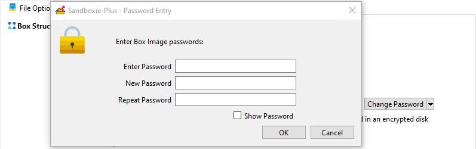
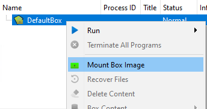
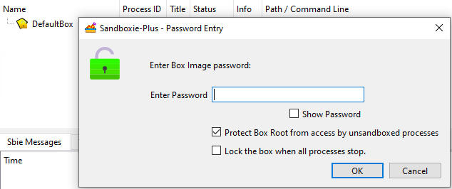
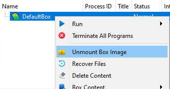

# Use File Image

_UseFileImage_ is a sandbox setting in [Sandboxie Ini](SandboxieIni.md), introduced in Sandboxie Plus 1.11.0 / Classic 5.66.0. It changes the physical backing beneath the sandbox's normal file root. Sandboxie's logical file virtualization remains in place above that storage.

The normal service workflow uses a persistent encrypted `.box` image mounted through ImBox and ImDisk. ImBox provides the image/encryption backing, ImDisk provides the virtual disk, and Sandboxie's service and driver provide integration and mounted-root protection.

> [!NOTE]
> This feature requires a currently applicable active [Support Certificate](https://sandboxie-plus.com/supporter-certificate/) with the encryption feature.

## Prerequisites

Install the **ImDisk Toolkit** through **Global Settings > Add-Ons Manager > Optional Add-Ons**.



The ImDisk device/driver must be available and respond with the expected capability/version. SandMan checks device readiness, not merely whether an installer record exists.

## Configuration

Configure the setting directly in the intended sandbox:

```ini
[DefaultBox]

UseFileImage=y
```

The service reads effective configuration, including applicable templates and global fallback, with a consumer fallback of `n`. SandMan's normal checkbox reads the direct box value instead. Direct per-box configuration is the supported and clearest workflow; an inherited/global value can reach the service even when the checkbox does not represent that effective state. Do not configure image backing globally as a substitute for configuring individual boxes.

Do not configure both `UseFileImage` and [UseRamDisk](UseRamDisk.md). SandMan treats them as alternative storage choices. If both nevertheless become effective, the current service path selects RAM-disk backing rather than reporting a configuration conflict; its entitlement check still observes the image flag.

> [!WARNING]
> The ordinary Options workflow is intended for an empty box. Enabling `UseFileImage` does not copy existing directory-backed files, `RegHive`, or snapshot metadata into an image or convert the old root in place. Disabling it does not extract image contents back into directory storage. Handle existing data separately; transfer/import/export is a different workflow.

## Image path and contents

The service appends `.box` to the resolved [FileRootPath](FileRootPath.md):

```text
Resolved FileRootPath: C:\Sandbox\alice\ExampleBox
Backing image:         C:\Sandbox\alice\ExampleBox.box
Mounted sandbox root:  C:\Sandbox\alice\ExampleBox
```

The `.box` file is a sibling backing file, not a file inside the mounted sandbox directory. The normal root path becomes a junction to `\Sandbox` inside the mounted virtual disk.

```text
Sandboxie logical file virtualization
        |
        v
resolved sandbox FileRootPath
        |
        v
junction to mounted virtual disk \Sandbox
        |
        v
ImDisk proxy device
        |
        v
ImBox encrypted backing
        |
        v
persistent .box file
```

Content stored beneath that root resides inside the image, including normal sandbox files, `RegHive`, `RegPaths.dat`, `FilePaths.dat`, `Snapshots.ini`, and snapshot directories. This does not redirect every file operation into the image: normal resource-access rules, including access to permitted host paths, remain relevant.

`Sandboxie.ini`, external header backups, recovered/exported files, and unrelated service state are not automatically stored inside the image. Changing the root path does not relocate an existing image. See [Sandbox Roots and Volume Layout](SandboxRootsVolumeLayout.md) for root configuration.

## SandMan GUI

### Setting Password

For an empty box with ImDisk ready:

1. **Right-click** the sandbox in SandMan and open **Sandbox Options**.
2. Navigate to **General Options > File Options**.
3. Enable **Encrypt sandbox content**.
4. Optionally enable [**Force protection on mount**](ForceProtectionOnMount.md).
5. Click **Set Password**.

    

6. Enter and confirm the password, and select the image capacity.

    

7. Apply the Sandbox Options changes to request creation.

The standard Sandbox Options creation path expects a password before final creation. However, the low-level service selects the encrypted image implementation even with empty password input; encryption alone does not establish that a meaningful password was chosen.

SandMan supplies the password/capacity to the service, which uses ImBox/ImDisk to create an NTFS virtual disk and then attempts to unmount it. Creation does not itself initialize all sandbox content and is not a transactional operation with guaranteed rollback. Check errors and the resulting image before relying on it.

Image capacity is selected at creation. There is no universal supported maximum established here, and supplying another creation size does not resize an existing non-empty image. Do not treat the creation operation as an overwrite or resize procedure.

### Changing Password

Unmount the image before changing its password.

1. **Right-click** the sandbox and open **Sandbox Options > General Options > File Options**.
2. Click **Change Password**.

    

3. Enter the current password.

    

4. Enter and confirm the new password.

Changing the password updates the image-header encryption/key-protection metadata rather than re-encrypting every payload block. Password/header operations are not documented as transactional. Keep a full backup and verify that the image unlocks with the new password before relying on the change.

The mount password is supplied for the operation; the normal workflow does not provide a reusable password vault or store it in `Sandboxie.ini`. An already-mounted image can be reused without revalidating a supplied password.

### Header Backup

With the image unmounted:

1. Open **Sandbox Options > General Options > File Options**.
2. Click the down arrow next to **Change Password**.
3. Select **Backup Image Header**.

    

4. Choose a location for the `.hdr` file. SandMan invokes the ImBox utility to copy the header.

Copying the header does not require supplying the image password. A header backup is not a full content backup: it contains sensitive encryption/header material needed to interpret the image. Protect it accordingly and maintain a full backup when the content matters.

### Header Restore

With the image unmounted:

1. Open **Sandbox Options > General Options > File Options**.
2. Click the down arrow next to **Change Password**.
3. Select **Restore Image Header**.

    

4. Select a known-good `.hdr` file from the matching image. SandMan invokes ImBox to restore it.

> [!WARNING]
> Restoring overwrites the current image header. A valid older header from the same image can restore older password/key metadata; changing the password does not automatically invalidate all previous matching header backups. Utility completion does not guarantee full recoverability. Image/header damage can prevent access, so retain full backups as well.

### Mounting Box Image

1. **Right-click** the sandbox in SandMan.
2. Select **Mount Box Image**.

    

3. Enter the password and review the mount options.

    

    - **Protect Box Root from access by unsandboxed processes** requests a separate mounted-root access restriction, not encryption.
    - **Lock the box when all processes stop.** requests automatic cleanup/unmount for this mount.

These are mount-instance options. Root protection restricts relevant new filesystem opens to the mounted disk root from unrelated host processes, with exceptions for the owning sandbox, SbieSvc, `csrss.exe`, and an allowed session leader. [ProtectAdminOnly](ProtectAdminOnly.md) controls whether that session-leader exception also requires administrative access.

Previously obtained handles are not universally revoked; kernel-mode and other paths skipped by this check are outside its coverage. Windows filesystem permissions remain separate. Neither all administrators nor all SYSTEM processes receive a blanket exception.

> [!WARNING]
> A mount request can succeed even if root-protection registration fails. Root protection is not a fail-closed condition for successful mounting, and the normal mount query does not reliably establish that protection is active.

See [Encrypted Sandboxes](../PlusContent/BoxEncryption.md) for the security boundaries.

### Automatic mounting and locking

When SandMan starts a program, it can pre-mount the image and prompt for its password before launching. Cancelling or failing that pre-mount prevents that launch path from continuing.

Separately, the service acquires the box root during sandbox process initialization. It can reuse a mounted image or attempt mounting without a universal interactive password prompt. Other startup paths can therefore fail instead of prompting if the image needs a password. Ordinary service acquisition does not create a missing image.

Displaying a box does not mount it, and the service does not eagerly mount every configured image at startup.

When **Lock the box when all processes stop.** is enabled for the current mount, cleanup/unmount is requested after the sandbox Registry/root lifecycle is released. This can follow the last process's exit, but successful hive unload and device cleanup are still required; it is not an immediate process-count guarantee. [ForceProtectionOnMount](ForceProtectionOnMount.md) must not be relied on to enable automatic unmount for every mount.

### Unmounting Box Image

Close programs and save work first.

1. **Right-click** the sandbox in SandMan.

    

2. Select **Unmount Box Image**.

> [!WARNING]
> SandMan's manual unmount action attempts to terminate sandboxed processes before requesting unmount. The underlying unmount API does not terminate processes and can refuse a root still marked in use. Neither termination nor unmount is guaranteed to succeed.

Mounted state belongs to the service/device lifecycle, not only the SandMan window. Closing SandMan does not itself prove the image was unmounted. Service shutdown attempts cleanup, but crashes/power loss are not clean-unmount guarantees. The `.box` file persists after reboot; an unlocked mount and a reusable password are not automatically persisted.

## Snapshots, recovery, and cleanup

[Snapshots](../PlusContent/BoxSnapshots.md) and [recovery](RecoveryArchitecture.md) use the mounted sandbox-root paths. Unmounted image contents are unavailable through those ordinary paths; recovery is not an automatic unlock workflow.

Deleting sandbox contents and deleting the `.box` backing image are different operations. Mounted content cleanup acts on sandbox filesystem contents, not by simply reformatting or removing the backing image.

## Command Line Operations

Advanced header utilities, used with an unmounted image:

```cmd
rem Backup header
ImBox.exe type=image image="C:\Sandbox\DefaultBox.box" backup="C:\Sandbox\backup.hdr"

rem Restore header; this overwrites the current header
ImBox.exe type=image image="C:\Sandbox\DefaultBox.box" restore="C:\Sandbox\backup.hdr"
```

The same backup/restore cautions apply to these commands.

[Start.exe](StartCommandLine.md) provides [mount](StartCommandLine.md#mount-box-images) and [unmount](StartCommandLine.md#unmount-box-images) operations:

```cmd
Start.exe /box:BoxName /key:"Password" /mount
Start.exe /box:BoxName /key:"Password" /mount_protected
Start.exe /box:BoxName /unmount
Start.exe /unmount_all
```

`/box` and `/key` must precede the mount operation. Command-line passwords can be exposed through command history or process inspection; use SandMan's interactive workflow where appropriate.

`/mount_protected` explicitly requests root protection. `/mount` does not consume `ForceProtectionOnMount`, and Start.exe does not provide the equivalent interactive password dialog. Its unmount commands attempt termination, but do not guarantee successful cleanup.

Shared SbieDll/SbieSvc/Start.exe paths exist independently of SandMan. This does not imply equivalent encrypted-image configuration dialogs in Sandboxie Control Classic.

## Failure considerations

Image creation/mounting can fail because prerequisites, credentials, the image/header, or root preparation are unavailable or invalid. If required root acquisition fails, sandbox startup cannot complete. Unmount can fail while the root remains in use. Do not assume rollback or guaranteed recovery from creation/header operations.

## Related pages

- [Sandboxie Ini](SandboxieIni.md)
- [Encrypted Sandboxes](../PlusContent/BoxEncryption.md)
- [Force Protection On Mount](ForceProtectionOnMount.md)
- [Protect Admin Only](ProtectAdminOnly.md)
- [Use RAM Disk](UseRamDisk.md)
- [File Root Path](FileRootPath.md)
- [Sandbox Roots and Volume Layout](SandboxRootsVolumeLayout.md)
- [Start Command Line](StartCommandLine.md)
