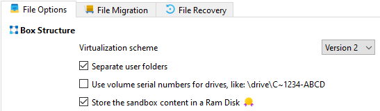

# Use Ram Disk

_UseRamDisk_ is a sandbox setting in [Sandboxie Ini](SandboxieIni.md) (introduced in v1.11.0 / 5.66.0) that changes the physical backing beneath the sandbox's normal file root to a RAM-backed virtual disk. Sandboxie's logical file and Registry virtualization layers remain in place above that storage.

> [!WARNING]
> Configure this setting for the intended sandbox. Applicable templates and `[GlobalSettings]` fallback can also enable it, affecting boxes without a direct override. Do not use a global value as a substitute for choosing backing for individual boxes.

> [!NOTE]
> An applicable active [Support Certificate](https://sandboxie-plus.com/supporter-certificate/) is required.

## Prerequisites

- Install the **ImDisk Toolkit** via the **Add-Ons Manager > Optional Add-Ons** tab in **Global Settings**.

    

- The ImDisk/ImBox runtime components must be operational; an installation record alone does not guarantee that the backing can be acquired.

- Configure [RamDiskSizeKb](RamDiskSizeKb.md) to define the requested shared backing capacity in KiB. Account for both filesystem space and system memory resources needed by the intended workloads.

- (Optional) Use the [RamDiskLetter](RamDiskLetter.md) setting to assign a specific drive letter for easier access to the RAM disk.

## Usage

```ini
[DefaultBox]

UseRamDisk=y
```

The service reads the effective box Boolean with a consumer fallback of `n`. Effective values can come from the box, applicable enabled templates, or `[GlobalSettings]` fallback. SandMan's checkbox reads and writes the direct box value, not every possible inherited effective value.

> [!WARNING]
> The normal SandMan storage selection is intended for an empty box. Enabling RAM backing does not migrate existing directory-backed content, and disabling it does not automatically export RAM-backed content to directory storage. Preserve wanted data separately before changing backing.

Do not configure both `UseRamDisk` and [UseFileImage](UseFileImage.md). SandMan presents them as alternative storage choices. If both nevertheless become effective and a new backing selection is needed, the service selects RAM backing; its certificate check still observes the image flag. An existing usable mount is not universally replaced merely by changing the flags.

## Storage and shared capacity

The service creates or reuses one shared RAM-disk backend through ImBox and ImDisk. For RAM-backed boxes, the service uses a box-name directory on that shared volume, and all such boxes share its filesystem capacity; space consumed by one box reduces the space available there to others. This shared backing is not an additional isolation or access-control boundary.

The normal [FileRootPath](FileRootPath.md) becomes a junction to the box directory on the RAM disk. Root-contained state, including ordinary sandbox files, the sandbox Registry hive, and snapshot state stored beneath that root, uses this backing. Normal resource-access rules can still direct operations to permitted host paths. `Sandboxie.ini`, recovered/exported files outside the root, and other host-side effects are not automatically RAM-backed. See [Sandbox Roots and Volume Layout](SandboxRootsVolumeLayout.md) for root contents and layout.

## Volatility and preserving data

Content stored only on the shared backend is volatile: it is not backed by a persistent RAM image and is lost when that backend is actually destroyed. Do not rely on RAM-only content surviving a normal reboot. Preserve wanted data by recovering or exporting it to persistent storage beforehand. Snapshots on the same RAM volume are not a durable independent backup.

Ordinary process exit, one box closing, a box-root release, a configuration reload, or closing SandMan does not itself establish that the shared backend has been destroyed. Service shutdown attempts cleanup, but restarting the service is not a guarantee of successful destruction or recreation.

## SandMan GUI

The RAM disk setting can be enabled through:

1. Right-click sandbox > `Sandbox Options`.
2. Navigate to `General Options > File Options`.
3. Enable the `Store the sandbox content in a Ram Disk` setting.

    

The control is normally enabled for an empty box when ImDisk is ready. The service's runtime checks remain separate from the checkbox's availability and certificate decoration.

## Memory and failure considerations

RAM-disk capacity is the virtual backing capacity. Memory for data is committed progressively as the backing is populated, rather than allocating the entire configured capacity as permanently resident physical RAM. Windows manages this committed virtual memory; do not assume that paging, page-file use, or host-storage I/O is excluded.

If required RAM backing cannot be acquired during sandbox initialization, an error is logged and that startup path cannot complete; it does not fall back to the ordinary directory root. Later allocation or resource failures are different: do not rely on clean transactional rollback or a predictable application-visible error. Monitor system memory resources as well as free space on the shared volume.

RAM backing is not the persistent encrypted `.box` / user-password workflow provided by [UseFileImage](UseFileImage.md). Its volatility does not guarantee forensic erasure or protection of operating-system artifacts.

## Performance Considerations

- Temporary file workloads and testing are possible uses when persistence is not required.
- Performance depends on the workload and memory pressure; RAM backing is not a guarantee of faster operation or reduced SSD wear.
- The configured capacity is not an immediate physical-memory reservation. Leave sufficient system resources for sandboxed and host applications.

Related [Sandboxie Ini](SandboxieIni.md), [RamDiskSizeKb](RamDiskSizeKb.md), [RamDiskLetter](RamDiskLetter.md), [UseFileImage](UseFileImage.md), [FileRootPath](FileRootPath.md)
