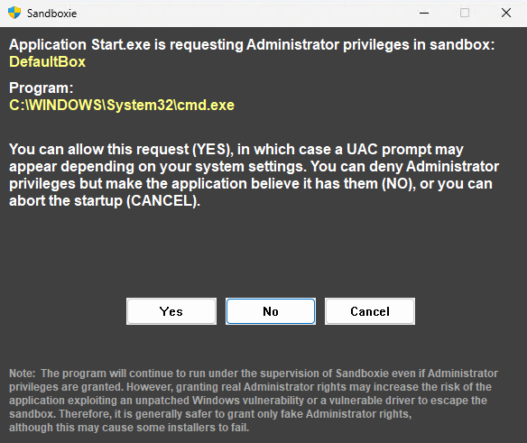

# Use Sandboxie UAC

**UseSandboxieUAC** is a global sandbox setting in [Sandboxie Ini](SandboxieIni.md) available since v1.16.0/5.71.0. Sandboxie intercepts and manages UAC elevation requests from sandboxed applications when enabled.

Usage:

```ini
   .
   .
   .
   [GlobalSettings]
   UseSandboxieUAC=y
```

## Sandboxie UAC Prompt



| Field/Button       | Description                                                                 |
|--------------------|-----------------------------------------------------------------------------|
| **Sandbox**        | The sandbox name where the request originates (e.g., "DefaultBox").         |
| **Program**        | The executable requesting privileges (e.g., "C:\WINDOWS\System32\cmd.exe"). |
| **Note**           | Explains risks of granting real admin rights and recommends fake rights for safety, though some installers may fail. |
| **Yes**            | Grants real Administrator privileges (may trigger a UAC prompt).            |
| **No**             | Grants fake[^1] Administrator privileges (application believes it has them).     |
| **Cancel**         | Denies the request and aborts the program startup.                          |

## Behavior and Configuration

By default, Sandboxie follows the system's UAC configuration - when User Account Control is set to prompt on the secure desktop, Sandboxie's UAC prompts will also appear there. This behavior can be modified using the [PromptOnSecureDesktop](PromptOnSecureDesktop.md) setting to prevent sandboxed applications from displaying elevation prompts on the secure desktop.

## Related Configuration

This setting corresponds to the GUI option in **Sandboxie Plus** under the following path:

**Options** > **Global Settings** > **Advanced Config**: _Use Sandboxie's own enhanced UAC prompt (experimental)_.

[^1]: See [FakeAdminRights](FakeAdminRights.md) for more information.