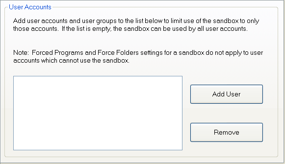

# User Accounts Settings

[Sandboxie Control](SandboxieControl.md) > [Sandbox Settings](SandboxSettings.md) > User Accounts:

This settings page can restrict use of this sandbox to specific user accounts. The _Add User_ button opens a standard Windows user account selection dialog box which can be used to find and select specific user accounts. User account groups may also be specified.

A sandbox that has been restricted to specific users is considered hidden to all other user accounts. Those other user accounts will not see the sandbox listed in [Sandboxie Control](SandboxieControl.md), and [Forced Programs](ProgramStartSettings.md#forced-programs) and [Forced Folders](ProgramStartSettings.md#forced-folders) settings will not apply to those user accounts.

A user account to which any sandboxes are hidden will have the [Reveal Hidden Sandbox](SandboxMenu.md#reveal-hidden-sandbox) command appear in the [Sandbox Menu](SandboxMenu.md) in [Sandboxie Control](SandboxieControl.md).

Related [Sandboxie Ini](SandboxieIni.md) setting: [Enabled](Enabled.md)
