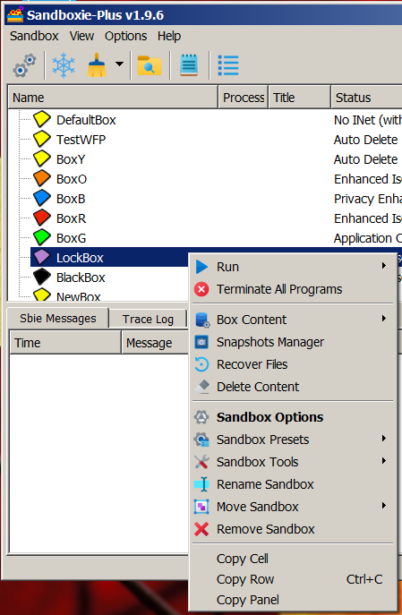
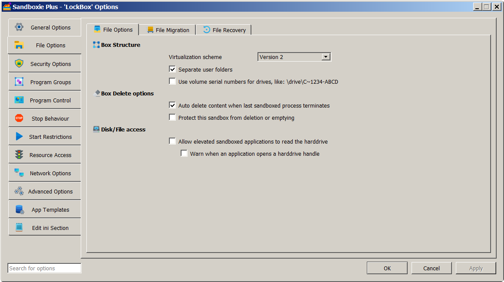

# Box Snapshots (for Sandboxie Plus)

A **snapshot** saves the current state of a sandbox. You can create multiple snapshots of a box at different times and make one of the snapshots the default. To get started, open the Sandman GUI, right-click on the desired sandbox and click 'Snapshots Manager' from the drop-down list. See image below.

- Note that you cannot create a snapshot if the box is empty (an error message is displayed).
- Note that you cannot create a snapshot if there are running processes in the box.

**Caveat:** Snapshots must be created with box AutoDelete disabled. To do so, open the Sandman GUI and double-click on the desired box to bring up the box options window. Then, click on 'File Options' and, under 'Box Delete Options', uncheck the option to AutoDelete content, and press OK (bottom right) to apply any changes. See image below.

**Installing Software to a Box and Creating a Snapshot:**

- Select a box, disable AutoDelete, install the software to this box, set it up just the way you like.
- Then, close the box, create a snapshot and enable box AutoDelete.
- Now, this box will revert to the snapshot you created whenever it is closed.

**Updating Software Installed to a Box:**

- Create a pre-update snapshot (for a baseline you can revert to, if need be).
- Disable box AutoDelete, update the software and test.
- If all is well, create a post-update snapshot, enable box AutoDelete.
- This automatically makes the last (post-update) snapshot the default.
- If there are problems, you can revert to the pre-update snapshot.
- You can always revert to any of the snapshots that you create for a box!

You have the ability to create a snapshot, remove a snapshot, revert to a snapshot or (starting with **Sandboxie Plus v1.0.9**) revert to an empty box while retaining all snapshots.

**Caveat:** It is wise to use the snapshot features only for boxes whose location is on a real disk (and not on a ramdisk).

**Additional Details:**

- Each snapshot is created its own folder, labeled snapshot-n,  where the number n is the snapshot id. You can change this label.
- All snapshot folders for a given box are inside the box folder.
- The snapshot layout and information on the current (default) snapshot are saved in the file **snapshot.ini** in the box folder.
- The **File-System** snapshots are incremental. Files are duplicated only when changed (just as with real files on the host).
- The **Registry** snapshots are NOT incremental. Each snapshot has a full copy and only the most recent reg hive file is used.
