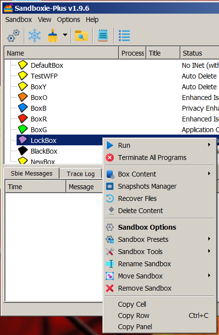
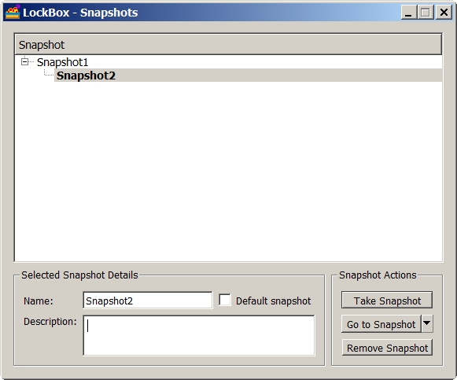
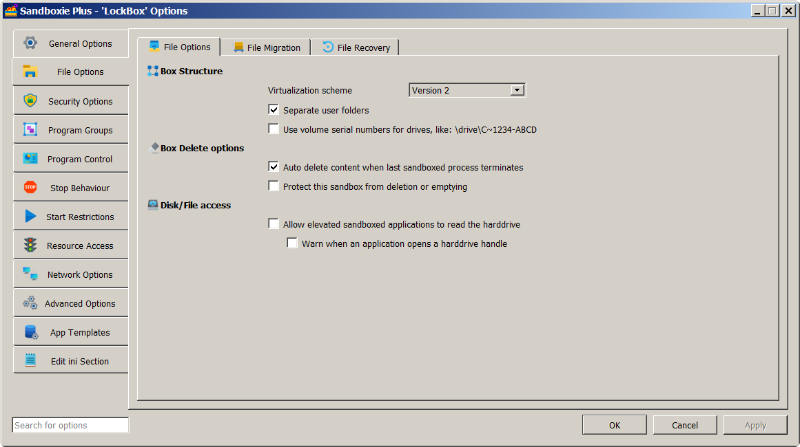

# Box Snapshots

Snapshot management is available through SandMan in Sandboxie Plus. Open **Snapshots Manager** from the sandbox menu to create and manage saved checkpoints of a sandbox. In the advanced menu layout, the command is under **Sandbox Tools > Snapshots Manager**.



Filesystem snapshot data is stored incrementally, while each snapshot contains a full saved registry state. After a snapshot is created or selected, new mutable changes continue in the live sandbox state above the active snapshot.

## Snapshot model

Sandboxie distinguishes between saved snapshots and the current mutable state:

- The **active snapshot** is the saved snapshot on which the live sandbox state is based.
- The **live state** contains mutable changes made after the active snapshot was created or selected. It is not itself a saved snapshot.
- The **default snapshot** is a separately selected cleanup target. It is independent from the active snapshot and does not control ordinary sandbox execution.
- The **empty-box state** has no saved snapshot active. Saved snapshots may still exist while the active state is empty.

The filesystem view is formed from the active snapshot, its parent snapshots, and the current live changes.

## Taking a snapshot

Taking, switching, and removing snapshots require all sandboxed processes in the box to be stopped. **Take Snapshot** also requires the sandbox to contain initialized, non-empty content.

When a snapshot is created:

1. The current live state is saved as a new snapshot.
2. The previously active snapshot becomes the new snapshot's parent.
3. The new snapshot becomes the active snapshot.
4. The default snapshot remains unchanged.
5. A fresh live mutable layer continues above the newly active snapshot.

A newly created snapshot therefore becomes active. The default snapshot is selected separately.



[Auto Delete](../Content/AutoDelete.md) does not technically prevent snapshot creation. However, disabling it can be useful while preparing or updating a sandbox because automatic cleanup may otherwise discard the live changes when the last sandboxed process exits. This is workflow advice, not a requirement of **Take Snapshot**.

## Active and default snapshots

The active and default selections can be different. For example, snapshot B can be active while snapshot A remains the default cleanup target. The active state can also be empty while A remains the default, or B can be active while no default is selected. Both selections can be empty even while saved snapshots remain available.

The active snapshot controls the saved snapshot chain on which current live changes are based. The default snapshot is used only by cleanup behavior that requests the default target.

Select a saved snapshot in Snapshot Manager and use the **Default snapshot** checkbox to set or clear the default. Creating a snapshot does not change this selection.

## Switching snapshots

Use **Go to Snapshot** to make a saved snapshot active. No sandboxed processes may be running. SandMan warns that the current state will be deleted before continuing.

Switching snapshots:

- discards unsaved live changes;
- restores the selected snapshot's saved registry state;
- makes the selected snapshot active;
- keeps both the saved snapshot being left and the selected target snapshot;
- leaves the default snapshot selection unchanged.

Switching snapshots discards the unsaved live state. It does not delete the saved snapshot you are leaving.

## Returning to an empty box

The **Revert to empty box** action clears the live state while retaining the saved snapshots. After the operation, no saved snapshot is active. A saved snapshot can be selected again later.

This empty-box state is different from an empty sandbox that has no saved snapshots. It is also different from the limitation on **Take Snapshot**, which requires initialized content to capture.

## Snapshot hierarchy

Snapshots form a parent/child tree and may branch. For example:

```text
Snapshot A
├── Snapshot B
└── Snapshot C
```

This can occur when A is active, B is created, the user switches back to A, and C is then created. Both B and C have A as their parent.

At runtime, only the chain from the active snapshot through its ancestors contributes to the current filesystem view. Snapshot history is therefore not necessarily linear.

## Removing snapshots

Snapshot removal depends on the selected snapshot's position in the hierarchy:

- A non-active leaf snapshot can be removed directly.
- A snapshot with one child may be merged into that child so the child remains usable.
- A snapshot shared by multiple child branches cannot simply be removed.
- Removing the active snapshot is available only in supported hierarchy cases; saved data may be merged into the current live state.

Removal may merge snapshot data rather than merely delete an internal directory. SandMan asks for confirmation, and all sandboxed processes must be stopped.

If a snapshot is marked as the default, select or clear the desired default separately before removing it when necessary. Do not assume that another snapshot will automatically become the default.

## Automatic and manual cleanup

### AutoDelete

When automatic deletion is enabled, current SandMan versions can be configured to return the sandbox to either the active snapshot state or the selected default snapshot. The choice is under **Sandbox Options > File Options > Box Delete options**.



The active target can represent the empty-box state when no saved snapshot is active. Enabling AutoDelete does not automatically select or change the default snapshot.

### Delete Contents

When saved snapshots exist, manual content deletion can retain or remove them. If snapshots are retained, cleanup returns to the default snapshot; if no default is selected, it returns to the empty-box state.

The deletion dialog can also offer **Also delete all Snapshots**. Selecting that option allows the saved snapshot storage to be removed as part of the full cleanup. See [Delete Sandbox](../Content/DeleteSandbox.md) for the general content-deletion workflow.

### File recovery

[Quick Recovery](../Content/QuickRecovery.md) and [Auto Recover](../Content/AutoRecover.md) recover individual files. Snapshot switching changes the state of the sandbox instead. Switching and removing snapshots use their own confirmations and do not invoke Quick Recovery.

## Snapshot Manager

Snapshot Manager provides these relevant controls:

- **Take Snapshot**;
- **Refresh View**;
- **Go to Snapshot**;
- **Revert to empty box**;
- **Remove Snapshot**;
- editable **Name** and **Description** fields;
- the **Default snapshot** checkbox;
- **Snapshot** and **Creation Time** columns.

Name and Description are editable metadata. There is no separate **Rename Snapshot** action. Changing the displayed name does not rename the internal snapshot storage directory. The active snapshot is emphasized in the snapshot tree, and the selected default is marked as such.

## Storage model and limitations

Snapshot metadata is stored in **Snapshots.ini** under the sandbox storage root. It records the active and default selections, parent relationships, displayed names, descriptions, and creation timestamps.

Saved filesystem layers use internal directories such as `snapshot-<ID>`. These names are implementation details and should not be renamed manually. Snapshot Manager lets you change a snapshot's displayed name without renaming its internal storage directory.

Filesystem snapshot storage is incremental. Snapshot creation saves the current filesystem layer rather than cloning the complete sandbox tree, and the active snapshot chain plus current live state is used to resolve files. The snapshot mechanism should not be understood as a collection of hardlinks, junctions, or symbolic links.

Each snapshot contains a full saved registry state. When snapshots are switched, the selected active snapshot's registry state is restored into the live sandbox. The active snapshot can be an older branch and is not necessarily the most recently created snapshot.

Snapshot durability depends on the underlying sandbox storage remaining available. Snapshot operations may fail if processes are still running, a snapshot no longer exists, data cannot be copied or restored, a shared parent cannot be safely removed, or the sandbox storage cannot be modified. Snapshot operations should not be assumed to provide transactional rollback after storage failures.

## Sandboxie Plus and Classic

Snapshot management is available through SandMan in Sandboxie Plus. Low-level snapshot-aware filesystem support is shared internally, but Sandboxie Control Classic does not provide the Snapshot Manager interface. See the [Feature Comparison](../Content/FeatureComparison.md).

## Related pages

- [Auto Delete](../Content/AutoDelete.md)
- [Delete Sandbox](../Content/DeleteSandbox.md)
- [Quick Recovery](../Content/QuickRecovery.md)
- [Auto Recover](../Content/AutoRecover.md)
- [Feature Comparison](../Content/FeatureComparison.md)
