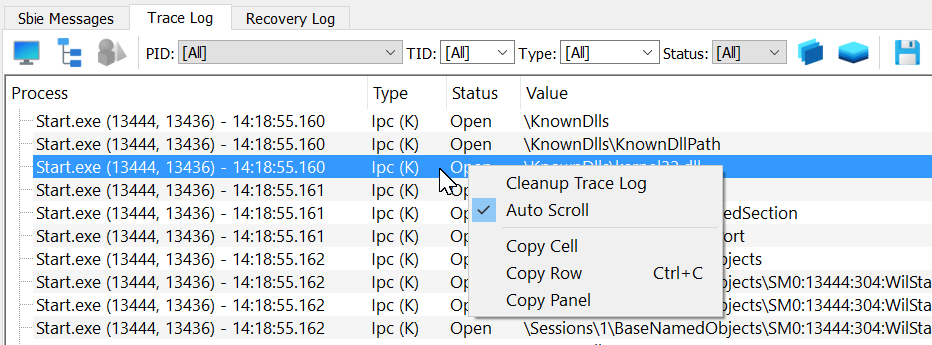

# Trace logging (for Sandboxie Plus)

The Trace Log displays resource access and other diagnostic records from sandboxed programs. It is the Sandboxie Plus viewer for the shared monitor used by the [Sandboxie Trace](../Content/SandboxieTrace.md) options.

**Important:** Please consider to use the Trace Log before opening a new issue.



## Using the Trace Log

1\. Enable the **Trace Log** tab through **View > Trace Logging**.

2\. When the Trace Log tab is activated, it immediately starts to collect and display resource access information from all sandboxed programs that are running.

3\. At this point, perform any specific tasks that fail when done under the supervision of Sandboxie Plus.

4\. Inspect or filter the collected records. Right-click and select **Copy Panel** to copy the data, or use the save action to write a log file.

5\. You can now paste (Ctrl+V) the collected data somewhere and make it available for analysis.

6\. Use Ctrl+F to search for specific entries when needed.

Opening Trace Logging activates the monitor and display pipeline. It does not automatically enable every detailed setting, such as `ApiTrace`, `FileTrace`, `HookTrace`, `DebugTrace`, or `ErrorTrace`. Configure those options separately under **Sandbox Options > Advanced Options > Tracing** or in [Sandboxie Ini](../Content/SandboxieIni.md).

## Stack traces and process information

**Show Stack Trace** controls `MonitorStackTrace`; simply opening Trace Logging does not enable stack capture. Stack information is collected with monitor entries only after the option is active for a newly created monitor buffer. SandMan then resolves symbols asynchronously.

After changing **Show Stack Trace**, stop Trace Logging and start it again for reliable activation or deactivation. Stack capture and symbol resolution add diagnostic cost, and symbol downloads can involve network access.

While integrated Trace Logging is active, SandMan temporarily enables **Keep terminated** and restores the user's saved preference when tracing stops. Retaining process information helps SandMan with process naming and symbol handling; it is not what enables the underlying stack capture.

## Buffer size

`TraceBufferPages` can request a larger shared monitor buffer. For example:

```ini
TraceBufferPages=2560
```

This example does not represent a documented byte or MiB conversion. Stop and restart Trace Logging after changing it. See [Sandboxie Trace](../Content/SandboxieTrace.md#monitor-buffer-size) for current behavior and overflow considerations.

## Performance impact

When Trace Logging is disabled, SandMan does not keep its active monitor buffer. Separately enabled trace settings can still install hooks or add work inside sandboxed processes while the viewer is closed. During active tracing, overhead depends on the selected diagnostics and event volume.

## Version history

> **Sandboxie Plus v0.7.0** added the ability to adjust the monitor buffer with `TraceBufferPages`.
>
> **Sandboxie Plus v0.8.0** adds the ability to disable resource access monitor for selected sandboxes with `DisableResourceMonitor=y`.
>
> **Sandboxie Plus v0.9.8b** adds the ability to save the trace log output into a new .log file (via the floppy disk icon).
>
> **Sandboxie Plus v0.9.8d** adds the ability to select multiple access types at once.
>
> **Sandboxie Plus v1.0.16** adds a monitor mode to the resource access trace.
>
> **Sandboxie Plus v1.9.6** added opt-in stack information for monitor records. SandMan also temporarily enables **Keep terminated** while integrated Trace Logging is active to retain process information used for naming and symbol handling.
>
> **Sandboxie Plus v1.10.1** adds an auto scroll functionality (enabled by default in the monitor mode).
