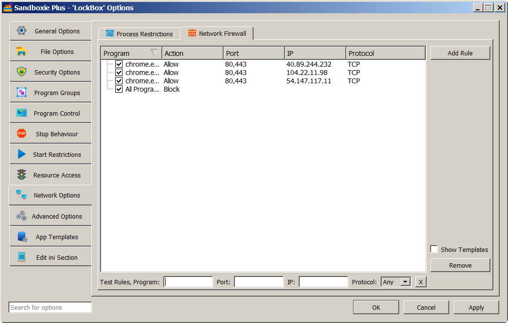

# WFP (Windows Filtering Platform) support

**Sandboxie Plus v0.9.3** introduced a unique approach to manage network connectivity by implementing not only a **kernel mode** (using a driver) "per box" firewall built on Windows Filtering Platform (WFP) but also a **user mode**, outbound rule-based packet filter.

### WFP implementation

To enable WFP functionality, add `NetworkEnableWFP=y` to the [GlobalSettings] section of the configuration file **[Sandboxie Ini](../Content/SandboxieIni.md)** and **reboot the machine or reload the driver** for it to take effect. WFP filtering **works for both inbound and outbound** traffic.

- To enable blocking globally, add `AllowNetworkAccess=n` to the [GlobalSettings] section.
- To enable WFP blocking for a box, such as DefaultBox, add `AllowNetworkAccess=n` to the [DefaultBox] section.
- To exempt blocking for a box, such as DefaultBox, add `AllowNetworkAccess=y` to the [DefaultBox] section.
- To allow a selected program in a box, such as DefaultBox, add `AllowNetworkAccess=program.exe,y` to the [DefaultBox] section.
- To block a selected program in a box, such as DefaultBox, add `AllowNetworkAccess=program.exe,n` to the [DefaultBox] section.

**Limitations of the WFP implementation:** WFP will filter **only** TCP/UDP protocols. The WFP filter rules can be implemented by restricting communication only to **specified IP addresses or selected port numbers** by using a rule based hierarchy based on **"NetworkAccess=..."** (as described later). Restricted boxed processes will still be able to resolve domain names using the system service but will not be able to send or receive data packets directly.

### User Mode Packet Filter implementation

**Sandboxie Plus v0.9.3** also added a fully functional rule-based packet filter in user mode for the case when **NetworkEnableWFP=y** is not set. This mechanism also replaces the primitive **"BlockPort=..."** functionality of older versions.

**Limitations of the user mode filter:**
If WFP support is not enabled, the same rules can still be set and used, but they will be applied only by means of user mode hooks. Unlike the WFP implementation, they will **apply only to outgoing connections** and there are no enforcement guarantees as user mode hooks can be bypassed or disabled by a malicious application.

**Caveat:** For reliable isolation, **the use of kernel mode WFP-based filtering is strongly recommended**.

**The rationale for two filtering modes:**
The rationale for implementing network functionality in both user mode and kernel mode (driver) is twofold. First, it allows for easier debugging of the rule processing code (simpler to debug in user mode) as both modes use the same code to make decisions based on the preset rules.
Second, the WFP callouts are global i.e. they are triggered for any process on the system whether sandboxed or not. In the latter case they don't do anything and the use of a hash map to identify sandboxed programs that require action can provide optimal performance.

**Combining WFP with user mode filtering:**
If you set "block internet access" for a given process and have the driver (for WFP) enabled, you can select for that box which method to apply: using WFP or blocking network devices. Even though the approach of blocking the network device endpoints is more absolute, it has been known to cause some applications to crash.

### WFP and multiple firewalls

Commercially available firewalls implement the Windows Filtering Platform (WFP) by installing a **provider** of filter rules. Some use the standard Windows Firewall's provider, while others create their own. Some use WFP at the user mode level (no drivers), while others use WFP in kernel mode (based on their own driver). If several firewalls are installed and active at the same time, each driver installs its own callout functions at the positions in the network stack it wants to control and all those functions are then called by the kernel for ALL the drivers (providers). This results in an amalgamation of rules set by each firewall. An inbuilt arbitration mechanism in WFP then decides which rules take precedence. Some firewalls recommend turning off the native Windows firewall in order to work effectively, while others can work even with the Windows firewall active. Users who have found a firewall they like are typically very reluctant to switch.

**Does Sandboxie Plus conflict with other firewalls?** Another firewall installed on a system (including the Windows firewall) does not conflict with Sandboxie Plus and can be used to block programs (sandboxed or not), but its rules are typically global and based on absolute program paths. The WFP implementation in Sandboxie Plus, on the other hand, offers the added advantage of "per box" rules which affect only processes within a given sandbox (without specifying program paths). For example, Box1 may allow network access for Program1, while in Box2 the same Program1 may be blocked or even allowed but with a different set of rules for network access.

### Implementing network access rules in Sandboxie Plus

The Sandman UI provides us with a method for editing and testing network rules. Right-click on a box and select "Sandbox Options" from the drop-down menu (or simply double-click on a box) to bring up the Box Options UI. Then click on Network Options in the left panel and select the Network Firewall tab. The Test Rules row appears at the bottom, below the rule list (which may or may not be already populated). One can enter program name, port number, IP address and protocol to see which rules are in play and which rule will be applied in the end. The choice of blocking (using WFP or by denying access to network devices) is selected in the Process Restrictions tab.

The **attributes** at our disposal (with some examples of syntax) are:

- **Action** = `Allow` | `Block` (selected from the Network Restrictions tab)
- **Program** = `program.exe`
- **Port** = `80,443,1000-2000`
- **Address** = `111.222.333.444,0.0.0.0-255.255.255.255`
- **Protocol** = `TCP` | `UDP`

The following **rules precedence** scheme determines rule hierarchy:

1. A rule for a specified program trumps a rule for all programs except a given one, trumps rules for all programs.
2. A rule with a Port number or IP address trumps a rule without:

    - 2a. A rule with an IP address and Port number trumps a rule with an IP address only or Port number only.
    - 2b. A rule with one IP address trumps a rule with an IP address range that is besides that on the same level.

3. Block rules trump Allow rules.
4. A rule without a Protocol means all protocols.

    - 4a. A rule with a Protocol trumps a rule without, if it is the only difference.

**Some examples:**

- `NetworkAccess=*,Block;Port=80,443` - block rule for selected port numbers 
  `NetworkAccess=*,Block;Port=80,443;Protocol=TCP` - block rule for all TCP connections 
  `NetworkAccess=*,Block;Port=80,443;Address=0.0.0.0-255.255.255.255` - block rule to deny network access

- `NetworkAccess=*,Allow;Port=80,443;Address=111.222.333.444` - allow any program to access this IP address 
  `NetworkAccess=chrome.exe,Allow;Port=80,443` - allow chrome.exe to access any IP address 
  `NetworkAccess=chrome.exe,Allow;Port=80,443;Address=111.222.333.444` - allow chrome.exe to access one IP address

**BlockPorts template:**

- `NetworkAccess=*,Block;Port=137,138,139,445` - enabled by default since version [1.3.4 / 5.58.4](https://github.com/sandboxie-plus/Sandboxie/commit/4420ba4448a797b7369917058c34e8a78c2ec9fc)
