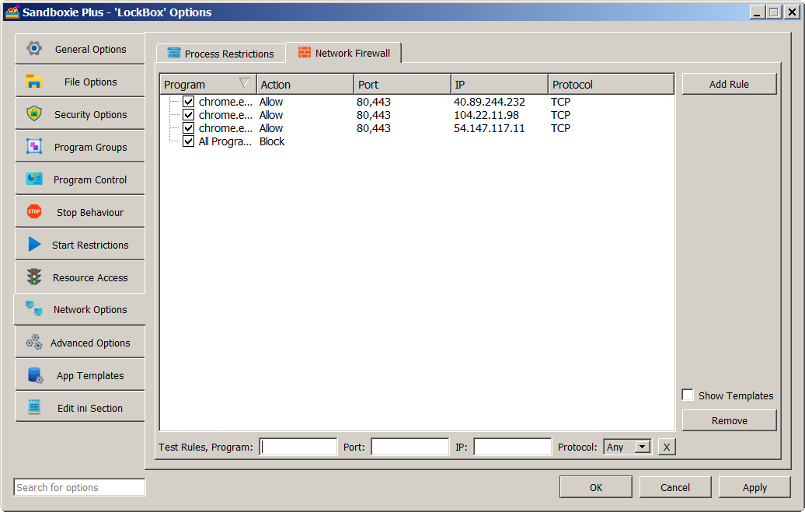

# WFP (Windows Filtering Platform) Support

Sandboxie can enforce network policy through Windows Filtering Platform (WFP) callouts in its driver. Without WFP, its SbieDll user-mode Winsock hooks can apply the same [NetworkAccess rules](../Content/NetworkAccess.md) to supported paths. WFP provides a stronger enforcement boundary against code that bypasses user-mode hooks, while other Sandboxie and Windows network controls remain separate.

## Enabling WFP

Enable the global WFP component in [Sandboxie.ini](../Content/SandboxieIni.md):

```ini
[GlobalSettings]
NetworkEnableWFP=y
```

The default is `n`. Sandboxie's WFP callouts are registered globally, rather than once per box. The driver maps traffic back to tracked sandboxed processes and applies the appropriate sandbox policy where applicable.

Current builds can load or unload the WFP component during configuration reconfiguration, so a Windows reboot or driver reload is not required solely to toggle `NetworkEnableWFP`. Restart affected sandboxed processes after changing this global mode so their SbieDll network path is initialized consistently for either WFP or user-mode filtering. Do not assume already-running processes automatically switch enforcement paths completely.

## WFP enforcement path

Sandboxie registers IPv4 and IPv6 callouts at WFP's `ALE_AUTH_CONNECT` and `ALE_AUTH_RECV_ACCEPT` authorization layers. For tracked sandboxed processes, this provides an outbound connection policy path and an inbound receive/accept policy path. The user-mode filter described below is primarily an outbound rule path and should not be treated as having the same inbound coverage.

WFP process state includes blanket Internet blocking, separate loopback blocking, and the process's `NetworkAccess` rules. The shared rule parser recognizes `Any`, `TCP`, `UDP`, and `ICMP`, and WFP passes the traffic protocol to that comparator. Actual coverage still depends on the Windows filtering layer and traffic type; this is not a guarantee for every raw or ICMP/ICMPv6 path. `Protocol=ICMPv6` is not a defined rule keyword.

## NetworkAccess rules

`NetworkAccess` supplies program, address, port, protocol, and Allow/Block rules to the shared engine used by WFP and the supported user-mode paths. A rule set with no matching rule permits traffic. To deny by default using this rule engine, add a broad applicable Block rule and then suitable narrower Allow rules.

The [Network Access](../Content/NetworkAccess.md) page documents its syntax and exact comparison order. `Block` does not universally override every `Allow`; process and endpoint specificity are compared first. A template-provided example is:

```ini
NetworkAccess=*,Block;Port=137,138,139,445
```

This is a `NetworkAccess` rule contributed by the `BlockPorts` template, not the removed legacy `BlockPort=` setting.

## AllowNetworkAccess

`AllowNetworkAccess` is a separate image-aware Boolean access gate:

```ini
AllowNetworkAccess=y
AllowNetworkAccess=n
AllowNetworkAccess=program.exe,y
AllowNetworkAccess=program.exe,n
```

It can also be supplied globally and overridden where applicable:

```ini
[GlobalSettings]
AllowNetworkAccess=n
```

Under WFP, a tracked process without a runtime Internet-access exemption gets a blanket BlockInternet state when its effective `AllowNetworkAccess` value is `n`. That blanket state is applied instead of evaluating its normal `NetworkAccess` rule list. Thus `AllowNetworkAccess=n` is not equivalent to `NetworkAccess=*,Block`, and a `NetworkAccess=program.exe,Allow` rule does not necessarily lift it. An applicable `AllowNetworkAccess=...,y` choice or runtime exemption is the relevant way to avoid the blanket gate.

SandMan may generate process-group configuration for its Internet Access choices. Interactive decisions described in [Prompt For Internet Access](../Content/PromptForInternetAccess.md) can grant a process-instance runtime exception; that approval is not a persistent `NetworkAccess` rule.

## User-mode filtering

When WFP is not handling filtering, SbieDll loads the same `NetworkAccess` rules and applies them through intercepted Winsock operations, including important outbound TCP connection and UDP send paths. This user-mode mechanism can be bypassed by code that avoids or removes its hooks. It does not promise coverage of every networking API, raw packet path, or ICMP operation.

## WFP and network-device blocking

SandMan's Internet Access choice can offer **Allow access**, **Block using Windows Filtering Platform**, and **Block by denying access to Network devices** when WFP is available. Device blocking uses resource/device access restrictions. It is separate from WFP callouts and from `NetworkAccess` rule selection; enabling WFP does not remove those other restrictions.

WFP also tracks [BlockLocalLoop](../Content/BlockLocalLoop.md) independently. A loopback block can deny loopback traffic even if an ordinary `NetworkAccess` Allow rule would otherwise match.

## SandMan

The rule editor is at **Sandbox Options > Network Options > Network Firewall**. It provides Program, Action, Protocol, IP/Address, and Port fields. Its protocol test selector includes `Any`, `TCP`, `UDP`, and `ICMP`. The test controls evaluate which configured rule wins for a candidate program and endpoint; they do not perform network I/O.



## Applying changes and failures

`NetworkEnableWFP` was introduced in Sandboxie Plus 0.9.0a; `AllowNetworkAccess` was also introduced in 0.9.0a. `NetworkAccess` and WFP rule state can be rebuilt for existing tracked WFP processes through Sandboxie's configuration update path, so not every rule edit requires a process restart. Changing `NetworkEnableWFP` itself switches the enforcement architecture; restart affected sandboxed applications to rebuild the SbieDll-side mode consistently. A reboot is not normally required.

If WFP rule loading fails while rebuilding a process's rule set, Sandboxie can set a more restrictive blanket Internet block for that process rather than allowing traffic by default. Required WFP initialization failures can also prevent normal process setup or filtering. This does not establish a fail-closed guarantee for every possible WFP failure.

## Other firewalls

Sandboxie's WFP callouts can coexist with Windows Firewall and other WFP consumers. Final effective behavior also depends on other installed filters, their layers and weights, and Windows Filtering Platform arbitration. Compatibility with every third-party firewall cannot be guaranteed.

## Related pages

- [Network Access](../Content/NetworkAccess.md)
- [Block Local Loop](../Content/BlockLocalLoop.md)
- [Prompt For Internet Access](../Content/PromptForInternetAccess.md)
- [Proxy Support](ProxySupport.md)
