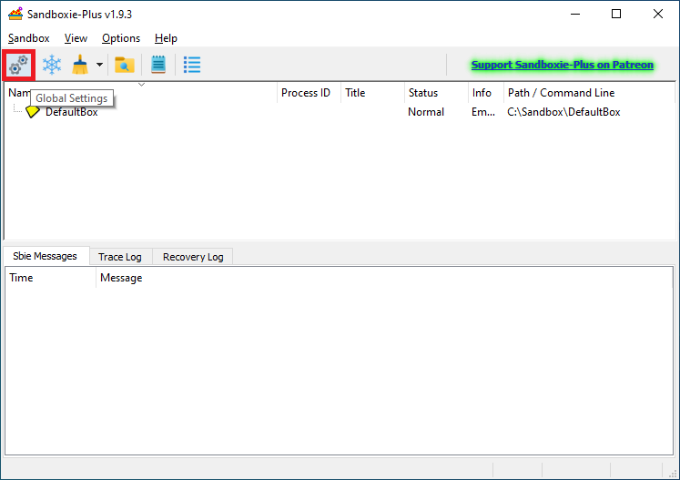
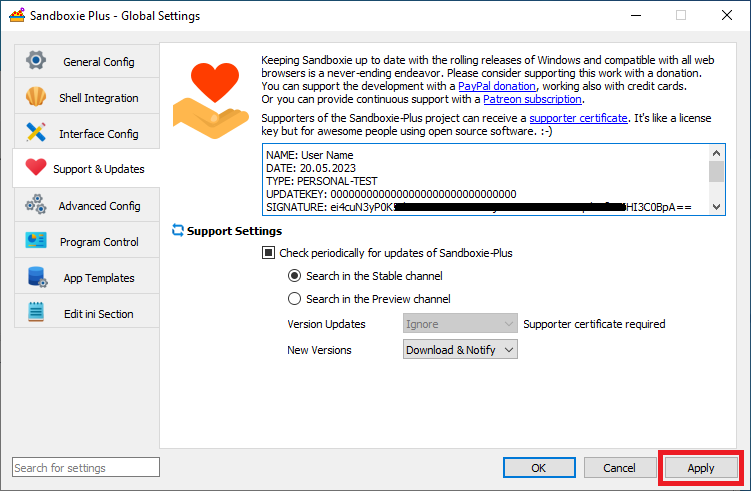
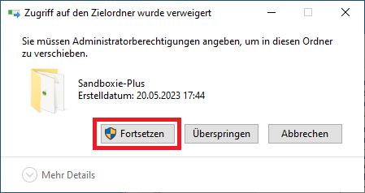

# Applying a Supporter Certificate using the Modern SandMan UI

To apply a supporter certificate, please start Sandboxie Plus and open the global settings:

In the global options, please go to the "Support & Updates" page:

Enter your entire certificate starting with `NAME:` up to and including the last two equal signs `==`, then press Apply (or OK):

Then you will be prompted to grant administrative privileges, you will need to allow them for the certificate to be installed:

Depending on your OS preset, you may also need to confirm an UAC prompt:

Once the certificate is accepted, the entry field should become green:

And a notification popup window should appear.
