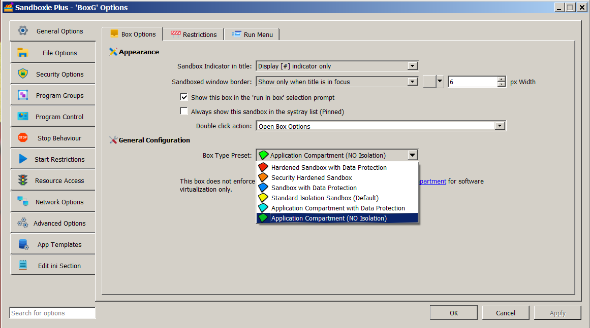

# Application Compartment

> [!NOTE]
> This feature requires a [supporter certificate](https://sandboxie-plus.com/supporter-certificate/).

Application Compartment was introduced in Sandboxie Plus 1.0.0. It favors application compatibility by bypassing several security-isolation mechanisms used by a standard sandbox while retaining selected Sandboxie virtualization and policy mechanisms.

> [!WARNING]
> Application Compartment materially reduces isolation and should be used only for trusted applications with compatibility requirements. It is not equivalent to running without Sandboxie, but file and registry virtualization alone should not be treated as a security boundary.

## Configuration

The primary box setting is:

```ini
[DefaultBox]
NoSecurityIsolation=y
```

In SandMan, select the **Application Compartment** box type under **Sandbox Options > General Options**. The New Box Wizard calls the corresponding preset **Application Compartment Box**. The status column normally identifies the resulting box as **Application Compartment**.

If the configuration also opens an entire resource root, for example with `OpenFilePath=*`, SandMan displays **OPEN Root Access** instead. This status warning takes display precedence over **Application Compartment**; it does not change the configured box type or disable `NoSecurityIsolation`.

The underlying advanced control is under **Sandbox Options > Security Options > Security Isolation** and is labeled **Disable Security Isolation**.



## Security and compatibility model

Application Compartment bypasses Sandboxie's normal restricted-primary-token replacement and normal impersonation-token filtering paths. It also excludes processes from Sandboxie's normal root Job Object assignment and relaxes several security-oriented path-policy defaults.

Application Compartment does not itself elevate a process. Instead, it bypasses Sandboxie's normal restricted-token replacement, so the process can retain the security context with which it was launched. An unelevated process remains unelevated, while a process deliberately launched elevated can retain that elevated context.

File-system and registry virtualization can remain active. File, registry-key, and kernel-object driver filtering also remain separate and are not disabled merely by selecting Application Compartment. Configured resource, network, IPC, and GUI rules can continue to apply.

For the detailed behavior and limitations, see [No Security Isolation](../Content/NoSecurityIsolation.md).

## Optional filtering relaxation

For additional compatibility, an Application Compartment can use:

```ini
NoSecurityFiltering=y
```

This setting disables Sandboxie's driver-level file, registry-key, and kernel-object filters while Application Compartment is active. It does not literally disable every Sandboxie hook, service, rule, or virtualization mechanism. See [No Security Filtering](../Content/NoSecurityFiltering.md).

In SandMan, the checkbox **Disable Security Filtering (not recommended)** appears on the same **Security Isolation** page and is enabled only when **Disable Security Isolation** is selected.

## Path and namespace handling

Sandboxie loads built-in `TemplateAppCPaths` rules for Application Compartment processes. Since Sandboxie Plus 1.8.0, the built-in path rules for this mode are maintained in that dedicated template. These rules provide box-type-specific path policy; they do not disable all resource isolation.

Normal NT directory-object namespace isolation remains a separate setting. Advanced Application Compartment configurations can instead use `UseAlternateIpcNaming=y`, which gives Sandboxie-redirected named kernel objects a sandbox-specific name suffix rather than using the normal separate directory-object namespace. This does not rename every IPC mechanism. See [NT Namespace Isolation](../Content/NtNamespaceIsolation.md#alternate-ipc-naming).

## Job Object limits

Application Compartment processes are not assigned to Sandboxie's normal root Job Object. Box-level process, memory, and CPU limits implemented through that Job Object therefore do not apply in the usual way. See [Job Objects](../Content/JobObjects.md).

## Version history

- **Sandboxie Plus 1.0.0 / Classic 5.55.0:** introduced Application Compartment through `NoSecurityIsolation=y`, together with the optional `NoSecurityFiltering` compatibility setting.
- **Sandboxie Plus 1.8.0:** moved the built-in Application Compartment access rules into `TemplateAppCPaths`.
- **Sandboxie Plus 1.17.0 / Classic 5.72.0:** added `UseAlternateIpcNaming` for alternate named-object handling in Application Compartment boxes.

## Related pages

- [No Security Isolation](../Content/NoSecurityIsolation.md)
- [No Security Filtering](../Content/NoSecurityFiltering.md)
- [NT Namespace Isolation](../Content/NtNamespaceIsolation.md)
- [Job Objects](../Content/JobObjects.md)
- [Sandboxie Ini](../Content/SandboxieIni.md)
