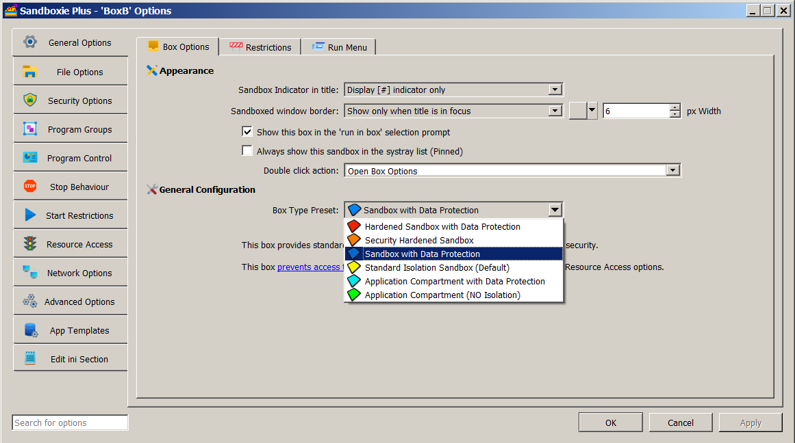

# Privacy Mode

**NOTE: This feature requires a [supporter certificate](https://sandboxie-plus.com/supporter-certificate/).**

The concept of privacy mode and privacy enhanced (or Data Protection) boxes was introduced in **Sandboxie Plus v1.0.0**.
In this mode, most of the locations on a PC are set to be treated like a Write[File/Key]Path, which means the sandboxed locations are writable, but the unsandboxed locations are not readable.
In addition, the registry does not allow reading of user root keys. In other words, even though sandboxed processes can continue to work, they cannot access private user data.

The setting for a privacy enhanced box can be enabled by adding `UsePrivacyMode=y` to the box settings section of **[Sandboxie Ini](../Content/SandboxieIni.md)**. It can also be enabled in the Sandman UI. Right-click on a box and select "Sandbox Options" from the drop-down menu (or simply double-click on a box) to bring up the Box Options UI. Select the box type preset as "Sandbox with Data Protection" (with a **blue** box icon) and click OK to apply changes. The status column of Sandman UI labels this box as **Privacy Enhanced**.

**What is User Space?** AppGuard refers to [user space](https://malwaretips.com/threads/run-by-smartscreen-utility.65145/post-561364) as "computer storage space that is typically accessible by non-admin Windows users. It contains the user's profile directory (which includes the My Documents folder and Desktop), removable storage devices, network shares, and all non-system hard drives such as additional external and internal disk drives." Think of "user space" as everything outside the **system** (where the core operating system and programs live), in other words, outside the `C:\Windows`, `C:\Program Files`, and `C:\Program Files (x86)` folders!

Internally, a privacy enhanced box is based on three defaults:

1. **Allow read access to system resources:**

    - `C:\Windows`
    - `C:\Program Files`
    - `C:\Program Files (x86)`
    - `C:\ProgramData\Microsoft` (since **Sandboxie Plus v1.12.7**)
    - Registry resources under HKLM (but not HKCU) are readable and can be sandboxed.
    - **Note:** The read access provides a good balance between privacy and convenience. One could, of course, drill down to identify selected system resources that may leak private data and further restrict them (using `Write[File/Key]Path`) if desired.

2. **Hide (and block access to) user space:**

    - In user space, a privacy box works in **default block** mode: all drive paths are set to WriteFilePath. This hides all files and folders outside the sandbox, but allows new files and folders to be created in the sandbox (unless specifically allowed by an overriding rule). Access to selected paths is enabled by invoking [Rule Specificity](../PlusContent/RuleSpecificity.md).

3. **Enable [Rule Specificity:](../PlusContent/RuleSpecificity.md)**

    - Internally, rule specificity is **always enabled** in privacy mode. It uses the **[Normal](../Content/NormalFilePath.md)** path directive (`Normal[File/Ipc/Key]Path`) to open selected locations to be **readable and sandboxed**. Note that setting a path to normal is meaningful only when a parent path was first set to something else, as done in privacy mode. It is thus relevant not only for **blue**  boxes (based on privacy mode) but also for **red** boxes (with both privacy mode **and** [security mode](../PlusContent/security-mode.md) enabled).

**Recent Changes:** Upon the introduction of privacy mode, a few built-in access rules were offered for some of the more common browsers and applications and these were augmented in later versions. Starting with **Sandboxie Plus v1.8.0**, all built-in access rules have been moved to a set of default templates (included in the file **Templates.ini** under the `[TemplatePModPaths]` section) for easier management.
