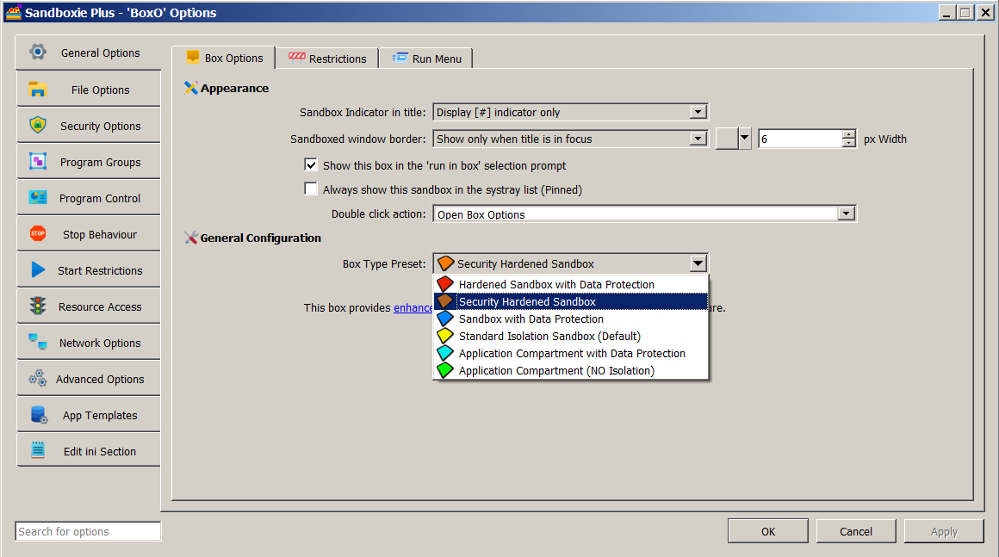

# Security Hardened Mode

**NOTE: This feature requires a [supporter certificate](https://sandboxie-plus.com/supporter-certificate/).**

The security hardened box and the concept of security hardened mode was introduced in **Sandboxie Plus v1.3.0**. It limits original/full-token execution within Sandboxie's system-call mediation to approved NT and Win32k system calls. It also provides device security by restricting device access to known safe/filtered endpoints.

The setting for a security hardened box can be enabled by adding `UseSecurityMode=y` to the box settings section of **[Sandboxie Ini](../Content/SandboxieIni.md)**. It can also be enabled in the Sandman UI. Right-click on a box and select "Sandbox Options" from the drop-down menu (or simply double-click on a box) to bring up the Box Options UI. Select the box type preset as "Security Hardened Sandbox" (with an **orange** box icon) and click OK to apply changes. The status column of Sandman UI labels this box as **Enhanced Isolation**.

At runtime, `UseSecurityMode=y` activates four related security behaviors. These relationships do not mean that enabling the preset writes four separate settings into the sandbox configuration:

1. **[DropAdminRights](../Content/DropAdminRights.md):** `UseSecurityMode=y` applies the drop-admin-rights behavior during token processing. Prior to **Sandboxie Plus v1.3.0**, any box with `DropAdminRights=y` was considered **hardened** and labeled "Enhanced Isolation" in the Sandman UI status column. Starting with **Sandboxie Plus v1.3.0**, only boxes with `UseSecurityMode=y` have their status listed as "Enhanced Isolation".

2. **[System-call lockdown](../Content/SyscallSettings.md):** `UseSecurityMode=y` causes the process to use the `SysCallLockDown` behavior. Under lockdown, an intercepted NT or Win32k system call receives Sandboxie's original/full-token execution path only when its entry is approved. Unapproved intercepted calls continue under the restricted sandbox token and may fail when required rights are absent. `ApproveWinNtSysCall` supplies NT approvals, while `ApproveWin32SysCall` supplies Win32k approvals when that hooking path is active. Approval affects this token-selection decision; it does not necessarily bypass the Sandboxie handler for the call. After changing approval entries, reload the configuration using **Options > Reload configuration** so the current driver maps are updated.

3. **[RestrictDevices](../Content/RestrictDevices.md):** `UseSecurityMode=y` applies the device-restriction behavior. An earlier **"DeviceSecurity"** template was replaced by a dedicated setting `RestrictDevices=y` in **Sandboxie Plus v1.3.0** to harden box security even further. This behavior broadly closes access to arbitrary endpoints under the NT `\Device` namespace while retaining built-in compatibility exceptions. Additional narrowly scoped **[Normal](../Content/NormalFilePath.md)** path rules can allow specific device endpoints when required.

4. **[Rule Specificity](../PlusContent/RuleSpecificity.md):** The device-restriction behavior activated by `UseSecurityMode=y` also enables rule-specific path matching. The setting `UseRuleSpecificity=y` can enable this behavior directly, allowing rules to be prioritized based on their "specificity". When rule specificity is combined with `Normal[File/Key/Ipc]Path` entries, selected subpaths can be made readable/writeable while parent paths are still protected. A security hardened box works in a **default allow** mode: every path is a `Normal[File/Key/Ipc]Path` (which allows read/write changes to a sandbox) unless specifically blocked by an overriding rule.

**Comparison with Other Box Types:** RuleSpecificity along with `Normal[File/Key/Ipc]Path` entries is also used in **blue** ([privacy enhanced](../PlusContent/privacy-mode.md)) boxes and in **red** boxes (that combine enhanced privacy and enhanced security). These two box types work in a **default block** mode: all drive paths are set to `WriteFilePath`. This hides all files and folders outside the sandbox, but allows new files and folders to be created in the sandbox (unless specifically allowed by an overriding rule).

**Recent Changes:** Starting with **Sandboxie Plus v1.8.0**, all built-in access rules for a security hardened box have been moved to a dedicated template (included in the file **Templates.ini** under the `[TemplateSModPaths]` section) for easier management.
