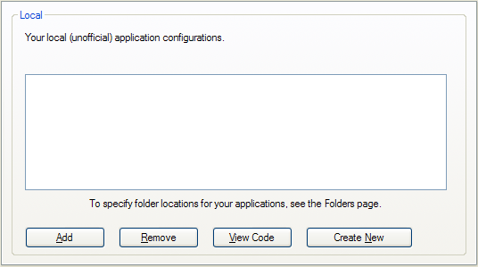

# Applications Settings

### Applications" Settings Group

[Sandboxie Control](SandboxieControl.md) > [Sandbox Settings](SandboxSettings.md) > Applications.

This group of settings pages offers quick configuration of Sandboxie for use with other applications, particularly the various well-known Web browsers and email programs, but also some third-party applications that are known to require special configuration in Sandboxie.

* * *

### Web Browser

[Sandboxie Control](SandboxieControl.md) > [Sandbox Settings](SandboxSettings.md) > Applications > Web Browser

This settings sub-group is itself divided into three sub-groups:

#### Internet Explorer

See also:   [Internet Explorer Tips](InternetExplorerTips.md)

#### Firefox

See also:  [Firefox Tips](FirefoxTips.md)

#### Other Browsers

This settings page offers quick configuration for the following browsers: Internet Explorer, Mozilla Firefox and SeaMonkey, the Opera Web browser, Maxthon 2, and Google Chrome.

Select (highlight) the desired configuration and click the _Add_ button to enable it for this sandbox. If you use non-default locations for the data (profile) folders used by your Web browsers, make sure to also visit the [Applications > Folders](ApplicationsSettings.md#folders) settings page to specify the alternate locations.

Two special settings on the Internet Explorer settings page:

*   Save outside sandbox: History of search strings and invoked commands. 
For detailed information, see [Sandboxie Ini](SandboxieIni.md) setting: [OpenProtectedStorage](OpenProtectedStorage.md).

*   ~~Save outside sandbox: Account information for Hotmail and Messenger.~~ (no longer available since Sandboxie v0.8.0 / 5.50.0). 
For detailed information, see [Sandboxie Ini](SandboxieIni.md) setting: [OpenCredentials](OpenCredentials.md).
*   See also [Save Outside Sandbox in Internet Explorer Tips](InternetExplorerTips.md#save-outside-sandbox) for more information and recommendations.

* * *

#### Email Reader

[Sandboxie Control](SandboxieControl.md) > [Sandbox Settings](SandboxSettings.md) > Applications > Email Reader

This settings page offers quick configuration for the following email programs:

*   Outlook Express
*   Office Outlook
*   Windows Vista Mail
*   Windows Live Mail
*   Mozilla Thunderbird
*   Mozilla SeaMonkey
*   Opera Mail
*   IncrediMail
*   Eudora
*   The Bat!

Select (highlight) the desired configuration and click the _Add_ button to enable it for this sandbox.

You may also need to tell Sandboxie where your mailbox data files reside, in the following cases:

*   If your mailbox resides in a non-default or non-standard location.
*   If you use the Eudora or The-Bat! email software.

To do that, open [Sandbox Settings > Applications > Folders](ApplicationsSettings.md#folders), select your email software from the drop-down list, and then select a folder location to be associated with it.

After completing the email configuration, you may want to test it, to make sure that even when running under Sandboxie, new emails are not lost when you delete the sandbox. To do that, follow the steps outlined in [Test Email Configuration](TestEmailConfiguration.md).

If your email program is not known to Sandboxie, you can use [Sandbox Settings > Resource Access > File Access > Direct Access](ResourceAccessSettings.md#file-access--direct-access) to explicitly add direct access to the folder containing your mailbox data files.

See also message [SBIE2212](SBIE2212.md), [Email Protection](EmailProtection.md), and [FAQ Email](FAQEmail.md).

* * *

### Miscellaneous

The following settings pages are used to enable configurations for third-party software, categorized by subject. There are settings pages for PDF and printing software, for password and security software, for desktop utilities and other miscellaneous programs and settings.

Select (highlight) the desired configuration and click the _Open Web Site_ button to visit the vendor Web site for a particular program recognized by Sandboxie.

Select (highlight) the desired configuration and click the _Add_ button to enable it for this sandbox. In some cases, you also specify the locations of the data files used by the third-party software. Use [Applications > Folders](ApplicationsSettings.md#folders) settings page to specify the alternate locations.

* * *

#### Local

[Sandboxie Control](SandboxieControl.md) > [Sandbox Settings](SandboxSettings.md) > Applications > Local

Use this settings page to enter your own custom settings as an application configuration package that can be easily enabled or disabled for a particular sandbox.

For more information about designing your own application configuration packages, or templates, consult the _Templates.ini_ file in the Sandboxie installation folder.

* * *

#### Folders

[Sandboxie Control](SandboxieControl.md) > [Sandbox Settings](SandboxSettings.md) > Applications > Folders

Use this settings page to specify any alternate (non-default) folder locations for the data files used by applications for which you have enabled in (or add to) the sandbox.

First, select (highlight) the desired application, then click the _Add_ button to specify the alternate location.

* * *

#### Accessibility Settings

[Sandboxie Control](SandboxieControl.md) > [Sandbox Settings](SandboxSettings.md) > Applications > Accessibility

This settings page offers quick configuration for the following screen reading programs:

*   JAWS
*   NVDA
*   Windows-Eyes
*   System Access

Accessibility support in Windows allows any program to provide hints and information about the content it is displaying. Screen reader software typically uses these hints to offer more detail about the content of the screen.

Normally, the isolation of Sandboxie prevents the screen reader from accessing the accessibility hints provided by the sandboxed program.

Enabling the setting will weaken the protection of the Sandboxie in order to permit two-way communication between the screen reader program and the sandboxed program.

You may wish to enable [Sandbox Settings > Restrictions > Drop Rights](RestrictionsSettings.md#drop-rights) to compensate for the lost protection.
