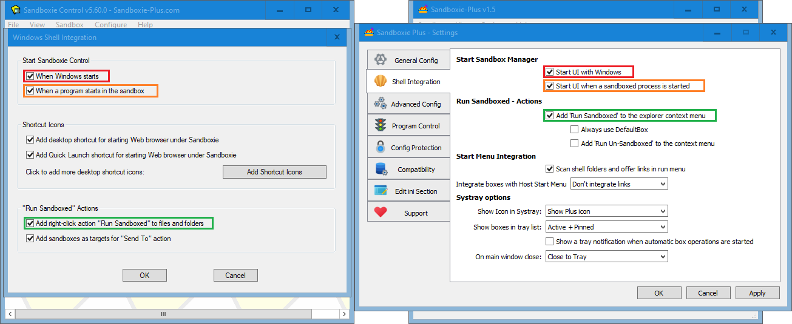
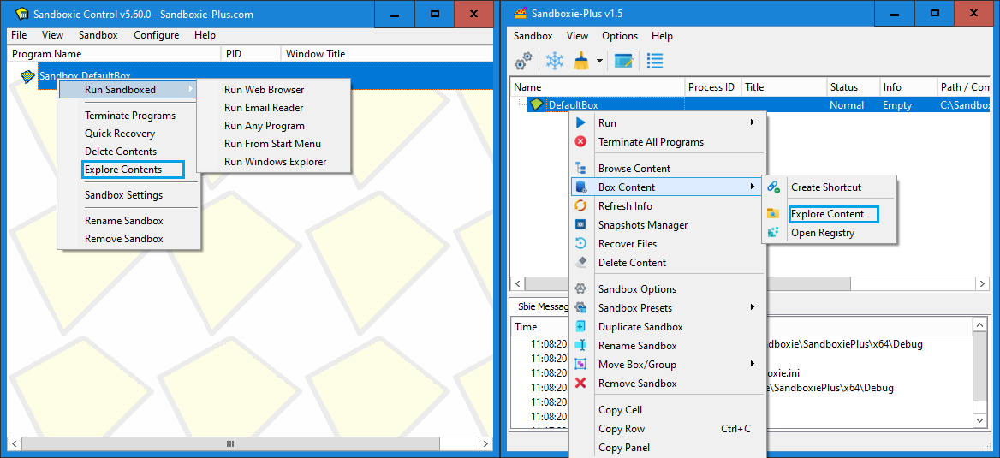
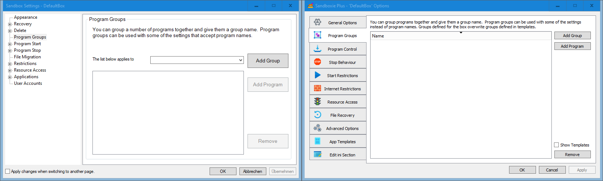

# Sandboxie-Plus Migration Guide

This guide shows where all the known Sandboxie functions can be found in the new UI.

## Main Window

The overall layout of the main window of SandMan.exe is exactly the same as the old one in SbieCtrl.exe when the "Simple View" is chosen. If the "Advanced View" is chosen, there are three additional tabs on the bottom of the window ("Sbie Messages" etc.), so it corresponds with what can be seen in the right picture.

## File and Sandbox Menus

All important menu commands can be found in similar locations, although some have been moved.

## Create New Box dialog

The "Create New Box" command opens the new box dialog. Unlike in Classic, here a box type preset can be selected.

The feature to copy an existing box can be found now on another place. (See the following unit.)

## Copying Sandbox Configuration

To copy a existing box configuration, the "Duplicate Sandbox" menu command can be used.

## View Menu

The "View" menu  offers a few more functions, and the option to enable a simplified view mode. The recovery log is no longer a separate window but a tab at the bottom (visible when the "Advanced View" is chosen).

## View Menu - Files and Folders

The modern Sandboxie UI has replaced the "Files and Folders" view with a separate window that can be opened from the box context menu.

## Files and Folders - view / window

The window "Files" offers the same functionality as the old view, but enhances it by providing a full context menu.

## Global Settings

The new Sandboxie Plus UI has a global settings window (Options --> Global Settings) where all options are located together on vertical tabs instead of having to open individual windows.

## File System Root

In the modern UI, it is possible to change not only the file system root path, but also the registry root and the IPC root.

## Program Start monitoring

Sandboxie Plus can not only warn when unboxed processes are started, but it can also prevent them from starting at all.

## Shell Integration

On this tab, the shell integration can be configured. Most functions are available, although some deprecated features were dropped and other options were moved out.

## Create Sandbox shortcut

To create a shortcut to a boxed program, now an option in the box context menu is to be used, which can be reached quicker.

## Software Compatibility

Also the compatibility dialog is now integrated into the window with the global settings (tab "Compatibility").

## Lock Configuration

Starting with version 1.9.0 / 5.64.0, the [Configuration Protection](ConfigurationProtection.md) options are located in the sub tab "Sandboxie.ini Presets" of the tab "Advanced Config".

## Sandbox Context Menu

The sandbox context menu is much more advanced, and contains all the options from the old menu. Double click on the sandbox name now opens the sandbox settings.

## Explore Contents

In addition to being able to explore contents, the "Box Content" sub menu allows to mount and browse the sandboxed registry.

## Sandbox Settings

All functionality from the old Sandbox Settings are now located in the Sandbox Options. Some areas are similar, but many have also been moved around.

## Quick and Immediate Recover

The options for Quick Recovery and Immediate Recovery have been merged into one tab ("File Recovery").

## Delete Options

The Delete Options have been moved to the sub tab "File Options" of the tab "General Options".

## Delete Command

The "Delete Command" option can now be found on the sub tab "Triggers" of the tab "Advanced Options".

## Program Groups

The new UI supports groups just like the old one.

## Forced Programs and Folders

Forced programs and folders are also merged into one tab ("Program Control", sub tab "Force* Programs").

## Lingering Programs & Leader Programs

Program stop behaviours are also merged into one tab.

## File Migration

File Migration options have been integrated into the "File Options" sub tab of the "General Options" tab.

## Internet Access

Sandboxie Plus can not only use the old method of blocking internet access but also the Windows Filtering Platform (WFP), which provides better compatibility.

## Network Access

Additionally, using the WFP facility, a per sandbox firewall can be configured (tab "Internet Restrictions" --> sub tab "Network Firewall Rules").

## Start/Run Access

Start restriction options have been promoted to a top level tab.

## Drop Rights

The "Drop Admin Rights" option is in the new UI located on the "Security" sub tab of the "General Options" tab, together with additional security enhancements.

## Network Files

"Block network files and folders access" has been moved to the "Access Restrictions" sub tab of the "General Options" tab.

## Resource Access

The "Resource Access" options have been integrated into a joined view which shows all presets in one list, the options can be edited as well as disabled without removing them.

## Application Compatibility Templates

The compatibility Templates are now also presented as a joined view (tab "App Templates", sub tab "Compatibility Templates").

## User Accounts

Last but not least, the ability to restrict a box to selected users has been moved to the sub tab "Users" of the tab "Advanced Options".

## About Dialog

And finally, we have the About dialog.

As is apparent, Sandboxie Plus has much more additional options not shown here, as this guide is only meant to facilitate the migration from Sandboxie Classic to Sandboxie Plus.
