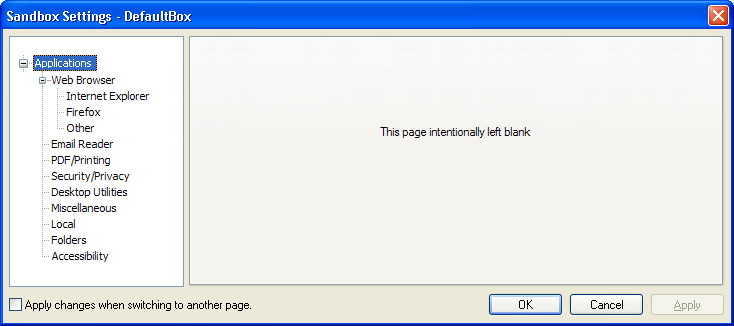

# 应用程序设置

### 应用程序设置组

[沙箱控制](SandboxieControl.md) > [沙箱设置](SandboxSettings.md) > 应用程序

此设置页面组为 Sandboxie 与其他应用程序的协同使用提供了快速配置，特别是众所周知的各类 Web 浏览器和电子邮件程序，同时也包括一些已知在 Sandboxie 中需要特殊配置的第三方应用程序。

* * *

### Web 浏览器

[沙箱控制](SandboxieControl.md) > [沙箱设置](SandboxSettings.md) > 应用程序 > Web 浏览器

该设置子组本身又分为三个子组

#### Internet Explorer

另请参阅：[Internet Explorer 使用技巧](InternetExplorerTips.md)

#### Firefox

另请参阅:  [Firefox Tips](FirefoxTips.md)

#### 其他浏览器

此设置页面为以下浏览器提供快速配置：Internet Explorer、Mozilla Firefox 和 SeaMonkey、Opera Web 浏览器、Maxthon 2 以及 Google Chrome。

请选择（高亮）所需的配置，并点击 _Add_ 按钮，以便为该沙箱启用相应设置。如果你的网页浏览器数据（配置文件）文件夹使用了非默认位置，请务必访问 [应用程序 > 文件夹](ApplicationsSettings.md#folders) 设置页面，指定备用位置。

Internet Explorer 设置页面上的两个特殊设置：

*   沙箱外保存：搜索字符串历史记录和已调用命令的历史 
如需详细信息，请参阅 [Sandboxie Ini](SandboxieIni.md) 设置项：[打开受保护存储](OpenProtectedStorage.md)

*   ~~沙箱外保存：Hotmail 和 Messenger 的账户信息~~（自 Sandboxie v0.8.0 / 5.50.0 起已不再提供） 
如需详细信息，请参阅 [Sandboxie Ini](SandboxieIni.md) 设置项：[OpenCredentials](OpenCredentials.md)
*   另请参阅 [Internet Explorer 技巧中的沙箱外保存](InternetExplorerTips.md#save-outside-sandbox)，获取更多信息与建议

* * *

#### 邮件阅读器

[沙箱控制](SandboxieControl.md) > [沙箱设置](SandboxSettings.md) > 应用程序 > 邮件阅读器

此设置页面为以下邮件程序提供了快速配置：

*   Outlook Express
*   Office Outlook
*   Windows Vista Mail
*   Windows Live Mail
*   Mozilla Thunderbird
*   Mozilla SeaMonkey
*   Opera Mail
*   IncrediMail
*   Eudora
*   The Bat!

请选择（高亮）所需的配置，并点击 _Add_ 按钮以在该沙箱中启用它

在以下情况下，您还需要告知 Sandboxie 您的邮箱数据文件存放位置：

* 如果您的邮箱存放在非默认或非常规位置
* 如果您使用 Eudora 或 The-Bat! 电子邮件软件

为此，请打开 [沙箱设置 > 应用程序 > 文件夹](ApplicationsSettings.md#folders)，从下拉列表中选择您的电子邮件软件，然后选择要与其关联的文件夹位置

完成邮箱配置后，您可能需要进行测试，以确保即使在 Sandboxie 下运行时，新邮件在删除沙箱后也不会丢失。请按照 [测试邮件配置](TestEmailConfiguration.md) 中的步骤进行操作

如果您的电子邮件程序未被 Sandboxie 识别，您可以通过 [沙箱设置 > 资源访问 > 文件访问 > 直接访问](ResourceAccessSettings.md#file-access--direct-access) 显式添加对存放邮箱数据文件的文件夹的直接访问权限

另请参阅消息 [SBIE2212](SBIE2212.md)、[邮件保护](EmailProtection.md) 和 [常见问题 邮件](FAQEmail.md)

* * *

### 其他

以下设置页面用于为第三方软件启用相关配置，并按主题进行分类。这些设置页面涵盖 PDF 与打印软件、密码与安全软件、桌面实用程序以及其他各种程序和设置。

选择（高亮）所需的配置后，点击 _打开网站_ 按钮，可访问由 Sandboxie 识别的特定程序的厂商网站。

选择（高亮）所需的配置后，点击 _Add_ 按钮，即可为此沙箱启用该配置。在某些情况下，你还需要指定第三方软件所使用的数据文件位置。请使用 [应用程序 > 文件夹](ApplicationsSettings.md#folders) 设置页面，指定其他位置
* * *

#### 本地

[沙箱控制](SandboxieControl.md) > [沙箱设置](SandboxSettings.md) > 应用程序 > 本地

可以使用本设置页面，将您自定义的设置作为应用程序配置包输入，以便在特定沙箱中轻松启用或禁用。

有关设计自定义应用程序配置包或模板的更多信息，请查阅 Sandboxie 安装目录下的 _Templates.ini_ 文件。

* * *

#### 文件夹

[沙箱控制](SandboxieControl.md) > [沙箱设置](SandboxSettings.md) > 应用程序 > 文件夹

可以使用本设置页面，指定已在沙箱中启用（或添加）的应用程序所使用的数据文件的任何备用（非默认）文件夹位置。

首先，选择（高亮）所需应用程序，然后单击 _Add_ 按钮以指定备用位置
* * *

#### 辅助功能设置

[沙箱控制](SandboxieControl.md) > [沙箱设置](SandboxSettings.md) > 应用程序 > 辅助功能

此设置页面为以下屏幕阅读程序提供了快速配置选项：

*   JAWS
*   NVDA
*   Windows-Eyes
*   System Access

Windows 的辅助功能支持允许任意程序提供其正在显示内容的提示和信息。屏幕阅读软件通常利用这些提示，为用户提供关于屏幕内容的更多细节。

通常情况下，Sandboxie 的隔离机制会阻止屏幕阅读器访问沙箱内程序提供的辅助功能提示。

启用此设置后，会削弱 Sandboxie 的防护，以便允许屏幕阅读程序与沙箱内程序进行双向通信。

您可以启用 [沙箱设置 > 限制 > 降低权限](RestrictionsSettings.md#drop-rights) 来补偿失去的防护能力。
