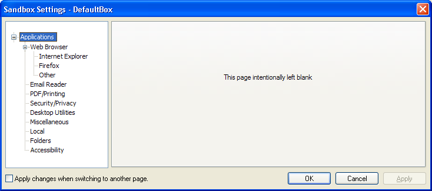
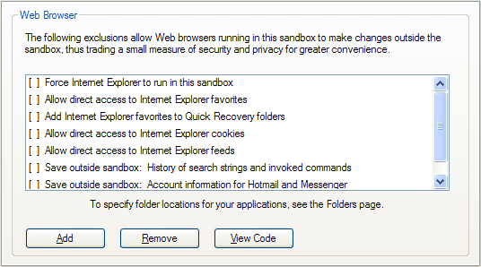
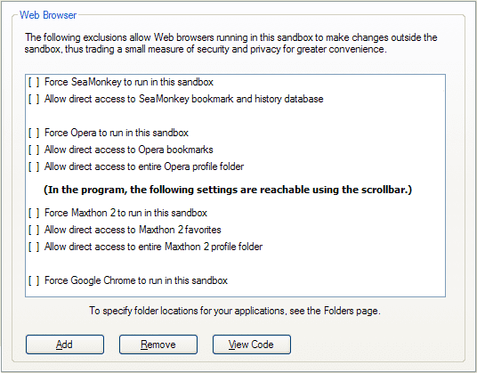
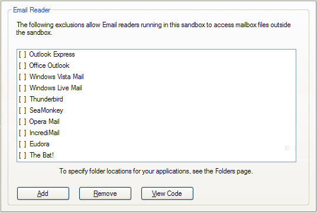
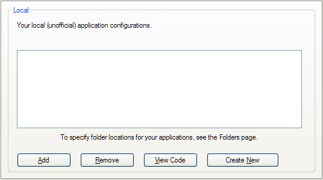
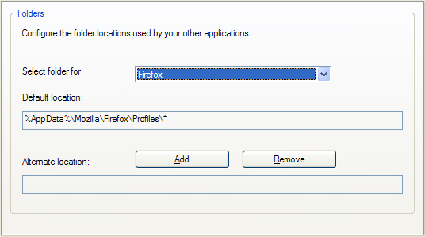
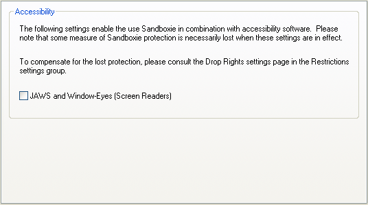

# 应用程序设置

### 应用程序设置组

[沙盒管理器](SandboxieControl.md) > [沙盒设置](SandboxSettings.md) > 应用程序。

这组设置页为 Sandboxie 与其他应用程序配合使用提供快捷配置，尤其是各种知名的网页浏览器和邮件程序，也包括一些已知在 Sandboxie 中需要特殊配置的第三方应用程序。

* * *

### Web 浏览器

[沙盒管理器](SandboxieControl.md) > [沙盒设置](SandboxSettings.md) > 应用程序 > Web 浏览器

此设置子组本身又分为三个子组：

#### Internet Explorer

另请参阅：[Internet Explorer 使用技巧](InternetExplorerTips.md)

#### Firefox

另请参阅：[Firefox 技巧](FirefoxTips.md)

#### 其他浏览器

此设置页为以下浏览器提供快捷配置：Internet Explorer、Mozilla Firefox 和 SeaMonkey、Opera 网页浏览器、Maxthon 2，以及 Google Chrome。

选择（高亮）所需配置并点击 _添加_ 按钮，即可为当前沙盒启用。如果你为网页浏览器使用的数据（配置文件）文件夹采用了非默认位置，务必同时访问 [应用程序 > 文件夹](ApplicationsSettings.md#文件夹) 设置页，指定备用位置。

Internet Explorer 设置页上的两个特殊设置：

*   在沙盒外保存：搜索字符串和已调用命令的历史记录。 
    详细信息参见 [Sandboxie Ini](SandboxieIni.md) 设置项：[开放受保护的存储](OpenProtectedStorage.md)。

*   ~~在沙盒外保存：Hotmail 和 Messenger 的帐户信息。~~（自 Sandboxie v0.8.0 / 5.50.0 起不再可用）。 
    详细信息参见 [Sandboxie Ini](SandboxieIni.md) 设置项：[开放凭据](OpenCredentials.md)。
*   更多信息和建议，另请参阅 [Internet Explorer 使用技巧中的在沙盒外保存](InternetExplorerTips.md#在沙盒外保存)。

* * *

#### 邮件阅读器

[沙盒管理器](SandboxieControl.md) > [沙盒设置](SandboxSettings.md) > 应用程序 > 邮件阅读器

此设置页为以下邮件程序提供快捷配置：

*   Outlook Express
*   Office Outlook
*   Windows Vista Mail
*   Windows Live Mail
*   Mozilla Thunderbird
*   Mozilla SeaMonkey
*   Opera Mail
*   IncrediMail
*   Eudora
*   The Bat!

选择（高亮）所需配置并点击 _添加_ 按钮，即可为当前沙盒启用。

在以下情况下，你可能还需要告知 Sandboxie 你的邮箱数据文件的位置：

*   如果邮箱位于非默认或非标准位置。
*   如果你使用 Eudora 或 The-Bat! 邮件软件。

为此，请打开 [沙盒设置 > 应用程序 > 文件夹](ApplicationsSettings.md#文件夹)，从下拉列表中选择你的邮件软件，然后选择一个与之关联的文件夹位置。

完成邮件配置后，建议测试一下，确保即使在 Sandboxie 下运行，删除沙盒时新邮件也不会丢失。请按照 [测试邮件配置](TestEmailConfiguration.md) 中概述的步骤操作。

如果你的邮件程序不被 Sandboxie 识别，可以使用 [沙盒设置 > 资源访问 > 文件访问 > 直接访问](ResourceAccessSettings.md#文件访问-直接访问) 显式添加对包含邮箱数据文件的文件夹的直接访问。

另请参阅消息 [SBIE2212](SBIE2212.md)、[邮件防护](EmailProtection.md) 和 [常见问题-电子邮件](FAQEmail.md)。

* * *

### 其他

以下设置页用于按主题分类启用第三方软件的配置。其中有面向 PDF 和打印软件、密码和安全软件、桌面实用工具及其他杂项程序和设置的设置页。

选择（高亮）所需配置并点击 _打开网站_ 按钮，可访问 Sandboxie 识别的特定程序的供应商网站。

选择（高亮）所需配置并点击 _添加_ 按钮，即可为当前沙盒启用。在某些情况下，你还需要指定第三方软件使用的数据文件的位置。使用 [应用程序 > 文件夹](ApplicationsSettings.md#文件夹) 设置页指定备用位置。

* * *

#### 本地

[沙盒管理器](SandboxieControl.md) > [沙盒设置](SandboxSettings.md) > 应用程序 > 本地

使用此设置页，把你自己的自定义设置作为应用程序配置包输入，以便为特定沙盒轻松启用或禁用。

关于设计你自己的应用程序配置包（或模板）的更多信息，请查阅 Sandboxie 安装文件夹中的 _Templates.ini_ 文件。

* * *

#### 文件夹

[沙盒管理器](SandboxieControl.md) > [沙盒设置](SandboxSettings.md) > 应用程序 > 文件夹

使用此设置页，为已在沙盒中启用（或添加到沙盒）的应用程序，指定其数据文件的任何备用（非默认）文件夹位置。

首先选择（高亮）所需应用程序，然后点击 _添加_ 按钮指定备用位置。

* * *

#### 辅助功能设置

[沙盒管理器](SandboxieControl.md) > [沙盒设置](SandboxSettings.md) > 应用程序 > 辅助功能

此设置页为以下屏幕朗读程序提供快捷配置：

*   JAWS
*   NVDA
*   Windows-Eyes
*   System Access

Windows 中的辅助功能支持允许任何程序提供关于其显示内容的提示和信息。屏幕朗读软件通常利用这些提示提供关于屏幕内容的更详细信息。

通常，Sandboxie 的隔离会阻止屏幕朗读程序访问沙盒化程序提供的辅助功能提示。

启用此设置会削弱 Sandboxie 的保护，以允许屏幕朗读程序与沙盒化程序之间的双向通信。

你可能希望启用 [沙盒设置 > 限制 > 放弃权限](RestrictionsSettings.md#放弃权限)，以弥补失去的保护。
