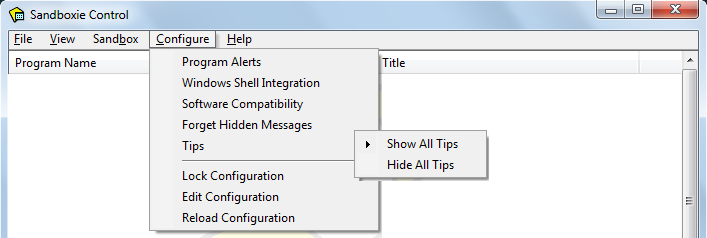

# 配置菜单

[沙箱控制](SandboxieControl.md) > 配置菜单

---

### 程序警报

_程序警报_ 命令会打开下图所示窗口，您可以在其中配置 Sandboxie，当特定程序在任何沙箱之外启动时，发出 [SBIE1301](SBIE1301.md) 消息。

- 使用 _添加程序_ 按钮，打开程序组窗口并选择要添加的程序。

- 例如，Internet Explorer 的 _iexplore.exe_，或 Firefox 的 _firefox.exe_。
- 通常，Internet Explorer 位于 _C:\Program Files\Internet Explorer_ 文件夹内。
- Mozilla Firefox 通常位于 _C:\Program Files\Mozilla Firefox_ 文件夹内。

如果目标程序已经在沙箱中运行，您也可以使用 [程序设置](ProgramSettings.md#page-1)，指定该程序应当触发 [SBIE1301](SBIE1301.md) 消息。

相关 [Sandboxie Ini](SandboxieIni.md) 设置项：[AlertProcess](AlertProcess.md)。

---

### Windows Shell 集成

_Windows Shell 集成_ 命令会打开一个窗口，用于控制 [沙箱控制](SandboxieControl.md) 如何与 Windows 桌面集成并进行关联。它还可用于创建沙箱化程序的桌面快捷方式图标。默认情况下，该窗口内的所有设置均为启用状态。

- 顶部区域用于指示 [沙箱控制](SandboxieControl.md) 应当何时启动：

- 选择 _Windows 启动时_，将 [沙箱控制](SandboxieControl.md) 集成到 Windows 启动流程中

- 选择 _沙箱化程序启动时_，则在某个沙箱化程序启动时（如果 Sandboxie Control 尚未运行），会自动启动 [沙箱控制](SandboxieControl.md)。这适用于通过 Sandboxie 明确启动的程序，如使用 [以沙箱方式运行](SandboxMenu.md#sandbox-menu) 命令或以下述方式创建的快捷方式时（见下述 _添加快捷方式图标_）。同样适用于 [强制程序](ProgramStartSettings.md#forced-programs) 及 [强制文件夹](ProgramStartSettings.md#forced-folders)。

- 中部区域用于管理快捷方式图标：

- 勾选 _为在 Sandboxie 下启动网页浏览器添加桌面快捷方式_，可在桌面上创建或移除 _沙箱化网页浏览器_ 快捷方式图标。

- 勾选 _为在 Sandboxie 下启动网页浏览器添加快速启动栏快捷方式_，可在 Windows 快速启动栏（通常位于开始菜单按钮旁）创建或移除 _沙箱化网页浏览器_ 快捷方式图标。

- _添加快捷方式图标_ 可在桌面创建一个用于在 Sandboxie 监管下启动特定程序的快捷方式。该程序可在 Sandboxie 启动菜单中选择。注意：如果有程序安装在沙箱中，Sandboxie 启动菜单内会显示安装期间创建的快捷方式，可用于创建桌面快捷方式。如需删除 _添加快捷方式图标_ 创建的桌面快捷方式，直接从桌面删除即可。

- 底部区域用于“右键菜单” Shell 集成：

- 勾选 _为文件和文件夹添加右键操作“以沙箱方式运行”_，将在桌面或 Windows 资源管理器中右键点击文件或文件夹时，显示或移除 _以沙箱方式运行_ 选项。

- 勾选 _为“发送到”操作添加沙箱作为目标_，可在桌面或资源管理器中右键点击文件或文件夹时，在 _发送到_ 操作中显示可用沙箱作为选项（启用后，[沙箱控制](SandboxieControl.md) 会在新建或移除沙箱时自动更新 _发送到_ 目标列表）。

---

### 软件兼容性

_软件兼容性_ 命令会打开一个窗口，显示可用的兼容性模板列表。

---

### 强制隐藏消息

每当 [沙箱控制](SandboxieControl.md) 显示一个或多个 [SBIE 消息](SBIEMessages.md) 时，您可以选择隐藏该消息的后续出现。这可通过高亮并点击 _隐藏_ 命令实现：

注意：消息仅根据消息代码进行过滤。例如，上图显示的消息 [SBIE1304](SBIE1304.md) 的信息详情为 _osk.exe_。隐藏该消息后，以后所有 [SBIE1304] 消息都会被隐藏，无论信息详情如何。

_忘记隐藏消息_ 命令用于让 Sandboxie 停止过滤消息，恢复显示所有出现的 SBIExxxx 消息。

---

### 提示信息

当 [沙箱控制](SandboxieControl.md) 显示警告或通知消息框时，通常会包含一个标签为 _以后不再显示此消息_ 的复选框。如果您勾选了该选项，则同类消息以后将不再显示。

_显示所有提示_ 命令让 Sandboxie 忽略此前对此类复选框的设置，恢复显示所有警告和通知。

_隐藏所有提示_ 命令让 Sandboxie 视为所有复选框都已被勾选，不再显示任何警告或通知。

---

### 锁定配置

请参见 [配置保护](ConfigurationProtection.md)。

---

### 编辑配置

使用系统文本编辑器（通常为 _Windows 记事本_）编辑 [Sandboxie Ini](SandboxieIni.md) 配置文件。关闭编辑器时会自动执行 _重新加载配置_。

注意：不建议手动编辑 Sandboxie.ini。建议通过 [沙箱设置](SandboxSettings.md) 及 [沙箱控制](SandboxieControl.md) 内的其他配置窗口进行修改。

注意：[Sandboxie Ini](SandboxieIni.md) 配置文件通常位于 _Windows_ 文件夹，且非特权用户帐户无法修改。如果您启用 Windows 用户帐户控制（UAC），则在修改 Sandboxie.ini 前可能需要提升为管理员帐户。

---

### 重新加载配置

强制 Sandboxie 从 [Sandboxie Ini](SandboxieIni.md) 配置文件重新加载其配置。

---

跳转到 [沙箱控制](SandboxieControl.md#menus)、[帮助主题](HelpTopics.md)
