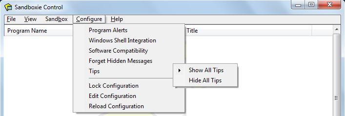
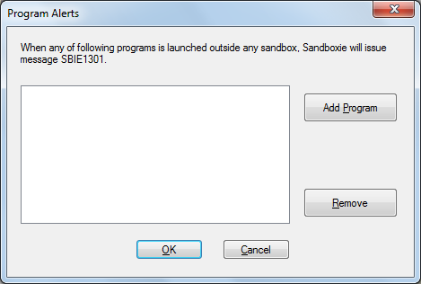
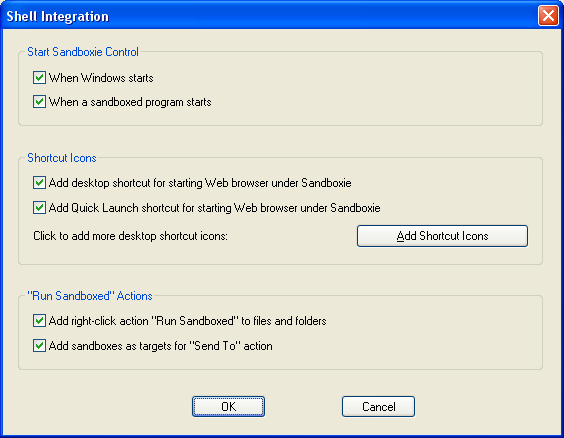
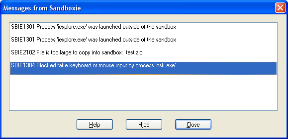
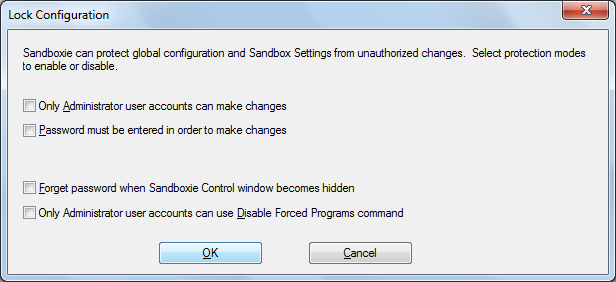

# 配置菜单

[沙盒管理器](SandboxieControl.md) > 配置菜单

* * *

### 程序警报

_程序警报_ 命令会打开如下窗口，可在特定程序于沙盒外启动时，配置 Sandboxie 发出 [SBIE1301](SBIE1301.md) 消息。

* 使用 _添加程序_ 按钮打开程序组窗口，并选择要添加的程序。

* 例如，Internet Explorer 的 _iexplore.exe_，或 Firefox 的 _firefox.exe_。
* 或者，Internet Explorer 通常位于 _C:\Program Files\Internet Explorer_ 文件夹中。
* Mozilla Firefox 通常位于 _C:\Program Files\Mozilla Firefox_ 文件夹中。

如果目标程序已在沙盒中运行，也可以使用 [程序设置](ProgramSettings.md#页面-1) 指定应针对该程序发出 [SBIE1301](SBIE1301.md) 消息。

相关 [Sandboxie Ini](SandboxieIni.md) 设置项：[警报进程](AlertProcess.md)。

* * *

### Windows Shell 集成

_Windows Shell 集成_ 命令会打开一个窗口，用于控制 [沙盒管理器](SandboxieControl.md) 如何集成并关联到你的 Windows 桌面，也可用于创建在沙盒中运行程序的桌面快捷方式图标。默认情况下，该窗口中的所有设置均处于启用状态。

* 顶部区域用于指定 [沙盒管理器](SandboxieControl.md) 的启动时机：

* 选择 _Windows 启动时_，将 [沙盒管理器](SandboxieControl.md) 集成到 Windows 的启动流程中。

* 选择 _沙盒化程序启动时_，则会在沙盒化程序启动时自动启动 [沙盒管理器](SandboxieControl.md)（若其尚未运行）。这适用于通过 Sandboxie 显式启动的程序，例如使用 [以沙盒方式运行](SandboxMenu.md#沙盒菜单) 命令或使用 _添加快捷方式图标_（见下文）创建的快捷方式，同样适用于 [强制程序](ProgramStartSettings.md#强制程序) 与 [强制文件夹](ProgramStartSettings.md#强制文件夹)。

* 中部区域用于管理快捷方式图标：

* 勾选 _为在 Sandboxie 下启动网页浏览器添加桌面快捷方式_，将在桌面创建（勾选时）或移除（取消勾选时）_沙盒化网页浏览器_ 快捷方式图标。

* 勾选 _为在 Sandboxie 下启动网页浏览器添加快速启动栏快捷方式_，将在快速启动栏创建或移除 _沙盒化网页浏览器_ 快捷方式图标。快速启动栏通常紧邻 Windows 开始菜单按钮。

* _添加快捷方式图标_ 会在桌面创建快捷方式图标，用于在 Sandboxie 的监管下运行特定程序。该程序从 Sandboxie 启动菜单中选择。注意：若曾向沙盒中安装过程序，Sandboxie 启动菜单将包含安装期间创建的快捷方式，也可用于创建桌面快捷方式。如需移除 _添加快捷方式图标_ 创建的桌面快捷方式，直接从桌面删除即可。

* 底部区域用于控制“右键菜单”Shell 集成：

* 勾选 _为文件和文件夹添加“以沙盒方式运行”右键操作_，可在桌面或 Windows 资源管理器中右键点击文件或文件夹时，启用（勾选时）或移除（取消勾选时）_以沙盒方式运行_ 选项。

* 勾选 _将沙盒添加为“发送到”操作的目标_，可在桌面或 Windows 资源管理器中右键点击文件或文件夹时，在“发送到”操作中启用（勾选时）或移除（取消勾选时）可用的沙盒目标。若启用该设置，[沙盒管理器](SandboxieControl.md) 将在沙盒被 [创建](SandboxMenu.md#创建新沙盒) 或移除时，自动更新“发送到”目标列表。

* * *

### 软件兼容性

_软件兼容性_ 命令会打开一个窗口，显示可用兼容性模板的列表。

* * *

### 忘记隐藏的消息

每当 [沙盒管理器](SandboxieControl.md) 显示一条或多条 [SBIE 消息](SBIEMessages.md) 时，你可以选择隐藏该消息的后续实例。方法是高亮选中消息并点击 _隐藏_ 命令：

注意：消息仅按消息代码过滤。例如，上图中的 [SBIE1304](SBIE1304.md) 消息附带信息详情 _osk.exe_。隐藏该消息后，无论信息详情如何，后续所有 SBIE1304 消息都将被隐藏。

_忘记隐藏的消息_ 命令指示 Sandboxie 停止过滤消息，恢复显示所有 SBIExxxx 消息。

* * *

### 提示信息

当 [沙盒管理器](SandboxieControl.md) 显示警告或通知消息框时，通常包含一个标签为 _以后不再显示此消息_ 的复选框。勾选该复选框后，同类消息将不再显示。

_显示所有提示_ 命令指示 Sandboxie 忽略此前对这些复选框的所有勾选，恢复显示所有警告和通知。

_隐藏所有提示_ 命令指示 Sandboxie 将所有复选框视为已勾选，不再显示任何警告或通知。

* * *

### 锁定配置

请参见 [配置保护](ConfigurationProtection.md)。

* * *

### 编辑配置

打开系统文本编辑器（通常为 _Windows 记事本_）以编辑 [Sandboxie Ini](SandboxieIni.md) 配置文件。关闭编辑器时会自动调用 _重新加载配置_ 命令。

注意：不建议手动编辑 Sandboxie.ini。建议通过 [沙盒设置](SandboxSettings.md) 及 [沙盒管理器](SandboxieControl.md) 中的其他配置窗口来修改 Sandboxie 的配置。

注意：[Sandboxie Ini](SandboxieIni.md) 配置文件通常位于 _Windows_ 文件夹，非特权用户帐户无法修改。若在启用用户帐户控制（UAC）的 Windows 上使用，修改 Sandboxie.ini 前可能需要提升至管理员帐户。

* * *

### 重新加载配置

强制 Sandboxie 从 [Sandboxie Ini](SandboxieIni.md) 配置文件重新加载配置。

* * *

跳转到 [沙盒管理器](SandboxieControl.md#菜单)、[帮助主题](HelpTopics.md)。
